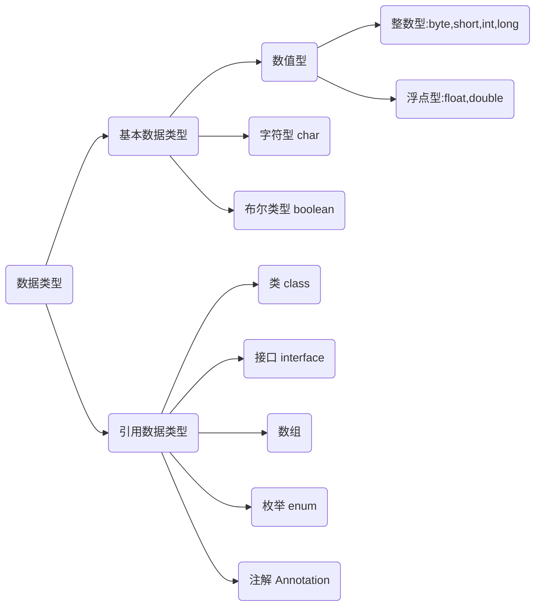
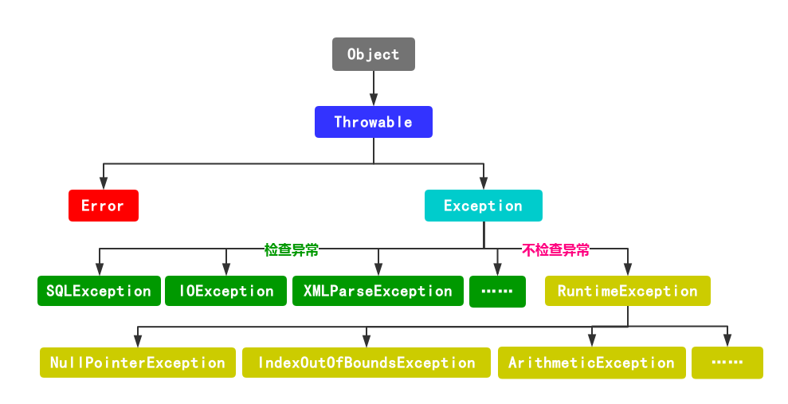
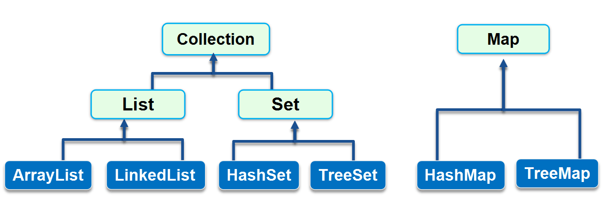
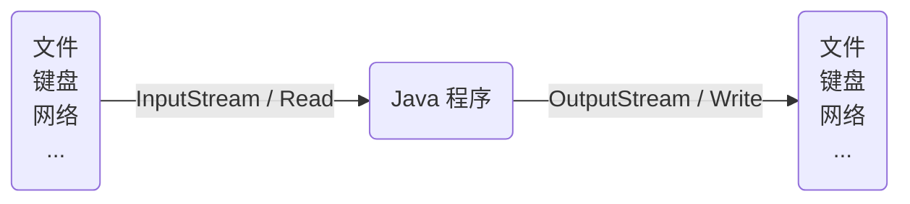
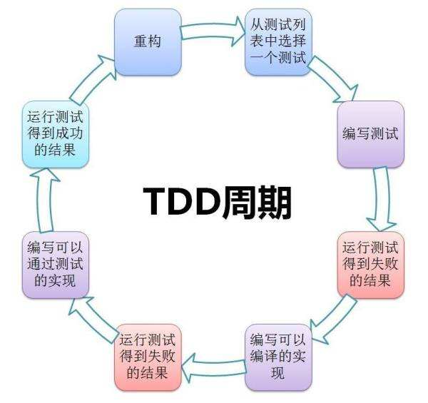
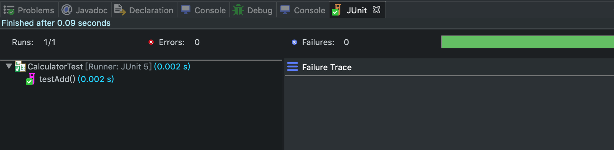

   * [1 Java 概述](#1-java-概述)
     * [1.1 Java 简介](#11-java-简介)
     * [1.2 JVM、JDK 和 JRE 解释](#12-jvmjdk-和-jre-解释)
         * [1.2.1 JVM](#121-jvm)
         * [1.2.2 JDK 和 JRE](#122-jdk-和-jre)
      * [1.3 Java 语言特点](#13-java-语言特点)
      * [1.4 IDE 集成开发工具](#14-ide-集成开发工具)
   * [2 Java 编程基础](#2-java-编程基础)
      * [2.1 Java 程序基本结构](#21-java-程序基本结构)
      * [2.2 变量和数据类型](#22-变量和数据类型)
         * [2.2.1 变量](#221-变量)
         * [2.2.2 数据型](#222-数据型)
            * [2.2.2.2 浮点型](#2222-浮点型)
            * [2.2.2.3 布尔类型](#2223-布尔类型)
            * [2.2.2.4 字符类型](#2224-字符类型)
            * [2.2.2.5 常量](#2225-常量)
            * [2.2.2.6 引用类型](#2226-引用类型)
            * [2.2.2.7 var关键字](#2227-var关键字)
            * [2.2.2.8 变量的作用范围](#2228-变量的作用范围)
            * [2.2.2.9 自动类型转换](#2229-自动类型转换)
            * [2.2.2.10 强制类型转换](#22210-强制类型转换)
         * [2.2.3 运算符](#223-运算符)
            * [2.2.3.1算术运算符](#2231算术运算符)
            * [2.2.3.2 关系运算符](#2232-关系运算符)
            * [2.2.3.3 逻辑运算符](#2233-逻辑运算符)
            * [2.2.3.4 赋值运算符](#2234-赋值运算符)
            * [2.2.3.5 条件运算符（?:）](#2235-条件运算符)
            * [2.2.3.6 instanceof 运算符](#2236-instanceof-运算符)
      * [2.3 流程控制](#23-流程控制)
         * [2.3.1 if条件语句](#231-if条件语句)
         * [2.3.2 switch 多重选择](#232-switch-多重选择)
         * [2.3.3 while 循环](#233-while-循环)
         * [2.3.4 do…while 循环](#234-dowhile-循环)
         * [2.3.5 for 循环](#235-for-循环)
         * [2.3.6 break 和 continue](#236-break-和-continue)
      * [2.4 数组](#24-数组)
         * [2.4.1 数组的定义](#241-数组的定义)
         * [2.4.2 数组遍历](#242-数组遍历)
         * [2.4.4 多维数组](#244-多维数组)
   * [3 面向对象编程](#3-面向对象编程)
      * [3.1 类与对象](#31-类与对象)
      * [3.2 方法](#32-方法)
      * [3.3 构造方法](#33-构造方法)
      * [3.4 方法重载（Overload）](#34-方法重载overload)
      * [3.6 继承](#36-继承)
      * [3.7 方法的重写（Override）](#37-方法的重写override)
      * [3.8 多态](#38-多态)
      * [3.9 抽象类](#39-抽象类)
      * [3.10 接口](#310-接口)
   * [4 Java API](#4-java-api)
      * [4.1 String、StringBuilder 和 StringJoiner](#41-stringstringbuilder-和-stringjoiner)
         * [4.1.1 String](#411-string)
         * [4.1.2 StringBuilder](#412-stringbuilder)
         * [4.1.3 StringJoiner](#413-stringjoiner)
      * [4.2 Math 和 Random](#42-math-和-random)
         * [4.2.1 Math](#421-math)
      * [4.3 日期与时间](#43-日期与时间)
         * [4.3.1 LocalDateTime](#431-localdatetime)
         * [4.3.2 ZonedDateTime](#432-zoneddatetime)
         * [4.3.3 DateTimeFormatter](#433-datetimeformatter)
         * [4.3.4 Instant](#434-instant)
      * [4.4 enum](#44-enum)
      * [4.5 Annotation](#45-annotation)
         * [4.5.1 定义注解](#451-定义注解)
         * [4.5.2 使用注解](#452-使用注解)
      * [4.6 异常](#46-异常)
         * [4.6.1 捕获异常](#461-捕获异常)
         * [4.6.2 抛出异常](#462-抛出异常)
         * [4.6.3 自定义异常](#463-自定义异常)
      * [4.7 反射](#47-反射)
         * [4.7.1 访问属性](#471-访问属性)
         * [4.7.1 访问方法](#471-访问方法)
         * [4.7.3 访问构造方法](#473-访问构造方法)
         * [4.7.4 动态代理](#474-动态代理)
   * [5 集合](#5-集合)
      * [5.1 List](#51-list)
      * [5.2 Set](#52-set)
      * [5.3 Map](#53-map)
      * [5.4 泛型](#54-泛型)
   * [6 IO](#6-io)
      * [6.1 File](#61-file)
      * [6.2 InputStream](#62-inputstream)
      * [6.3 OutputStream](#63-outputstream)
      * [6.4 Reader](#64-reader)
      * [6.5 Writer](#65-writer)
   * [7 单元测试](#7-单元测试)
      * [7.1 JUnit 测试](#71-junit-测试)
      * [7.2 使用 Fixture](#72-使用-fixture)
      * [7.3 条件测试](#73-条件测试)
      * [7.4 参数化测试](#74-参数化测试)

# 1 Java 概述

## 1.1 Java 简介

​	计算机语言（Computer Language）是人与计算机之间通信的语言，它主要由一些指令组成，这些指令包括数字、符号和语法等内容，程序员可以通过这些指令来指挥计算机进行各种工作。计算机语言的种类非常多，总的来说可以分成机器语言、汇编语言、高级语言三大类。计算机所能识别的语言只有机器语言，但通常人们编程时，不采用机器语言，这是因为机器语言都是由二进制的0和1组成的编码，不便于记忆和识别。目前通用的编程语言是汇编语言和高级语言，汇编语言采用了英文缩写的标识符，容易识别和记忆；而高级语言采用接近于人类的自然语言进行编程，进一步简化了程序编写的过程，所以，高级语言目前是绝大多数编程者的选择。

​	Java 是一种高级计算机语言，它是由 SUN 公司（已被 Oracle 公司收购）的詹姆斯·高斯林（高司令，人称 Java 之父）在上个世纪90年代初开发的一种编程语言，最初被命名为Oak，目标是针对小型家电设备的嵌入式应用，结果市场没啥反响。谁料到互联网的崛起，让 Oak 重新焕发了生机，于是SUN公司改造了 Oak，在1995年以 Java 的名称正式发布的一种可以编写跨平台应用软件、完全面向对象的程序设计语言。

​	Java 介于编译型语言和解释型语言之间。编译型语言如 C、C++，代码是直接编译成机器码执行，但是不同的平台（x86、ARM等）CPU的指令集不同，因此，需要编译出每一种平台的对应机器码。解释型语言如 Python、Ruby 没有这个问题，可以由解释器直接加载源码然后运行，代价是运行效率太低。而Java是将代码编译成一种“字节码”，它类似于抽象的 CPU 指令，然后，针对不同平台编写虚拟机，不同平台的虚拟机负责加载字节码并执行，这样就实现了“一次编写，到处运行”的效果。当然，这是针对 Java 开发者而言。对于虚拟机，需要为每个平台分别开发。为了保证不同平台、不同公司开发的虚拟机都能正确执行 Java 字节码，SUN 公司制定了一系列的 Java 虚拟机规范。从实践的角度看，JVM 的兼容性做得非常好，低版本的 Java 字节码完全可以正常运行在高版本的 JVM 上。

## 1.2 JVM、JDK 和 JRE 解释

### 1.2.1 JVM

​	Java 虚拟机（JVM）是运行 Java 字节码的虚拟机。JVM有针对不同系统的特定实现（Windows，Linux，macOS），目的是使用相同的字节码，它们都会给出相同的结果。

**什么是字节码?采用字节码的好处是什么?**

>在 Java 中，JVM 可以理解的代码就叫做字节码（即扩展名为 .class 的文件），它不面向任何特定的处理器，只面向虚拟机。Java 语言通过字节码的方式，在一定程度上解决了传统解释型语言执行效率低的问题，同时又保留了解释型语言可移植的特点。所以 Java 程序运行时比较高效，而且，由于字节码并不针对一种特定的机器，因此，Java 程序无须重新编译便可在多种不同操作系统的计算机上运行。

**Java 程序从源代码到运行一般有下面3步：**


​	Java 虚拟机（JVM）是运行 Java 字节码的虚拟机。JVM 有针对不同系统的特定实现（Windows，Linux，macOS），目的是使用相同的字节码，它们都会给出相同的结果。字节码和不同系统的 JVM 实现是 Java 语言“一次编译，随处可以运行”的关键所在。

### 1.2.2 JDK 和 JRE

​	JDK 是Java Development Kit，它是功能齐全的 Java SDK。它拥有 JRE 所拥有的一切，还有编译器（javac）和工具（如 javadoc 和 jdb）。它能够创建和编译程序。

​	JRE 是 Java 运行时环境。它是运行已编译 Java 程序所需的所有内容的集合，包括 Java 虚拟机（JVM），Java 类库，java 命令和其他的一些基础构件。但是，它不能用于创建新程序。

​	简单而言，使用 JDK 开发完成的 Java 程序，交给 JRE 去运行。

## 1.3 Java 语言特点

* Java 是基于 JVM 虚拟机的跨平台语言，一次编写，到处运行
* Java 程序易于编写，而且有内置垃圾收集，不必考虑内存管理
* Java 虚拟机拥有工业级的稳定性和高度优化的性能，且经过了长时期的考验
* Java 拥有最广泛的开源社区支持，各种高质量组件随时可用
* 互联网和企业应用，这是 Java EE 的长期优势和市场地位
* Android 移动平台
* 大数据平台，主要有 Hadoop、Spark、Flink 等，他们都是 Java 或 Scala（一种运行于JVM的编程语言）开发的；

## 1.4 IDE 集成开发工具

​	IDE 是集成开发环境：Integrated Development Environment的缩写。

​	使用 IDE 的好处在于按，可以把编写代码、组织项目、编译、运行、调试等放到一个环境中运行，能极大地提高开发效率。

IDE提升开发效率主要靠以下几点：

* 编辑器的自动提示，可以大大提高敲代码的速度
* 代码修改后可以自动重新编译，并直接运行
* 可以方便地进行断点调试

目前，流行的用于 Java 开发的 IDE 有：

**IntelliJ Idea**

​	IntelliJ Idea 是由 JetBrains 公司开发的一个功能强大的 IDE ，分为免费版和商用付费版。JetBrains 公司的 IDE 平台也是基于 IDE 平台+语言插件的模式，支持 Python 开发环境、Ruby 开发环境、PHP 开发环境等，这些开发环境也分为免费版和付费版。

**Eclipse**

​	Eclipse 是由 IBM 开发并捐赠给开源社区的一个 IDE，也是目前应用最广泛的 IDE。Eclipse 的特点是它本身是 Java 开发的，并且基于插件结构，即使是对 Java 开发的支持也是通过插件 JDT 实现的。除了用于 Java 开发，Eclipse 配合插件也可以作为 C/C++ 开发环境、PHP 开发环境、Rust 开发环境等。


# 2 Java 编程基础

## 2.1 Java 程序基本结构

​	我们首先来分析一个完整的 Java 程序，分析结构是什么

```java
/**
 * 文档注释
 */
public class HelloWorld { //class 定义开始
    public static void main(String[] args) {
        // 向屏幕输出文本:
        System.out.println("Hello, world!");
        /* 多行注释开始
        注释内容
        注释结束 */
    }
} // class 定义结束
```

​	Java 是面向对象的语言，一个程序的基本单位就是 class，class 是关键字，这里定义的 class 名字就是 HelloWorld。

```java
public class HelloWorld { // 类名是 HelloWorld
    // ...功能执行语句
} // class 定义结束
```

[^注意]: public 是访问修饰符，表示该 class 是公开的。修饰符是对访问权限的限定。

>Java中，可以使用访问控制符来保护对类、变量、方法和构造方法的访问。Java 支持 4 种不同的访问权限。
>
>- **default** (即默认，什么也不写）: 在同一包内可见，不使用任何修饰符。使用对象：类、接口、变量、方法。
>- **private** : 在同一类内可见。使用对象：变量、方法。 **注意：不能修饰类（外部类）**
>- **public** : 对所有类可见。使用对象：类、接口、变量、方法
>- **protected** : 对同一包内的类和所有子类可见。使用对象：变量、方法。 **注意：不能修饰类（外部类）**。

​	Java 中的程序代码可分为**结构定义语句**和**功能执行语句**，其中，结构定义语句用于声明一个类或方法，功能执行语句用于实现具体的功能。每条功能执行语句的最后都必须用分号(;)结束。

​	在编写程序时，为了使代码易于阅读，通常会在实现功能的同时为代码加一些注释。注释是对程序的某个功能或者某行代码的解释说明，它只在 Java 源文件中有效，在编译程序时编译器会忽略这些注释信息，不会将其编译到 class 字节码文件中去。

```java
1.单行注释,以双斜线开头，直到这一行的结尾结束
// 这是注释...
2.多行注释以/*星号开头，以*/结束，可以有多行
/*
这是注释
...  
这是注释
*/
3.特殊的多行注释，以/**开头，以*/结束，如果有多行，每行通常以星号开头：
/**
 * 文档注释
 * 
 * @auther jake
 */
```

​	在编程过程中，经常需要在程序中定义一些符号来标记一些名称，如，包名、类名、方法名、参数名、变量名等，这些符号被称为标识符。标识符可以由任意顺序的大小写字母、数字、下划线（_）和美元符号（$）组成，但不能以数字开头，不能是 Java 中的关键字

建议初学者在定义标识符时还应该遵循以下规则：

1. 包名所有字母一律小写。例如：cn.jake.test。
2. 类名和接口名每个单词的首字母都要大写。如：ArrayList、Iterator。
3. 常量名所有字母都大写，单词之间用下划线连接。例如：DAY_OF_MONTH。
4. 变量名和方法名的第一个单词首字母小写，从第二个单词开始每个单词首字母大写。例如：lineNumber、getLineNumber。
5. 在程序中，应该尽量使用有意义的英文单词来定义标识符，使得程序便于阅读。例如使用userName表示用户名，password表示密码。

## 2.2 变量和数据类型

### 2.2.1 变量

​	在计算机世界中,数据作为必不可少的一部分。我们的平时生活中,QQ,微信,网页浏览,无一不在浏览或者创造一些数据。如果没有了数据，计算机也只是一堆废铁。在我们一台计算机上,数据存储的位置分为:硬盘和内存。

**硬盘**:存储的数据为永久性数据。除非人为的删除和硬盘的损坏。
**内存**:程序运行时的占用空间,进行数据的处理。变量就是存储在此位置。　	

​	Java 作为一种高级语言,类似于写一篇文章一样，一个健硕的程序离不开一行行代码的堆积。变量类似于一个个的文字。保存着自己的数据。如同我们在住酒店时,酒店分为不同的房间类型一样(单间,标准)，我们的数据也分为不同的类型。在程序运行期间，随时可能产生一些临时数据，应用程序会将这些数据保存在一些内存单元中，每个内存单元都用一个标识符来标识。这些内存单元我们称之为变量，定义的标识符就是变量名，内存单元中存储的数据就是变量的值。

​	在 Java 中，变量必须先定义后使用，在定义变量的时候，可以给它一个初始值。例如：

```java
int x = 1; //定义了一个整型 int 类型的变量，名称为x，初始值为 1
```

​	变量的一个重要特点是可以重新赋值。例如，对变量 x，先赋值100，再赋值200，观察两次打印的结果:

```java
public class Example {
    public static void main(String[] args) {
        int x = 100; // 定义 int 类型变量x，并赋予初始值100
        System.out.println(x); // 打印该变量的值，观察是否为100
        x = 200; // 重新给变量x赋值为200
        System.out.println(x); // 打印该变量的值，观察是否为200
    }
}
```

​	变量不但可以重新赋值，还可以赋值给其他变量。让我们来看一个例子:

```java
public class Example {
    public static void main(String[] args) {
        int n = 100; // 定义变量n，同时赋值为100
        System.out.println("n = " + n); // 打印n的值

        n = 200; // 变量n赋值为200
        System.out.println("n = " + n); // 打印n的值

        int x = n; // 变量x赋值为n（n的值为200，因此赋值后x的值也是200）
        System.out.println("x = " + x); // 打印x的值

        x = x + 100; // 变量x赋值为x+100（x的值为200，因此赋值后x的值是200+100=300）
        System.out.println("x = " + x); // 打印x的值
        System.out.println("n = " + n); // 再次打印n的值，n应该是200还是300？
   }
}
```

### 2.2.2 数据型



#### 2.2.2.1整数型

​	对于整数型，Java 只定义了带符号的整型，因此，最高位的bit表示符号位（0表示正数，1表示负数）。各种整数型能表示的最大范围如下：

* byte：-128 ~ 127 【最小值是（-$2^7$）,最大值是（$2^7$-1）】
* short: -32768 ~ 32767 【最小值是 （-$2^{15}$）,最大值是（$2^{15}$ - 1）】
* int: -2147483648 ~ 2147483647 【最小值是（-$2^{31}$）,最大值是（$2^{31}$ - 1）】
* long: -9223372036854775808 ~ 9223372036854775807  【最小值是（-$2^{63}$）,最大值是（$2^{63}$ -1）】

```java
public class Example {
    public static void main(String[] args) {
        byte a = 100;
        byte b = -50;
        short c = 1000;
        short d = -20000;
        int e = 2147483647;
        int f = -2147483648;
        int d = 2_000_000_000; // 加下划线更容易识别
        int h = 0xff0000; // 十六进制表示的16711680
        int i = 0b1000000000; // 二进制表示的512
        long l = 9000000000000000000L; // long型的结尾需要加L
    }
}
```

#### 2.2.2.2 浮点型

​	浮点型的数就是小数，因为小数用科学计数法表示的时候，小数点是可以“浮动”的，如1234.5可以表示成12.345x$10^2$，也可以表示成1.2345x$10^3$，所以称为浮点数。浮点数类型分为两种：单精度浮点数（float）、双精度浮点数（double），double 型所表示的浮点数比float型更精确。(浮点数不能用来表示精确的值，如货币)

​	在为一个 float 类型的变量赋值时需要注意一点，所赋值的后面一定要加上字母“F”（或“f”），而为 double 类型的变量赋值时，可以在所赋值的后面加上字符“D”（或“d”），也可不加。

```java
float f1 = 234.5f;
float f2 = 3.14e38f; // 科学计数法表示的3.14x10^38
double d1 = 123.4;
double d2 = 321.4d;
```

#### 2.2.2.3 布尔类型

​	布尔类型 boolean 只有 true 和 false 两个值，布尔类型总是关系运算的计算结果：

```java
boolean b1 = true;
boolean b2 = false;
boolean isGreater = 5 > 3; // 计算结果为true
int age = 12;
boolean isAdult = age >= 18; // 计算结果为false
```

#### 2.2.2.4 字符类型

​	字符类型 char 表示一个字符。Java 的 char 类型除了可表示标准的 ASCII 外，还可以表示一个 Unicode 字符。

```java
public class Example {
    public static void main(String[] args) {
        char a = 'A';
        char zh = '中';
        System.out.println(a);
        System.out.println(zh);
    }
}
```

#### 2.2.2.5 常量

​	定义变量的时候，如果加上 **final** 修饰符，这个变量就变成了常量：

```java
final double PI = 3.14; // PI是一个常量
double r = 5.0;
double area = PI * r * r;
PI = 300; // compile error!
```

​	常量在定义时进行初始化后就不可再次赋值，再次赋值会导致编译错误。常量的作用是用有意义的变量名来避免魔术数字（Magic number），例如，不要在代码中到处写`3.14`，而是定义一个常量。如果将来需要提高计算精度，我们只需要在常量的定义处修改，例如，改成`3.1416`，而不必在所有地方替换`3.14`。根据习惯，常量名通常全部大写。

#### 2.2.2.6 引用类型

​	在 Java 中,引用类型指向一个对象，指向对象的变量是引用变量。这些变量在声明时被指定为一个特定的类型，变量一旦声明后，类型就不能被改变了。 所有引用类型的默认值都是 null 。引用类型一般是通过new关键字来创建。

​	**String 类**

​	String 类和 char 类型不同，字符串类型 String 是引用类型，我们用双引号"..."表示字符串。一个字符串可以存储0个到任意个字符。

```java
String s = ""; // 空字符串，包含0个字符
String s1 = "A"; // 包含一个字符
String s2 = "ABC"; // 包含3个字符
String s3 = "中文 ABC"; // 包含6个字符，其中有一个空格
String s4 = "abc\"xyz"; // 包含7个字符: a, b, c, ", x, y, z
String s5 = "abc\\xyz"; // 包含7个字符: a, b, c, \, x, y, z，因为\是转义字符，所以，两个\\表示一个\字符
```

>常见的转义字符包括：
>
>* \\" 表示字符"
>* \\\' 表示字符'
>* \\\\ 表示字符\
>* \\n 表示换行符
>* \\r 表示回车符
>* \\t 表示Tab
>* \\u#### 表示一个Unicode编码的字符

Java 的编译器对字符串做了特殊照顾，可以使用+连接任意字符串和其他数据类型，这样极大地方便了字符串的处理。

```java
public class Example {
    public static void main(String[] args) {
        int age = 18;
        String s1 = "age is " + age; //字符串连接
        System.out.println(s1);
        String s2 = "first line \n" // 多行字符串
        		 + "second line \n"
         		 + "end";
        System.out.println(s2);
        //从 JDK 13 开始，字符串可以用"""..."""表示多行字符串（Text Blocks）了
        String s3 = """         
                   SELECT * FROM
                     users
                   WHERE id > 100
                   ORDER BY name DESC
                   """;
         System.out.println(s3);
    }
}
```

**自定义引用类型**：

```java
public class Book{
    String name; //使用String类，定义一个引用类型的变量 name
    double price;//定义双精度浮点型变量 price

    /**
    * 带参数的构造方法
    **/
    public Book(String name,double price){
        this.name = name;
        this.price = price;
    }
    public void getInfo(){
        System.out.println("图书名称："+ name + "，价格：" + price);
    }
}

public class Example{
   public static void main(String[] args){
       Book book = new Book("Java开发指南",66.6); // 使用Book类，定义一个引用类型的变量 book,通过new关键字来创建
       book.getInfo();  //图书名称：Java开发指南，价格：66.6
   }
}
```

​	String 类和 char 类型不同，字符串类型 String 是引用类型，我们用双引号"..."表示字符串。一个字符串可以存储0个到任意个字符

#### 2.2.2.7 var关键字

有些时候，类型的名字太长，写起来比较麻烦。例如：

```java
StringBuilder sb = new StringBuilder();
```

这个时候，如果想省略变量类型，可以使用 var 关键字（需要 JDK  版本为10以上，才支持 var 关键字）：

```java
var sb = new StringBuilder();
```

编译器会根据赋值语句自动推断出变量 sb 的类型是 StringBuilder 。

#### 2.2.2.8 变量的作用范围

​	在Java中，多行语句用{ }括起来。只要正确地嵌套这些{ }，编译器就能识别出语句块的开始和结束。而在语句块中定义的变量，它有一个作用域，就是从定义处开始，到语句块结束。超出了作用域引用这些变量，编译器会报错。举个例子：

```java
{
    ...
    int i = 0; // 变量i从这里开始定义
    ...
    {
        ...
        int x = 1; // 变量x从这里开始定义
        ...
        {
            ...
            String s = "hello"; // 变量s从这里开始定义
            ...
        } // 变量s作用域到此结束
        ...
        // 注意，这是一个新的变量s，它和上面的变量同名，
        // 但是因为作用域不同，它们是两个不同的变量:
        String s = "hi";
        ...
    } // 变量x和s作用域到此结束
    ...
} // 变量i作用域到此结束
```

定义变量时，要遵循作用域最小化原则，尽量将变量定义在尽可能小的作用域，并且，不要重复使用变量名。

#### 2.2.2.9 自动类型转换

​	整型、实型（常量）、字符型数据可以混合运算。运算中，不同类型的数据先转化为同一类型，然后进行运算。转换从低级到高级，byte,short,char—> int —> long—> float —> double 。数据类型转换必须满足如下规则：

1. 不能对boolean类型进行类型转换。
2. 不能把对象类型转换成不相关类的对象。
3. 在把容量大的类型转换为容量小的类型时必须使用强制类型转换。
4. 转换过程中可能导致溢出或损失精度。

```java
public class Example{
        public static void main(String[] args){
            char c1='a';//定义一个char类型
            int i1 = c1;//char自动类型转换为int
            System.out.println("char自动类型转换为int后的值等于"+i1);
            char c2 = 'A';//定义一个char类型
            int i2 = c2+1;//char 类型和 int 类型计算
            System.out.println("char类型和int计算后的值等于"+i2);
        }
}
```

#### 2.2.2.10 强制类型转换

​	强制类型转换也叫显式类型转换，指的是两种数据类型之间的转换需要进行显式地声明。当两种类型彼此不兼容，或者目标类型取值范围小于源类型时，自动类型转换无法进行，这时就需要进行强制类型转换。

```java
目标类型 变量 = (目标类型)值
```

### 2.2.3 运算符

#### 2.2.3.1算术运算符

​	算术运算符用在数学表达式中，它们的作用和在数学中的作用一样。下表列出了所有的算术运算符。（假设整数变量A的值为10，变量B的值为20）

| 操作符 | 描述                              |        例子        |
| :----: | :-------------------------------- | :----------------: |
|   +    | 加法 - 相加运算符两侧的值         |   A + B 等于 30    |
|   -    | 减法 - 左操作数减去右操作数       |   A – B 等于 -10   |
|   *    | 乘法 - 相乘操作符两侧的值         |    A * B等于200    |
|   /    | 除法 - 左操作数除以右操作数       |     B / A等于2     |
|   ％   | 取余 - 左操作数除以右操作数的余数 |      B%A等于0      |
|   ++   | 自增: 操作数的值增加1             | B++ 或 ++B 等于 21 |
|   --   | 自减: 操作数的值减少1             | B-- 或 --B 等于 19 |

```java
public class Example {
  public static void main(String[] args) {
     int a = 10;
     int b = 20;
     int c = 25;
     int d = 25;
     System.out.println("a + b = " + (a + b) );
     System.out.println("a - b = " + (a - b) );
     System.out.println("a * b = " + (a * b) );
     System.out.println("b / a = " + (b / a) );
     System.out.println("b % a = " + (b % a) );
     System.out.println("c % a = " + (c % a) );
     System.out.println("a++   = " +  (a++) );
     System.out.println("a--   = " +  (a--) );
     // 查看  d++ 与 ++d 的不同
     System.out.println("d++   = " +  (d++) );
     System.out.println("++d   = " +  (++d) );
  }
}
```

自增自减运算

```java
public class Example{
    public static void main(String[] args){
        int a = 3;//定义一个变量；
        int b = ++a;//自增运算 int b = ++a; 拆分运算过程为: a=a+1=4; b=a=4, 最后结果为b=4,a=4
        int c = 3;
        int d = --c;//自减运算 int d = --c; 拆分运算过程为: c=c-1=2; d=c=2, 最后结果为d=2,c=2
        int x = 2*++a; //前缀自增自减法(++a,--a): 先进行自增或者自减运算，再进行表达式运算
        int y = 2*b++; //后缀自增自减法(a++,a--): 先进行表达式运算，再进行自增或者自减运算 
        System.out.println("进行自增运算后的值等于"+b);
        System.out.println("进行自减运算后的值等于"+d);
        System.out.println("自增运算符前缀运算后a="+a+",x="+x);
        System.out.println("自增运算符后缀运算后b="+b+",y="+y);
    }
}
```

#### 2.2.3.2 关系运算符

| 运算符 | 描述                                                         |       例子       |
| :----: | :----------------------------------------------------------- | :--------------: |
|   ==   | 检查如果两个操作数的值是否相等，如果相等则条件为真。         | （A == B）为假。 |
|   !=   | 检查如果两个操作数的值是否相等，如果值不相等则条件为真。     | (A != B) 为真。  |
|   >    | 检查左操作数的值是否大于右操作数的值，如果是那么条件为真。   |  （A> B）为假。  |
|   <    | 检查左操作数的值是否小于右操作数的值，如果是那么条件为真。   |  （A <B）为真。  |
|   >=   | 检查左操作数的值是否大于或等于右操作数的值，如果是那么条件为真。 | （A> = B）为假。 |
|   <=   | 检查左操作数的值是否小于或等于右操作数的值，如果是那么条件为真。 | （A <= B）为真。 |

```java
public class Example {
  public static void main(String[] args) {
     int a = 10;
     int b = 20;
     System.out.println("a == b = " + (a == b) );
     System.out.println("a != b = " + (a != b) );
     System.out.println("a > b = " + (a > b) );
     System.out.println("a < b = " + (a < b) );
     System.out.println("b >= a = " + (b >= a) );
     System.out.println("b <= a = " + (b <= a) );
  }
}
```

#### 2.2.3.3 逻辑运算符

| 操作符 | 描述                                                         | 例子                |
| :----: | :----------------------------------------------------------- | ------------------- |
|   &&   | 称为逻辑与运算符。当且仅当两个操作数都为真，条件才为真。     | （A && B）为假。    |
| \| \|  | 称为逻辑或操作符。如果任何两个操作数任何一个为真，条件为真。 | （A \| \| B）为真。 |
|   ！   | 称为逻辑非运算符。用来反转操作数的逻辑状态。如果条件为true，则逻辑非运算符将得到false。 | !（A && B）为真。   |

```java
public class Example {
  public static void main(String[] args) {
     boolean a = true;
     boolean b = false;
     System.out.println("a && b = " + (a&&b));
     System.out.println("a || b = " + (a||b) );
     System.out.println("!(a && b) = " + !(a && b));
  }
}
```

#### 2.2.3.4 赋值运算符

| 操作符  | 描述                                                         |                   例子                   |
| :-----: | ------------------------------------------------------------ | :--------------------------------------: |
|    =    | 简单的赋值运算符，将右操作数的值赋给左侧操作数               |     C = A + B将把A + B得到的值赋给C      |
|   + =   | 加和赋值操作符，它把左操作数和右操作数相加赋值给左操作数     |          C + = A等价于C = C + A          |
|   - =   | 减和赋值操作符，它把左操作数和右操作数相减赋值给左操作数     |         C - = A等价于C = C -  A          |
|   * =   | 乘和赋值操作符，它把左操作数和右操作数相乘赋值给左操作数     |          C * = A等价于C = C * A          |
|   / =   | 除和赋值操作符，它把左操作数和右操作数相除赋值给左操作数     | C / = A，C 与 A 同类型时等价于 C = C / A |
| （％）= | 取模和赋值操作符，它把左操作数和右操作数取模后赋值给左操作数 |           C％= A等价于C = C％A           |

```java
public class Example {
    public static void main(String[] args) {
        int a = 10;
        int b = 20;
        int c = 0;
        c = a + b;
        System.out.println("c = a + b = " + c );
        c += a ;
        System.out.println("c += a  = " + c );
        c -= a ;
        System.out.println("c -= a = " + c );
        c *= a ;
        System.out.println("c *= a = " + c );
        a = 10;
        c = 15;
        c /= a ;
        System.out.println("c /= a = " + c );
        a = 10;
        c = 15;
        c %= a ;
        System.out.println("c %= a  = " + c );
    }
}
```

#### 2.2.3.5 条件运算符（?:）

​	条件运算符也被称为三元运算符。该运算符有3个操作数，并且需要判断布尔表达式的值。该运算符的主要是决定哪个值应该赋值给变量。

```java
// 三元运算b ? x : y会首先计算b，如果b为true，则只计算x，否则，只计算y。此外，x和y的类型必须相同，因为返回值不是boolean，而是x和y之一
public class Example {
   public static void main(String[] args){
      int a , b;
      a = 10;
      // 如果 a 等于 1 成立，则设置 b 为 20，否则为 30
      b = (a == 1) ? 20 : 30;
      System.out.println( "Value of b is : " +  b );
 
      // 如果 a 等于 10 成立，则设置 b 为 20，否则为 30
      b = (a == 10) ? 20 : 30;
      System.out.println( "Value of b is : " + b );
   }
}

```

#### 2.2.3.6 instanceof 运算符

该运算符用于操作对象实例，检查该对象是否是一个特定类型（类类型或接口类型）。

```java
String name = "Jake";
boolean result = name instanceof String; // 由于 name 是 String 类型，所以返回真
```

## 2.3 流程控制

### 2.3.1 if条件语句

​	在 Java 程序中，如果要根据条件来决定是否执行某一段代码，就需要 if 语句。

if 语句的基本语法是：

```java
if (条件) {
    // 条件满足时执行
}
```

根据 if 的计算结果（ true 还是 false ），JVM 决定是否执行 if 语句块（即花括号{}包含的所有语句）。

```java
public class Example {
    public static void main(String[] args) {
        int score = 70;
        if (score >= 60) {
            System.out.println("及格了"); // 当条件 score >= 60计算结果为true时，if语句块被执行，将打印"及格了"，否则，if语句块将被跳过。修改 score 的值可以看到执行效果。
        }
        System.out.println("END");
    }
}
```

if 语句还可以编写一个 else { ... }，当条件判断为 false 时，将执行 else 的语句块。

```java
public class Example {
    public static void main(String[] args) {
        int score = 70;
        if (score >= 60) {
            System.out.println("及格了");
        } else {
            System.out.println("挂科了");
        }
        System.out.println("END");
    }
}
```

还可以用多个 if ... else if ...串联，在串联使用多个if时，要特别注意判断顺序。

```java
public class Example {
    public static void main(String[] args) {
        int score = 100;
        if (score >= 60) {
            System.out.println("及格了");
        } else if (score >= 90) {
            System.out.println("优秀");
        } else {
            System.out.println("挂科了");
        }
        // 执行发现，score = 100时，满足条件 score >= 90，但输出的不是"优秀"，而是"及格了"，原因是if语句从上到下执行时，先判断 score >= 60成功后，后续else不再执行，因此，if (score >= 90)没有机会执行了
    }
}
```

在 Java 中，判断值类型的变量是否相等，可以使用==运算符。但是，判断引用类型的变量是否相等，要判断引用类型的变量内容是否相等，必须使用equals()方法。

```java
public class Example {
    public static void main(String[] args) {
        String s1 = "hello";
        String s2 = "HELLO".toLowerCase();// toLowerCase()将字符串转换为小写
        System.out.println(s1);
        System.out.println(s2);
        if (s1.equals(s2)) {
            System.out.println("s1 equals s2");
        } else {
            System.out.println("s1 not equals s2");
        }
    }
}
```

### 2.3.2 switch 多重选择

​	在判断过程中，有时需要判断多个条件，需要使用多个 else 语句，而这样会导致程序冗长乏味，而且还会影响可读性。例如，在游戏中，让用户选择选项：单人模式、多人模式、退出游戏，这时，switch 语句就派上用场了。switch 语句根据 switch (表达式)计算的结果，跳转到匹配的 case 结果，然后继续执行后续语句，直到遇到 break 结束执行。

语法结构：

```java
switch(expression){
    case value :
       //语句
       break; //可选
    case value :
       //语句
       break; //可选
    //你可以有任意数量的case语句
    default : //可选
       //语句
}
```

例如：

```java
public class Example {
    public static void main(String[] args) {
        int option = 1;
        switch (option) {
        case 1:
            System.out.println("Selected 1");
            break;
        case 2:
            System.out.println("Selected 2");
            break;
        case 3:
            System.out.println("Selected 3");
            break;
        }
    }
}
```

如果 option 的值没有匹配到任何 case，例如 option = 99，那么，switch语句不会执行任何语句。这时，可以给 switch 语句加一个 default，当没有匹配到任何 case 时，执行 default：

```java
public class Example {
    public static void main(String[] args) {
        int option = 99;
        switch (option) {
        case 1:
            System.out.println("Selected 1");
            break;
        case 2:
            System.out.println("Selected 2");
            break;
        case 3:
            System.out.println("Selected 3");
            break;
        default:
            System.out.println("Not selected");
            break;
        }
    }
}
 //如果把switch语句翻译成if语句，那么上述的代码相当于：
public class Example {
    public static void main(String[] args) {
        if (option == 1) {
            System.out.println("Selected 1");
        } else if (option == 2) {
            System.out.println("Selected 2");
        } else if (option == 3) {
            System.out.println("Selected 3");
        } else {
            System.out.println("Not selected");
        }
    }
}
```

同时注意，只有在 switch 语句中对每个 case 正确编写了 break 语句才能对应得上。使用 switch 时，注意 case 语句并没有花括号{}，而且，case 语句具有“穿透性”，漏写 break 将导致意想不到的结果,使用 switch 语句时，只要保证有 break，case 的顺序不影响程序逻辑。但是从 **JDK 12**开始，switch 语句升级为更简洁的表达式语法，使用类似模式匹配（Pattern Matching）的方法，保证只有一种路径会被执行，并且不需要break语句：

```java
/**
*	注意新语法使用->，如果有多条语句，需要用{}括起来。不要写break语句，因为新语法只会执行匹配的语句，没有穿透*	 效应。
**/
public class Example {
    public static void main(String[] args) {
        String fruit = "apple";
        switch (fruit) {
        case "apple" -> System.out.println("Selected apple");
        case "pear" -> System.out.println("Selected pear");
        case "mango" -> {
            System.out.println("Selected mango");
            System.out.println("Good choice!");
        }
        default -> System.out.println("No fruit selected");
        }
    }
}
```

使用新的 switch 语法，不但不需要 break，还可以直接返回值,如果需要复杂的语句，我们也可以写很多语句，放到{...}里，然后，用 yield 返回一个值作为 switch 语句的返回值。

```java
public class Example {
    public static void main(String[] args) {
        String fruit = "orange";
        int opt = switch (fruit) {
            case "apple" -> 1;
            case "pear", "mango" -> 2;
            default -> {
                int code = fruit.hashCode();
                yield code; // switch语句返回值
            }
        };
        System.out.println("opt = " + opt);
    }
}
```

使用`switch`实现一个简单的石头、剪子、布游戏:

```java
import java.util.Scanner;
/**
 * switch实现石头/剪子/布并判断胜负
 */
public class Example {
    public static void main(String[] args) {
        System.out.println("请选择:");
        System.out.println(" 1: 剪刀");
        System.out.println(" 2: 石头");
        System.out.println(" 3: 布");
        // 使用 Java API Scanner 类接收用户在控制台的输入
        Scanner s = new Scanner(System.in);
        int choice = s.nextInt();
        // 计算机随机数 1, 2, 3:
        int random = (int) (1 + Math.random() * 3);
        switch (choice) {
            case 1 -> System.out.println("你出了剪刀");
            case 2 -> System.out.println("你出了石头");
            case 3 -> System.out.println("你出了布");
            default -> System.out.println("你没有出");
        }
        switch (random) {
            case 1 -> System.out.println("电脑出了剪刀");
            case 2 -> System.out.println("电脑出了石头");
            case 3 -> System.out.println("电脑出了布");
            default -> System.out.println("电脑没有出");
        }
        switch (choice-random) {
            case 1 -> System.out.println("很不错，你赢了！");
            case 2 -> System.out.println("-_-!,你输了！");
            case -1 -> System.out.println("-_-!,你输了！");
            case -2 -> System.out.println("很不错，你赢了！");
            case 0 -> System.out.println("平局，再来一次吧！");
            default -> System.out.println("你不能不出哦！");
        }
    }
}
```

### 2.3.3 while 循环

循环语句就是让计算机根据条件做循环计算，在条件满足时继续循环，条件不满足时退出循环。

例如，计算从1到100的和：

```java
1 + 2 + 3 + 4 + … + 100 = ?
```

除了用数列公式外，完全可以让计算机做100次循环累加。因为计算机的特点是计算速度非常快，我们让计算机循环一亿次也用不到1秒，所以很多计算的任务，人去算是算不了的，但是计算机算，使用循环这种简单粗暴的方法就可以快速得到结果。

while条件循环语法格式：

```java
while( 布尔表达式 ) {
  //循环内容
}
```

while 循环在每次循环开始前，首先判断条件是否成立。如果计算结果为 true，就把循环体内的语句执行一遍，如果计算结果为 false，那就直接跳到 while 循环的末尾，继续往下执行。

我们用 while 循环来累加1到100，可以这么写:

```java
public class Example {
    public static void main(String[] args) {
        int sum = 0; // 累加的和，初始化为0
        int n = 1;
        while (n <= 100) { // 循环条件是n <= 100
            sum = sum + n; // 把n累加到sum中
            n ++; // n自身加1
        }
        System.out.println(sum); // 5050
    }
}
```

while 循环是先判断循环条件，再循环，因此，有可能一次循环都不做。对于循环条件判断，以及自增变量的处理，要特别注意边界条件，如果循环条件永远满足，那这个循环就变成了死循环。死循环将导致100%的 CPU 占用，用户会感觉电脑运行缓慢，所以要避免编写死循环代码。

### 2.3.4 do…while 循环

对于 while 语句而言，如果不满足条件，则不能进入循环。但有时候我们需要即使不满足条件，也至少执行一次。do…while 循环和 while 循环相似，不同的是，do while 循环则是先执行循环，再判断条件，条件满足时继续循环，条件不满足时退出，循环至少会执行一次。它的用法是：

```java
do {
       //代码语句
}while(布尔表达式);
```

我们把对1到100的求和用 do…while 循环改写一下:

```java
public class Example {
	public static void main(String[] args) {
		int sum = 0;
        int n = 1;
        do {
            sum = sum + n;
            n ++;
        } while (n <= 100);
        System.out.println(sum);
	}
}
```

### 2.3.5 for 循环

​	虽然所有循环结构都可以用 while 或者 do...while表示，但 Java 提供了另一种语句 —— for 循环，使一些循环结构变得更加简单。

​	for 循环的功能非常强大，它使用计数器实现循环。for 循环会先初始化计数器，然后，在每次循环前检测循环条件，在每次循环后更新计数器。语法如下：

```java
for (初始条件; 循环检测条件; 循环后更新计数器) {
    // 执行语句
}
//如果用①表示初始条件、②表示循环检测条件、③表示循环后更新计数器、④表示循环体，则for循环的执行流程如下所示
for(①;②;③){
   ④	
}
//第一步：执行①
//第二步：执行②，如果判断结果为 true，执行第三步，如果判断结果为 false，执行第五步
//第三步：执行④
//第四步：执行③，然后重复执行第二步
//第五步：退出循环
```

我们把1到100求和用 for 循环改写一下：

```java
public class Example {
    public static void main(String[] args) {
        int sum = 0;
        for (int i=1; i<=100; i++) {
            sum = sum + i;
        }
        System.out.println(sum);
    }
}
```

**for each循环**

for 循环经常用来遍历后面会介绍的数组，因为通过计数器可以根据索引来访问数组的每个元素：

```java
public class Example {
    public static void main(String[] args) {
        int[] ns = { 1, 4, 9, 16, 25 };
        for (int i=0; i<ns.length; i++) {
            System.out.println(ns[i]);
        }
    }	
}	
```

但是，很多时候，我们实际上真正想要访问的是数组每个元素的值。Java 还提供了另一种 for each 循环，它可以更简单地遍历数组：

```java
public class Example {
    public static void main(String[] args) {
        int[] ns = { 1, 4, 9, 16, 25 };
        for (int n : ns) {
            System.out.println(n);
        }
    }
}
```

和 for循环相比，for each 循环的变量 n 不再是计数器，而是直接对应到数组的每个元素。for each 循环的写法也更简洁。但是，for each 循环无法指定遍历顺序，也无法获取数组的索引。除了数组外，for each 循环能够遍历所有“可迭代”的数据类型，包括后面会介绍的 List、Map 等。

### 2.3.6 break 和 continue

无论是 while 循环还是 for 循环，有两个特别的语句可以使用，就是 break 语句和 continue 语句。

* break 语句：用在 switch 条件语句和循环语句中，它的作用是终止某个case并跳出switch结构或终止循环。
* continue 语句：用在循环语句中，它的作用是终止本次循环，执行下一次循环

```java
public class Example {
    public static void main(String[] args) {
        int sum = 0;
        for (int i=1; ; i++) {
            sum = sum + i;
            if (i == 100) {
                //使用for循环计算从1到100时，我们并没有在for()中设置循环退出的检测条件。但是，在循环内部，我们用if判断，如果i==100，就通过break退出循环
                break;
            }
        }
        System.out.println(sum);
    }
}
```

```java
public class Example {
    public static void main(String[] args) {
        int sum = 0;
        for (int i=1; i<=10; i++) {
            System.out.println("begin i = " + i);
            if (i % 2 == 0) {
                continue; // continue语句会结束本次循环
            }
            sum = sum + i;
            System.out.println("end i = " + i);
        }
        System.out.println(sum); // 25
    }
}
```

## 2.4 数组

​	数组是指一组数据的集合，数组中的每个元素被称为元素，在数组中可以存放任意类型的元素，但同一个数组中存放的元素类型必须一致。

### 2.4.1 数组的定义

如果我们有一组类型相同的变量，例如，5位同学的成绩，可以这么写：

```java
public class Example {
    public static void main(String[] args) {
        // 5位同学的成绩:
        int n1 = 68;
        int n2 = 79;
        int n3 = 91;
        int n4 = 85;
        int n5 = 62;
    }
}
```

但其实没有必要定义5个int变量。可以使用数组来表示“一组”int类型。代码如下:

```java
public class Example {
    public static void main(String[] args) {
        // 5位同学的成绩:
        int[] ns = new int[5];
        ns[0] = 68;
        ns[1] = 79;
        ns[2] = 91;
        ns[3] = 85;
        ns[4] = 62;
    }
}
```

​	定义一个数组类型的变量，使用数组类型“类型[]”，例如，int[]。和单个基本类型变量不同，数组变量初始化必须使用 new int[5] 表示创建一个可容纳5个 int 元素的数组。

Java的数组有几个特点：

* 数组所有元素初始化为默认值，整型都是0，浮点型是0.0，布尔型是false；
* 数组一旦创建后，大小就不可改变。

要访问数组中的某一个元素，需要使用索引。数组索引从0开始，例如，5个元素的数组，索引范围是0~4。

可以修改数组中的某一个元素，使用赋值语句，例如，ns[1] = 79;。

可以用 **数组变量.length** 获取数组大小：

```java
public class Example {
    public static void main(String[] args) {
        // 5位同学的成绩:
        int[] ns = new int[5];
        System.out.println(ns.length); // 5
    }
}
```

数组是引用类型，在使用索引访问数组元素时，如果索引超出范围，运行时将报错。也可以在定义数组时直接指定初始化的元素，这样就不必写出数组大小，而是由编译器自动推算数组大小。例如：

```java
public class Example {
    public static void main(String[] args) {
        // 5位同学的成绩:
        int[] ns = new int[] { 68, 79, 91, 85, 62 };
        System.out.println(ns.length); // 编译器自动推算数组大小为5
    }
}
```

还可以进一步简写为:

```java
int[] ns = { 68, 79, 91, 85, 62 };
```

注意数组是引用类型，并且数组大小不可变。

### 2.4.2 数组遍历

数组最常见的一个操作就是遍历，通过 fo r循环就可以遍历数组。因为数组的每个元素都可以通过索引来访问，因此，使用标准的 for 循环可以完成一个数组的遍历：

```java
public class Example {
    public static void main(String[] args) {
        int[] ns = { 1, 4, 9, 16, 25 };
        for (int i=0; i<ns.length; i++) {
            int n = ns[i];
            System.out.println(n);
        }
    }
}
```

 为了实现for循环遍历，初始条件为 i=0，因为索引总是从0开始，继续循环的条件为 i<ns.length，因为当 i=ns.length 时，i 已经超出了索引范围（索引范围是0 ~ ns.length-1），每次循环后，i++。

### 2.4.3 数组排序

对数组进行排序是程序中非常基本的需求。常用的排序算法有冒泡排序、插入排序和快速排序等。

​	冒泡排序是一种简单的排序算法。它重复地走访过要排序的数列，一次比较两个元素，如果它们的顺序错误就把它们交换过来。走访数列的工作是重复地进行直到没有再需要交换，也就是说该数列已经排序完成。这个算法的名字由来是因为越小的元素会经由交换慢慢“浮”到数列的顶端。 

**算法描述**

1. 比较相邻的元素。如果第一个比第二个大，就交换它们两个；
2. 对每一对相邻元素作同样的工作，从开始第一对到结尾的最后一对，这样在最后的元素应该会是最大的数；
3. 针对所有的元素重复以上的步骤，除了最后一个；
4. 重复步骤1~3，直到排序完成。

**动图演示**


**代码实现**

```java
import java.util.Arrays;

public class BubbleSort {
    public static void main(String[] args) {
        int[] ns = { 28, 12, 89, 73, 65, 18, 96, 50, 8, 36 };
        // 排序前:
        /*
        	数值数组是不能够整体输出的，你可以使用循环输出
			for(i=0;i<ns.length;i++)
				int n = ns[i];
              System.out.println(n);
            }
			借助Arrays.toString(ns)就节省了上面的循环步骤
			而一步输出（当然，调用函数的内部进行了处理）。 
        */
        System.out.println(Arrays.toString(ns));
        for (int i = 0; i < ns.length - 1; i++) {
            for (int j = 0; j < ns.length - i - 1; j++) {
                if (ns[j] > ns[j+1]) {
                    // 交换ns[j]和ns[j+1]:
                    int tmp = ns[j];
                    ns[j] = ns[j+1];
                    ns[j+1] = tmp;
                }
            }
        }
        // 排序后:
        System.out.println(Arrays.toString(ns));
    }
}
```

### 2.4.4 多维数组

多维数组可以简单地理解为在数组中嵌套数组。在程序中比较常见的就是二维数组。

```java
public class Example {
    public static void main(String[] args) {
        int[][] ns = {
            { 1, 2, 3, 4 },
            { 5, 6, 7, 8 },
            { 9, 10, 11, 12 }
        };
        int[] arr0 = ns[0];
        System.out.println(arr0.length); // 4
    }
}
```

实际上 arr0 就获取了 ns 数组的第0个元素。因为 ns 数组的每个元素也是一个数组，因此，arr0 指向的数组就是{ 1, 2, 3, 4 }。


# 3 面向对象编程

​	面向对象是一种符合人类思维习惯的编程思想。现实生活中存在各种形态不同的事物，这些事物之间存在着各种各样的联系。在程序中使用对象来映射现实中的事物，使用对象的关系来描述事物之间的联系，这种思想就是面向对象。

​	现在让我们深入了解什么是对象。看看周围真实的世界，会发现身边有很多对象，比如：车，狗，人等等，即“万物皆对象”。任何事物都可以理解为一个对象，而每个事物都有自己的特征和行为，例如，一个人是一个对象，它的特征有：姓名、年龄、性别、身高、体重等；他的特征有：吃、说话、走路等；又比如一条狗是一个对象，它的特征有：颜色、名字、品种；行为有：摇尾巴、叫、吃等。

面向对象的特点主要可以概括为封装性、继承性和多态性，接下来针对这三种特性进行简单介绍。

1. **封装性**

​        封装是面向对象的核心思想，将对象的属性和行为封装起来，不需要让外界知道具体实现细节，这就是封装思想。例如，用户使用电脑，只需要使用手指敲键盘就可以了，无需知道电脑内部是如何工作的，即使用户可能碰巧知道电脑的工作原理，但在使用时，并不完全依赖电脑工作原理这些细节。

2. **继承性**

​        继承性主要描述的是类与类之间的关系，通过继承，可以在无需重新编写原有类的情况下，对原有类的功能进行扩展。例如，有一个汽车的类，该类中描述了汽车的普通特性和功能，而轿车的类中不仅应该包含汽车的特性和功能，还应该增加轿车特有的功能，这时，可以让轿车类继承汽车类，在轿车类中单独添加轿车特性的方法就可以了。继承不仅增强了代码的复用性、提高开发效率，还为程序的维护补充提供了便利。 

3. 多态性

​        多态性指的是在程序中允许出现重名现象，它指在一个类中定义的属性和方法被其它类继承后，它们可以具有不同的数据类型或表现出不同的行为，这使得同一个属性和方法在不同的类中具有不同的语义。例如，当听到“Cut” 这个单词时，理发师的行为是剪发，演员的行为表现是停止表演，不同的对象，所表现的行为是不一样的。


## 3.1 类与对象

​	类是一个模板，它描述某个对象的特征和行为。类中可以定义成员变量和成员方法，其中成员变量用于描述对象的特征，也被称作属性，成员方法用于描述对象的行为，可简称为方法

​	现实世界中，我们定义了“人”这种抽象概念，而具体的人则是“张三”、“李四”、“王五”等一个个具体的人。所以，“人”可以定义为一个类（class），而具体的人则是对象实例（instance）：

| 现实世界 | 计算机模型      | Java代码                       |
| :------- | :-------------- | :----------------------------- |
| 人       | 类 / class      | class Person { }               |
| 张三     | 实例 / zhongsan | Person zhongsan = new Person() |
| 李四     | 实例 / lisi     | Person lisi = new Person()     |
| 王五     | 实例 / wangwu   | Person wangwu = new Person()   |

在Java中，创建一个类，例如，给这个类命名为Person，就是定义一个class

```java
/**
* 创建一个类，类名为 Person
**/
class Person {
    String name;// 定义一个 String 类型的变量 name, 描述人的姓名，即人的特征，也被称作对象的属性
    int age;// 定义一个 int 类型的变量 age, 描述人的年龄，即人的特征，也被称作对象的属性
    void speak(){ //定义了一个无返回值类型的 speak()，描述人的说话的行为，即对象的方法
         System.out.println("大家好，我叫"+name+"，今年"+age+"岁！");//方法中打印属性name和age的值
  	}
}
```

定义了class，只是定义了对象模版，而要根据对象模版创建出真正的对象实例，必须用new操作符。new操作符可以创建一个实例，然后，我们需要定义一个引用类型的变量来指向这个实例：

```java
public class Example {
    public static void main(String[] args) {
        // new Person()是创建 Person 实例,此时 JVM 就为该对象实例分配内存空间
        // Person p 是定义 Person 引用类型的变量 p
        // 中间的等号用于将Person对象在内存中的地址赋值给变量 p，这样变量 p 便持有了对象的引用
        Person p = new Person();
        //访问实例变量可以用 【变量.属性】
        p.name = "张三"; // 对字段name赋值
        p.age = 12; // 对字段age赋值
        System.out.println(p.name); // 访问字段name
    }
}
```

注意：需要定义引用类型的变量 p 指向 Person实例呢？如果直接使用 new Person() ,那么程序每执行一次，就会产生一个新的对象实例，同时 JVM 就为新对象实例分配内存空间，也就是说每次都在使用一个新的实例对象，而不是具体的某一个。

**包（package）**

在前面的代码中，我们把类命名为 Person、Hello 等简单名字。

在现实中，如果张三写了一个 Person 类，李四也写了一个 Person 类，现在，王五既想用张三的 Person，也想用李四的Person，怎么办？

如果小军写了一个 Arrays 类，恰好JDK也自带了一个 Arrays 类，如何解决类名冲突？

在Java中，我们使用 package 来解决名字冲突。

包的作用：

1. 把功能相似或相关的类或接口组织在同一个包中，方便类的查找和使用。

2. 如同文件夹一样，包也采用了树形目录的存储方式。同一个包中的类名字是不同的，不同的包中的类的名字是可以相同的，当同时调用两个不同包中相同类名的类时，应该加上包名加以区别。因此，包可以避免名字冲突。

3. 包也限定了访问权限，拥有包访问权限的类才能访问某个包中的类。

Java 使用包（package）这种机制是为了防止命名冲突，访问控制，提供搜索和定位类（class）、接口、枚举（enumerations）和注释（annotation）等。 

包语句的语法格式为：

```java
package bean; // 申明包名

public class Person {
}
```

在 Java 虚拟机执行的时候，JVM 只看完整类名，因此，只要包名不同，类就不同。包可以是多层结构，用.隔开。例如：java.util。

src作为源码目录，那么所有文件结构就是:

```ascii
src
    ├─ zhangsan
    │  └─ Person.java
    │  lisi
    │  └─ Person.java
    └─ mr
       └─ wangwu
          └─ Arrays.java
```

位于同一个包的类，可以访问包作用域的字段和方法。不用 public、protected、private 修饰的字段和方法就是包作用域。例如，Person 类定义在 hello 包下面：

```java
package hello;

public class Person {
    // 包作用域:
    void hello() {
        System.out.println("Hello!");
    }
}
```

Example 类也定义在 hello 包下面：

```java
package hello;

public class Example {
    public static void main(String[] args) {
        Person p = new Person();
        p.hello(); // 可以调用，因为Example和Person在同一个包
    }
}
```

在一个 class 中，我们总会引用其他的 class。例如，张三的 zhangsan.Person 类，如果要引用王五的 mr.wangwu.Arrays类：

```java
// Person.java
package zhangsan;

// 导入完整类名:
import mr.wangwu.Arrays;

public class Person {
    public void run() {
        Arrays arrays = new Arrays();
    }
}
```

## 3.2 方法

定义方法的语法是：

```java
修饰符 方法返回类型 方法名(方法参数列表) {
    若干方法语句;
    return 方法返回值;
}
```

方法返回值通过 return 语句实现，如果没有返回值，返回类型设置为 void，可以省略 return。

>Java中，可以使用访问控制符来保护对类、变量、方法和构造方法的访问。Java 支持 4 种不同的访问权限。
>
>- **default** (即默认，什么也不写）: 在同一包内可见，不使用任何修饰符。使用对象：类、接口、变量、方法。
>- **private** : 在同一类内可见。使用对象：变量、方法。 **注意：不能修饰类（外部类）**
>- **public** : 对所有类可见。使用对象：类、接口、变量、方法
>- **protected** : 对同一包内的类和所有子类可见。使用对象：变量、方法。 **注意：不能修饰类（外部类）**。

对于修饰符，例如：

```java
public class Person {
    private String name; // 使用 private 修饰  姓名 属性 field
    private int age;  // // 使用 private 修饰 年龄 属性 field
}
public class Example {
    public static void main(String[] args) {
        Person p = new Person(); //创建 Person 对象实例
        p.name = "张三"; // 对字段 name 赋值
        p.age = 12; // 对字段 age 赋值
    }
}
//是不是编译报错？修改 属性字段 的修饰符 就可以正常编译了
```

**方法参数**

方法可以包含0个或任意个参数。方法参数用于接收传递给方法的变量值。调用方法时，必须严格按照参数的定义一一传递。例如：

```java
class Person {
    ...
    public void setNameAndAge(String name, int age) {
        ...
    }
}
```

调用这个 setNameAndAge() 方法时，必须有两个参数，且第一个参数必须为 String，第二个参数必须为 int：

```java
Person p = new Person();
p.setNameAndAge("张三"); // 编译错误：参数个数不对
p.setNameAndAge(12, "张三"); // 编译错误：参数类型不对
```

**可变参数**

可变参数用 **类型...** 定义，可变参数相当于数组类型：

```java
class Group {
    private String[] names;

    public void setNames(String... names) {
        this.names = names;
    }
}
```

上面的setNames()就定义了一个可变参数。调用时，可以这么写：

```java
Group g = new Group();
g.setNames("张三", "李四", "王五"); // 传入3个String
g.setNames("张三", "李四"); // 传入2个String
g.setNames("张三"); // 传入1个String
g.setNames(); // 传入0个String
```

完全可以把可变参数改写为 String[] 类型：

```java
class Group {
    private String[] names;

    public void setNames(String[] names) {
        this.names = names;
    }
}
```

但是，调用方需要自己先构造String[]，比较麻烦。例如：

```java
Group g = new Group();
g.setNames(new String[] {"张三", "李四", "王五"}); // 传入1个String[]
```

设置属性 field 的修饰符为 private，外部代码不能访问这些 field，那我们定义这些 field 有什么用？怎么才能给它赋值？怎么才能读取它的值？所以我们需要使用方法（method）来让外部代码可以间接修改 field：

```java
class Person {
    private String name; // 姓名 属性 field
    private int age; //年龄 属性 field

    public String getName() {
        return this.name;
    }
    
    public void setName(String name) {
        this.name = name;
    }

    public int getAge() {
        return this.age;
    }

    public void setAge(int age) {
        if (age >0 && age <= 100) {
             this.age = age;
        }
    }
}
public class Example {
    public static void main(String[] args) {
        Person ming = new Person();
        ming.setName("张三"); // 设置name
        ming.setAge(12); // 设置age
        System.out.println(ming.getName() + ", " + ming.getAge());
    }
}
```

虽然外部代码不能直接修改 private 字段，但是，外部代码可以调用方法 setName() 和 setAge() 来间接修改 private 字段。在方法内部，我们就有机会检查参数。比如，setAge() 就会检查传入的参数，参数超出了范围，将不执行任何操作。这样，外部代码就没有任何机会把 age 设置成不合理的值。（*上述案例就是面向对象**封装**的特征，将对象的属性封装起来，不需要让外界直接访问，而是通过提供的方法来访问*）

上例中使用了 **this** 关键字，在方法内部，可以使用一个隐含的变量 this，它始终指向当前实例。因此，通过 this.field 就可以访问当前实例的字段。如果没有命名冲突，可以省略 this。例如：

```java
class Person {
    private String name;
    public String getName() {
        return name; // 相当于this.name
    }
}
```

但是，如果有局部变量和字段重名，那么局部变量优先级更高，就必须加上 this：

```java
class Person {
    private String name;

    public void setName(String name) {
        this.name = name; // 前面的this不可少，少了就变成局部变量name了
    }
}
```

## 3.3 构造方法

创建实例的时候，我们经常需要同时初始化这个实例的字段，例如：

```java
Person ming = new Person();
ming.setName("张三");
ming.setAge(12);
```

初始化对象实例需要3行代码，而且，如果忘了调用setName()或者setAge()，这个实例内部的状态就是不正确的。能否在创建对象实例时就把内部字段全部初始化为合适的值？完全可以。这时，我们就需要构造方法。

每个类都有构造方法。如果没有显式地为类定义构造方法，Java编译器将会为该类提供一个默认构造方法。在创建一个对象的时候，至少要调用一个构造方法，一个类可以有多个构造方法。由于构造方法是如此特殊，所以构造方法的名称就是类名。构造方法的参数没有限制，在方法内部，也可以编写任意语句。

构造方法的特性：

* 名字与类名相同
* 没有返回值（也没有void）
* 调用构造方法，必须用 new 操作符。

**默认构造方法**

那前面我们并没有为 Person 类编写构造方法，为什么可以调用new Person()？原因是一个类没有定义构造方法，编译器会自动为我们生成一个默认构造方法，它没有参数，也没有执行语句，类似这样：

```java
class Person {
    public Person() {
    }
}
```

**定义多个构造方法**

要特别注意的是，如果我们自定义了一个构造方法，那么，编译器就不再自动创建默认构造方法,因此我们需要添加一个没有参数的构造方法：

```java
class Person {
    private String name;
    private int age;
   
	public Person() {
    }
    public Person(String name) {
        this.name = name;
        this.age = 12;
    }
    public Person(String name, int age) {
        this.name = name;
        this.age = age;
    }   
}
public class Example {
    public static void main(String[] args) {
        Person p1 = new Person(); // 调用无参数构造方法 会自动匹配到构造方法public Person()
        Person p2 = new Person("张三"); // 既可以调用带参数的构造方法 会自动匹配到构造方法public Person(String)
        Person p3 = new Person("张三", 15); // 既可以调用带参数的构造方法 会自动匹配到构造方法public Person(String, int)
    }
}
```

## 3.4 方法重载（Overload）

重载(overloading) 是在一个类里面，方法名字相同，而参数不同。返回类型可以相同也可以不同。

每个重载的方法（或者构造方法）都必须有一个独一无二的参数类型列表。

最常用的地方就是构造器的重载。

重载规则:

* 被重载的方法必须改变参数列表(参数个数或类型不一样)；
* 被重载的方法可以改变返回类型；
* 被重载的方法可以改变访问修饰符；
* 被重载的方法可以声明新的或更广的检查异常；
* 方法能够在同一个类中或者在一个子类中被重载。
* 无法以返回值类型作为重载函数的区分标准。

```java
class Hello {
    public void hello() {
        System.out.println("Hello, world!");
    }
	//hello 方法重载
    public void hello(String name) {
        System.out.println("Hello, " + name + "!");
    }
	//hello 方法重载
    public void hello(String name, int age) {
        if (age < 18) {
            System.out.println("Hi, " + name + "!");
        } else {
            System.out.println("Hello, " + name + "!");
        }
    }
}
```

方法重载的目的是，功能类似的方法使用同一名字，更容易记住，因此，调用起来更简单。

**static关键字**

​	在 Java 类中，使用一对大括号包围起来的若干行代码被称为一个代码块，用 static 关键字修饰的代码块称为静态代码块。当类被加载时，静态代码块会执行，由于类只加载一次，因此静态代码块只执行一次。在程序中，通常会使用静态代码块来对类的成员变量进行初始化。

​	在一个 class 中定义的字段，我们称之为实例字段。实例字段的特点是，每个实例都有独立的字段，各个实例的同名字段互不影响。

​	还有一种字段，是用 static 修饰的字段，称为静态字段：static field。

​	实例字段在每个实例中都有自己的一个独立“空间”，但是静态字段只有一个共享“空间”，所有实例都会共享该字段。举个例子：

```java
class Person {
    public String name;
    public int age;
    // 定义静态字段number:
    public static int number;
}
```

我们来看看下面的代码：

```java
class Person {
    public String name;
    public int age;

    public static int number;

    public Person(String name, int age) {
        this.name = name;
        this.age = age;
    }
}

public class Example {
    public static void main(String[] args) {
        Person zhangsan = new Person("张三", 12);
        Person lisi = new Person("李四", 15);
        zhangsan.number = 88;
        System.out.println(zhangsan.number);
        lisi.number = 99;
        System.out.println(lisi.number);
    }
}
```

虽然实例可以访问静态字段，但是它们指向的其实都是 Person class 的静态字段。所以，所有实例共享一个静态字段。

因此，不推荐用实例变量.静态字段去访问静态字段，因为在 Java 程序中，实例对象并没有静态字段。在代码中，实例对象能访问静态字段只是因为编译器可以根据实例类型自动转换为类名.静态字段来访问静态对象。

推荐用类名来访问静态字段。可以把静态字段理解为描述 class 本身的字段（非实例字段）。对于上面的代码，更好的写法是：

```java
Person.number = 99;
System.out.println(Person.number);
```

有静态字段，就有静态方法。用 static 修饰的方法称为静态方法。

调用实例方法必须通过一个实例变量，而调用静态方法则不需要实例变量，通过类名就可以调用。静态方法类似其它编程语言的函数。例如：

```java
class Person {
    public static int number;

    public static void setNumber(int value) {
        number = value;
    }
}
public class Example {
    public static void main(String[] args) {
        Person.setNumber(99);
        System.out.println(Person.number);
    }
}
```

因为静态方法属于 class 而不属于实例，因此，静态方法内部，无法访问 this 变量，也无法访问实例字段，它只能访问静态字段。

通过实例变量也可以调用静态方法，但这只是编译器自动帮我们把实例改写成类名而已。

通常情况下，通过实例变量访问静态字段和静态方法，会得到一个编译警告。

静态方法经常用于工具类。例如：

* Arrays.sort()
* Math.random()

静态方法也经常用于辅助方法。注意到 Java 程序的入口 main() 也是静态方法。

## 3.5 封装

前面讲了面向对象，对象都有属性，比如人类，有姓名，有年龄，这些其实都是隐私，不会轻易告诉任何人。那既然所有人的姓名、年龄、性别都是隐私，也就是人类的这些属性是隐私的。在 Java 中，这些隐私同样是可以封装起来的，不对外开放。

那怎么去做的？对，没错，就是用 private ！在方法和属性前边加上private后，就封装了某些属性和某些方法，他们就不会对外公开了。

```java
class Person {
    private String name;
    private int age;
}
public class Example {
	public static void main(String[] args) {
		Person p = new  Person();
		//此时并没有办法调用 Person中的属性
	}
}

```

实际工作中，我们写的代码量是远远大于 Person 这类的，一个类会有几百行甚至上千行，那方法甚至会有几十个，可能这个类就完成几个简单的功能，却有几十个方法来协同工作，所以只需要把这几个简单的功能公开出来就好。

比如 Person 的年龄每年自增，那如何自增的逻辑没必要让其他人看到吧，因为代码太多，他可能只是需要使用这个类来获取这个人的年龄，所以，把年龄自增的逻辑封装起来( private 修饰符)，仅仅提供一个获取年龄的方法就可以了( public 修饰符)。

这样调用你的类同事是不是只要去看你公开了哪些可以使用的方法就可以了？一般方法都会有注释，我前边讲过的注释规则还记得吧，注释中一般都会写着这个方法是做什么用的，那大家使用你这个类的时候，是不是只要看公开的 public 的方法和属性以及他们的注释就足够了，没必要读完整个类，毕竟大家都挺忙的，需要争分夺秒完成任务。

再比如，我们使用电脑，只需要使用手指敲键盘就可以了，无需知道电脑内部是如何工作的，即使我们可能碰巧知道电脑的工作原理，但在使用时，并不完全依赖电脑工作原理这些细节。

对每个值属性提供对外的公共方法访问，也就是创建一对赋取值方法，用于对私有属性的访问，例如：

```java
public class Person{
    private String name;
    private int age;

   public String getName() { return this.name; }
    public void setName(String name) { this.name = name; }

    public int getAge() { return this.age; }
    public void setAge(int age) { this.age = age; }
}
```

采用 this 关键字是为了解决实例变量（private String name）和局部变量（setName(String name) 中的 name 变量）之间发生的同名的冲突。

封装的优点：

1. 良好的封装能够减少耦合。
2. 类内部的结构可以自由修改。
3. 可以对成员变量进行更精确的控制。
4. 隐藏信息，实现细节。

**JavaBean**

那么在Java中，就有很多class的定义都符合这样的规范：

* 若干 private 属性字段
* 通过 public 方法来读写属性字段

我们通常把一组对应的读方法（getter）和写方法（setter）称为属性（property）。例如，name 属性：

```java
对应的读方法是 String getName()
对应的写方法是 setName(String)
```

只有 getter 的属性称为只读属性（read-only），例如，定义一个 age 只读属性：

```java
 对应的读方法是 int getAge()
 无对应的写方法 setAge(int)
```

类似的，只有 setter 的属性称为只写属性（write-only）。

很明显，只读属性很常见，只写属性不常见。

属性只需要定义 getter 和 setter 方法，不一定需要对应的字段。例如，child 只读属性定义如下：

```java
public class Person {
    private String name;
    private int age;

    public String getName() { return this.name; }
    public void setName(String name) { this.name = name; }

    public int getAge() { return this.age; }
    public void setAge(int age) { this.age = age; }

    public boolean isChild() {
        return age <= 6;
    }
}
```

可以看出，getter和setter也是一种数据封装的方法。

JavaBean 主要用来传递数据，即把一组数据组合成一个 JavaBean 便于传输。此外，JavaBean 可以方便地被 IDE 工具分析，生成读写属性的代码，主要用在图形界面的可视化设计中。

通过 IDE，可以快速生成 getter 和 setter。例如，在 Eclipse 中，先输入以下代码：

```java
public class Person {
    private String name;
    private int age;
}
```

然后，点击右键，在弹出的菜单中选择 “Source”，“Generate Getters and Setters”，在弹出的对话框中选中需要生成getter 和 setter 方法的字段，点击确定即可由 IDE 自动完成所有方法代码。

## 3.6 继承

在前面的章节中，我们已经定义了 Person 类：

```java
class Person {
    private String name;
    private int age;

    public String getName() {...}
    public void setName(String name) {...}
    public int getAge() {...}
    public void setAge(int age) {...}
}
```

现在，假设需要定义一个 Student 类，字段如下:

```java
class Student {
    private String name;
    private int age;
    private int score;

    public String getName() {...}
    public void setName(String name) {...}
    public int getAge() {...}
    public void setAge(int age) {...}
    public int getScore() { … }
    public void setScore(int score) { … }
}
```

仔细观察，发现 Student 类包含了 Person 类已有的字段和方法，只是多出了一个 score 字段和相应的 getScore()、setScore() 方法。

能不能在 Student 中不要写重复的代码？

这个时候，继承就派上用场了。

继承是面向对象编程中非常强大的一种机制，它首先可以复用代码。当我们让 Student 从 Person 继承时，Student 就获得了 Person 的所有功能，我们只需要为 Student 编写新增的功能。

Java 使用 extends 关键字来实现继承：

```java
class Person {
    private String name;
    private int age;

    public String getName() {...}
    public void setName(String name) {...}
    public int getAge() {...}
    public void setAge(int age) {...}
}

class Student extends Person {
    // 不要重复name和age字段/方法,
    // 只需要定义新增score字段/方法:
    private int score;

    public int getScore() { … }
    public void setScore(int score) { … }
}
```

可见，通过继承，Student 只需要编写额外的功能，不再需要重复代码。

在 OOP 的术语中，我们把 Person 称为超类（super class），父类（parent class），基类（base class），把 Student 称为子类（subclass），扩展类（extended class）。

**继承有什么好处？**

* 提高代码的复用性。
* 让类与类之间产生了关系，是多态的前提。

**继承的特点**

​	除了 Object 类意外，所有的类都有切仅有一个父类，如果一个类没有用 extends 关键词声明父类，则该类隐含继承Object 类，因此如果一个类继承另外一个父类，而该父类可能又是继承的另外一个类，最终的起点在 Object 类。

1. Java只支持单继承，不支持多继承。

```java
//一个类只能有一个父类，不可以有多个父类。
class SubDemo extends Demo{} 
class SubDemo extends Demo1,Demo2...//不支持
```

2. Java支持多层（重）继承(继承体系)。

```java
class A{}
class B extends A{} // B类继承A类
class C extends B{} // C类继承B类
```

3. 子类无法访问父类的 private 字段或者 private 方法

```java
class Person {
    private String name;
    private int age;
}

class Student extends Person {
    public String hello() {
        return "Hello, " + name; // 编译错误：无法访问name字段
    }
}
//为了让子类可以访问父类的字段，我们需要把 private 改为 protected
class Person {
    protected String name;
    protected int age;
}

class Student extends Person {
    public String hello() {
        return "Hello, " + name; // OK!
    }
}
```

**super 关键字**

super 关键字表示父类（超类）。子类引用父类的字段时，可以用 super.fieldName。例如：

```java
class Student extends Person {
    public String hello() {
        return "Hello, " + super.name;
    }
}
```

实际上，这里使用 super.name，或者 this.name，或者 name，效果都是一样的。编译器会自动定位到父类的 name 字段。但是，在某些时候，就必须使用 super。我们来看一个例子:

```java
class Person {
    protected String name;
    protected int age;

    public Person(String name, int age) {
        this.name = name;
        this.age = age;
    }
}
class Student extends Person {
    protected int score;

    public Student(String name, int age, int score) {
        this.score = score;
    }
}
public class Example {
    public static void main(String[] args) {
        Student stu = new Student("张三", 12, 89);// 编译出错
    }
}
```

运行上面的代码，会得到一个编译错误，意思是在 Student 的构造方法中，无法调用 Person 的构造方法。这是因为在Java 中，任何 class 的构造方法，第一行语句必须是调用父类的构造方法。如果没有明确地调用父类的构造方法，编译器会帮我们自动加一句 super();，所以，Student 类的构造方法实际上是这样：

```java
class Student extends Person {
    protected int score;

    public Student(String name, int age, int score) {
        super(); // 自动调用父类的构造方法
        this.score = score;
    }
}
```

但是，Person 类并没有无参数的构造方法，因此，编译失败。

解决方法是调用 Person 类存在的某个构造方法。例如：

```java
class Student extends Person {
    protected int score;

    public Student(String name, int age, int score) {
        super(name, age); // 调用父类的构造方法Person(String, int)
        this.score = score;
    }
}
```

这样就可以正常编译了！

因此我们得出结论：如果父类没有默认的构造方法，子类就必须显式调用 super() 并给出参数以便让编译器定位到父类的一个合适的构造方法。

这里还顺带引出了另一个问题：即子类不会继承任何父类的构造方法。子类默认的构造方法是编译器自动生成的，不是继承的。

**向上转型**

如果一个引用变量的类型是 Student，那么它可以指向一个 Student 类型的实例：

```java
Student stu = new Student();
```

如果一个引用类型的变量是 Person，那么它可以指向一个 Person 类型的实例：

```java
Person p = new Person();
```

现在问题来了：如果 Student 是从 Person 继承下来的，那么，一个引用类型为 Person 的变量，能否指向 Student 类型的实例？

```java
Person p = new Student(); // ???
```

测试一下就可以发现，这种指向是允许的！

这是因为 Student 继承自 Person，因此，它拥有 Person 的全部功能。Person 类型的变量，如果指向 Student 类型的实例，对它进行操作，是没有问题的！

这种把一个子类类型安全地变为父类类型的赋值，被称为向上转型（upcasting）。

向上转型实际上是把一个子类型安全地变为更加抽象的父类型：

```java
Student stu = new Student();
Person p = stu; // 向上转型, 成功
Object o1 = p; // 向上转型, 成功。上面提到所有类的最终的起点在 Object 类
Object o2 = stu; // 向上转型, 成功。继承树是 Student > Person > Object
```

**使用继承时的注意事项**

* 如果类之间存在着：is a 的关系，就可以考虑使用继承。
* 不要为了继承部分功能，而去使用继承。

## 3.7 方法的重写（Override）

子类中出现与父类一模一样的方法时（除了权限修饰符，权限修饰符大于等于不包括 private，返回值类型，方法名和参数列表相同），会出现覆盖操作，也称为重写或者复写。父类私有方法，子类看不到，因此父类私有方法的重写也就无从谈起。

**重写注意事项**

* 重写时，子类方法权限一定要大于等于父类方法权限
* 静态只能重写静态

```java
class Person{
   public void run(){
      System.out.println("我去走走....");
   }
}
class Student extends Person{
   public void run(){
      System.out.println("我去操场跑跑...");
   }
}
public class Example{
   public static void main(String args[]){
      Person p = new Person(); // Person 对象
      Person stu = new Student(); // Student 对象
 
      p.run();// 执行 Person 类的方法
      stu.run();//执行 Student 类的方法
   }
}
```

**方法重写的规则：**

* 参数列表必须完全与被重写方法的相同。
* 返回类型与被重写方法的返回类型可以不相同。
* 访问权限不能比父类中被重写的方法的访问权限更低。例如：如果父类的一个方法被声明为 public，那么在子类中重写该方法就不能声明为 protected。
* 父类的成员方法只能被它的子类重写。
* 构造方法不能被重写。

## 3.8 多态

同一操作作用于不同的对象，可以有不同的解释，产生不同的执行结果，这就是多态性。通俗的讲就是一种事物可以有多种表现形式。（例如：按下 F1 键这个动作，在不同的窗口都有不同的作用）

```java
Person p = new Student();
p.run(); // 无法确定运行时究竟调用哪个run()方法
```

那么此时会问，从上面的代码一看就明白，肯定调用的是 Student 的 run() 方法啊。

但是，假设我们编写这样一个方法：

```java
public void runTwice(Person p) {
    p.run();
    p.run();
}
```

它传入的参数类型是 Person，我们是无法知道传入的参数实际类型究竟是 Person，还是 Student，还是 Person 的其他子类，因此，也无法确定调用的是不是 Person 类定义的 run() 方法。

所以，多态的特性就是，运行期才能动态决定调用的子类方法。对某个类型调用某个方法，执行的实际方法可能是某个子类的覆写方法。这种不确定性的方法调用，究竟有什么作用？

多态的优点
1. 消除类型之间的耦合关系
2. 可替换性
3. 可扩充性
4. 接口性
5. 灵活性
6. 简化性

多态存在的三个必要条件

* 继承：在多态中必须存在有继承关系的子类和父类。
* 重写：子类对父类中某些方法进行重新定义，在调用这些方法时就会调用子类的方法。
* 向上转型：在多态中需要将子类的引用赋给父类对象，只有这样该引用才既能可以调用父类的方法，又能调用子类的方法。

我们还是来举栗子。

1. 创造动物类：

```java
// 动物类
class Animal {
    // 动物类里面有个吃的方法
    public void eat() {
        System.out.println("我不知道吃什么");
    }
}
```

2. 其次，分别创造猫类和狗类（他们继承于动物类）：

```java
// 狗类继承于动物类
class Dog extends Animal {
    // 重写方法
    public void eat() {
        System.out.println("我是狗，我爱吃骨头");
    }
}
// 猫类继承于动物类
class Cat extends Animal {
    // 重写方法
    public void eat() {
        System.out.println("我是猫，我爱吃鱼");
    }
}
```

3. 再者，创建食物类

```java
// 食物类
class Food {
    // 食物类里面让它有一个方法
    public void showName() {
 
    }
}
```

4. 再者，猫和狗都有自己不同的爱吃的食物（他们继承于食物类）

```java
// 鱼（食物的一种）继承于食物
class Fish extends Food {
    public void showName() {
        System.out.println("食物：鱼");
    }
}
// 骨头（食物的一种）继承于食物
class Bone extends Food {
    public void showName() {
        System.out.println("食物：骨头");
    }
}
```

5. 主人类（就可以将动物和对应的食物统一起来）：

```java
// 主人类 存在一种喂食方法
class Master {
    // 给动物喂食物，如果没有多态，他要写给猫喂食和给狗喂食两个方法
    // 有了多态，以后即使再来好多动物，用这一个函数就可以了
    public void feed(Animal an, Food f) {
        an.eat();
        f.showName();
    }
}
```

6. 最后，方法的调用（测试）：

```java
public class DuoTaiDemo {
    public static void main(String args[]) {
        Master master = new Master();
        master.feed(new Dog(), new Bone());
        // hin方便，可以再试试
        master.feed(new Cat(), new Fish());
    }
}
```

**覆写 Object 方法**

因为所有的class最终都继承自 Object，而 Object 定义了几个重要的方法：

* toString()：把实例（instance ）输出为 String；
* equals()：判断两个 instance 是否逻辑相等；
* hashCode()：计算一个 instance 的哈希值。

在必要的情况下，我们可以覆写 Object 的这几个方法。例如：

```java
class Person {
    ...
    // 显示更有意义的字符串:
    @Override
    public String toString() {
        return "Person:name=" + name;
    }

    // 比较是否相等:
    @Override
    public boolean equals(Object o) {
        // 当且仅当o为Person类型:
        if (o instanceof Person) {
            Person p = (Person) o;
            // 并且name字段相同时，返回true:
            return this.name.equals(p.name);
        }
        return false;
    }

    // 计算hash:
    @Override
    public int hashCode() {
        return this.name.hashCode();
    }
}
```

**final 关键字**

final 是一个关键字，可以用于修饰类，成员变量，成员方法。

特点：

* 它修饰的类不能被继承。
* 它修饰的成员变量是一个常量。
* 它修饰的成员方法是不能被子类重写的。

```java
final class Person {
    protected String name;
}

// compile error: 不允许继承自Person
Student extends Person {
}
```

```java
class Person {
    protected String name;
    public final String hello() {
        return "Hello, " + name;
    }
}

Student extends Person {
    // compile error: 不允许覆写
    @Override
    public String hello() {
    }
}
```

final 修饰的常量定义一般都有书写规范,被 final 修饰的常量名称,所有字母都大写。

final 修饰成员变量,必须初始化,初始化有两种

* 显示初始化
* 构造方法初始化
* 但是不能两个一起初始化

final 和 private 的区别：

* final 修饰的类可以访问
* private 不可以修饰外部类，但可以修饰内部类（其实把外部类私有化是没有意义的）
* final 修饰的方法不可以被子类重写
* private 修饰的方法表面上看是可以被子类重写的，其实不可以，子类是看不到父类的私有方法的
* final 修饰的变量只能在显示初始化或者构造函数初始化的时候赋值一次，以后不允许更改
* private 修饰的变量，也不允许直接被子类或一个包中的其它类访问或修改，但是他可以通过 set 和 get 方法对其改值和取值

## 3.9 抽象类

由于多态的存在，每个子类都可以覆写父类的方法，例如：

```java
class Person {
    public void run() { … }
}
class Student extends Person {
    @Override
    public void run() { … }
}
class Teacher extends Person {
    @Override
    public void run() { … }
}
```

从 Person 类派生的 Student 和 Teacher 都可以覆写 run() 方法。

如果父类 Person 的 run() 方法没有实际意义，能否去掉方法的执行语句？

```java
class Person {
    public void run(); // Compile Error!
}
```

答案是不行，会导致编译错误，因为定义方法的时候，必须实现方法的语句。

能不能去掉父类的 run() 方法？

答案还是不行，因为去掉父类的 run() 方法，就失去了多态的特性。例如，runTwice() 就无法编译：

```java
public void runTwice(Person p) {
    p.run(); // Person没有run()方法，会导致编译错误
    p.run();
}
```

如果父类的方法本身不需要实现任何功能，仅仅是为了定义方法签名，目的是让子类去覆写它，那么，可以把父类声明为抽象类，并且把父类的方法声明为抽象方法，使用 abstract 关键字：

```java
abstract class Person {
    public abstract void run();
}
```

因为抽象类本身被设计成只能用于被继承，因此，抽象类可以强迫子类实现其定义的抽象方法，否则编译会报错。因此，抽象方法实际上相当于定义了“规范”。

例如，Person 类定义了抽象方法 run()，那么，在实现子类 Student 的时候，就必须覆写 run() 方法：

```java
abstract class Person {
    public abstract void run();
}
class Student extends Person {
    @Override
    public void run() {
        System.out.println("Student.run");
    }
}
public class Example {
    public static void main(String[] args) {
        Person p = new Student();
        p.run();
    }
}
```

**抽象类总结规定**

1. 抽象类不能被实例化(初学者很容易犯的错)，如果被实例化，就会报错，编译无法通过。只有抽象类的非抽象子类可以创建对象。
2. 抽象类中不一定包含抽象方法，但是有抽象方法的类必定是抽象类。
3. 抽象类中的抽象方法只是声明，不包含方法体，就是不给出方法的具体实现也就是方法的具体功能。
4. 构造方法，类方法（用 static 修饰的方法）不能声明为抽象方法。
5. 抽象类的子类必须给出抽象类中的抽象方法的具体实现，除非该子类也是抽象类。

## 3.10 接口

在抽象类中，抽象方法本质上是定义接口规范：即规定高层类的接口，从而保证所有子类都有相同的接口实现，这样，多态就能发挥出威力。

如果一个抽象类没有字段，所有方法全部都是抽象方法：

```java
abstract class Person {
    public abstract void run();
    public abstract String getName();
}
```

就可以把该抽象类改写为接口：interface 。

在 Java 中，使用 interface 可以声明一个接口：

```java
interface Person {
    void run();
    String getName();
}
```

所谓 interface，就是比抽象类还要抽象的纯抽象接口，因为它连字段都不能有。因为接口定义的所有方法默认都是 public  abstract 的，所以这两个修饰符不需要写出来（写不写效果都一样）。

当一个具体的 class 去实现一个 interface 时，需要使用 implements 关键字。举个例子：

```java
class Student implements Person {
    private String name;
    public Student(String name) {
        this.name = name;
    }
    @Override
    public void run() {
        System.out.println(this.name + " run");
    }
    @Override
    public String getName() {
        return this.name;
    }
}
```

我们知道，在 Java 中，一个类只能继承自另一个类，不能从多个类继承。但是，一个类可以实现多个 interface，例如：

```java
class Student implements Person, Hello { // 实现了两个interface
    ...
}
```

Java 的接口特指 interface 的定义，表示一个接口类型和一组方法签名，而编程接口泛指接口规范，如方法签名，数据格式，网络协议等。

抽象类和接口的对比如下：

|            |     abstract class      |           interface            |
| :--------: | :---------------------: | :----------------------------: |
|    继承    | 只能 extends 一个 class | 可以 implements 多个 interface |
|    字段    |    可以定义实例字段     |        不能定义实例字段        |
|  抽象方法  |    可以定义抽象方法     |        可以定义抽象方法        |
| 非抽象方法 |   可以定义非抽象方法    |      可以定义default方法       |

**接口继承**

一个 interface 可以继承自另一个 interface。interface 继承自 interface 使用 extends，它相当于扩展了接口的方法。例如：

```java
interface Hello {
    void hello();
}

interface Person extends Hello {
    void run();
    String getName();
}
```

此时，Person 接口继承自 Hello 接口，因此，Person 接口现在实际上有3个抽象方法签名，其中一个来自继承的 Hello 接口。

**default方法**

在接口中，可以定义 default 方法。例如，把 Person 接口的 run() 方法改为 default 方法：

```java
interface Person {
    String getName();
    default void run() {
        System.out.println(getName() + " 在跑步！");
    }
}

class Student implements Person {
    private String name;

    public Student(String name) {
        this.name = name;
    }

    public String getName() {
        return this.name;
    }
}

public class Example {
    public static void main(String[] args) {
        Person p = new Student("张三");
        p.run();
    }
}
```

**接口的静态字段**

因为 interface 是一个纯抽象类，所以它不能定义实例字段。但是，interface 是可以有静态字段的，并且静态字段必须为final 类型：

```java
public interface Person {
    public static final int MALE = 1;
    public static final int FEMALE = 2;
}
```

实际上，因为 interface 的字段只能是 public static final 类型，所以我们可以把这些修饰符都去掉，上述代码可以简写为：

```java
public interface Person {
    // 编译器会自动加上public statc final:
    int MALE = 1;
    int FEMALE = 2;
}
```

编译器会自动把该字段变为 public static final 类型。

## 3.11 模块

从 Java 9 开始，JDK 又引入了模块（Module）。

什么是模块？这要从 Java 9 之前的版本说起。

​	我们知道，.class 文件是 JVM 看到的最小可执行文件，而一个大型程序需要编写很多 Class，并生成一堆 .class 文件，很不便于管理，所以，jar 文件就是 class 文件的容器。在 Java 9 之前，一个大型 Java 程序会生成自己的 jar 文件，同时引用依赖的第三方 jar 文件，而JVM自带的 Java 标准库，实际上也是以 jar 文件形式存放的，这个文件叫 rt.jar，一共有60多 M。

​	如果是自己开发的程序，除了一个自己的 app.jar 以外，还需要一堆第三方的 jar 包，如果漏写了某个运行时需要用到的 jar，那么在运行期极有可能抛出 ClassNotFoundException。所以，jar 只是用于存放 class 的容器，它并不关心 class 之间的依赖。 

​	从 Java 9 开始引入的模块，主要是为了解决“依赖”这个问题。如果 a.jar 必须依赖另一个 b.jar 才能运行，那我们应该给 a.jar 加点说明啥的，让程序在编译和运行的时候能自动定位到 b.jar，这种自带“依赖关系”的 class 容器就是模块。

​	为了表明 Java 模块化的决心，从 Java 9 开始，原有的 Java 标准库已经由一个单一巨大的 rt.jar 分拆成了几十个模块，这些模块以 .jmod 扩展名标识，可以在 $JAVA_HOME/jmods 目录下找到它们：

* java.base.jmod

* java.compiler.jmod
* java.datatransfer.jmod
* java.desktop.jmod
*  ...

​        这些 .jmod 文件每一个都是一个模块，模块名就是文件名。例如：模块 java.base 对应的文件就是 java.base.jmod。模块之间的依赖关系已经被写入到模块内的 module-info.class 文件了。所有的模块都直接或间接地依赖 java.base 模块，只有 java.base 模块不依赖任何模块，它可以被看作是“根模块”，好比所有的类都是从 Object 直接或间接继承而来。

​	把一堆 class 封装为 jar 仅仅是一个打包的过程，而把一堆 class 封装为模块则不但需要打包，还需要写入依赖关系，并且还可以包含二进制代码（通常是 JNI 扩展）。此外，模块支持多版本，即在同一个模块中可以为不同的 JVM 提供不同的版本。

**创建模块**

那么，我们应该如何编写模块呢？还是以具体的例子来说。首先，创建模块和原有的创建 Java 项目是完全一样的，以demo-module 工程为例，它的目录结构如下：

```ascii
demo-module
    └── src
        └── com
             └── modules
                  ├── mymodule
                  │      └── com
                  │            └── demo
                  │                  └── Hello.java
                  └── module-info.java
```

仅仅在src目录下多新建了一个 module-info.java 这个文件，这就是模块的描述文件。在这个模块中，它长这样：

```java
module com.modules.mymodule{
	requires java.base; // 可不写，任何模块都会自动引入java.base
}
```

其中，module 是关键字，com.modules.mymodule 是自定义的模块名称，该名称要和模块目录的名称com.modules.mymodule 一致后面的。

在模块目录 com.modules.mymodule 中创建名称为 com.demo的包，在 包下创建 Hello.java 文件。Hello.java 代码如下：

```java
package com.demo;

public class Hello {
	public static void main(String[] args) {
		 System.out.println("Hello Module!!!"); 
	}
}
```

最简单的模块就开发完毕，下面进行编译和运行, 在命令行中进入demo-module 目录，然后输入：

```java
javac -d byteoutdir --module-source-path . com.modules.mymodule/module-info.java com.modules.mymodule/com/demo/Hello.java
```

其中：

* -d：指定字节码 class 的输出目录；

* byteoutdir：自定义的字节码文件的保存目录；

* --module-source-path：指定模块的源码路径；

当没有任何的错误提示说明编译通过了。输入如下命令运行编译后的 Hello：

```java
java --module-path byteoutdir -m com.modules.mymodule/com.demo.Hello
```

运行后会在控制台输出：Hello Module !!!

上面演示了模块最基本的使用方法, 下面再演示一个使用 java.sql 模块的方法。

在现有模块目录 com.modules.mymodule 中添加一个新的包，在 com.modules.mymodule 目录下创建 com.jdbc 包，这样就在 com.modules.mymodule 模块下的 com 下就有 demo 和  jdbc 两个包。在 jdbc 下新建JDBCDemo.java 文件，内容如下：

```java
package com.jdbc;

public class JDBCDemo {
	public static void main(String[] args) {
		  /*使用java.sql包中的接口   需要在module-info.java文件中对java.sql模块进行声明*/        			  Connection conn = null;  
	}
}
```

需要编辑模块信息文件 module-info.java，最终的代码如下：

```java
module com.modules.mymodule{
	requires java.sql; //声明依赖的模块，以便该模块中的类可以使用声明后的模块
}
```

现在可以编译模块了，输入：

```java
javac -d byteoutdir --module-source-path . com.modules.mymodule/module-info.java com.modules.mymodule/com/demo/Hello.java com.modules.mymodule/com/jdbc/JDBCDemo.java
```


# 4 Java API

## 4.1 String、StringBuilder 和 StringJoiner

### 4.1.1 String

在 Java 中，String 是一个引用类型，它本身也是一个 class。但是，Java 编译器对 String 有特殊处理，即可以直接用"..."来表示一个字符串：

```java
String str1 = "Hello world!";
```

实际上字符串在 String 内部是通过一个 char[] 数组表示的，因此，按下面的写法也是可以的：

```java
String str2 = new String(new char[] {'H', 'e', 'l', 'l', 'o', '!'});
```

因为 String 太常用了，所以 Java 提供了"..."这种字符串字面量表示方法。

Java 字符串的一个重要特点就是字符串不可变。这种不可变性是通过内部的 private final char[] 字段，以及没有任何修改char[] 的方法实现的。

```java
public class Example{

   public static void main(String args[]){
        String str = "Hello";
        System.out.println(str);//输出 Hello
        str = str.toUpperCase();//toUpperCase() 将此 String 中的所有字符都转换为大写
        System.out.println(str); //输出 Hello ,字符串内容不改变
   }
}
```

**字符串比较**

当我们想要比较两个字符串是否相同时，要特别注意，我们实际上是想比较字符串的内容是否相同。必须使用 equals() 方法而不能用 == ,例如：

```java
public class Example {
    public static void main(String[] args) {
        String str1 = "hello";
        String str2 = "hello";
        System.out.println(str1 == str2);
        System.out.println(str1.equals(str2));
    }
}
```

从表面上看，两个字符串用 == 和 equals() 比较都为 true，但实际上那只是 Java 编译器在编译期，会自动把所有相同的字符串当作一个对象放入常量池，自然 str1 和 str2 的引用就是相同的。

所以，这种 == 比较返回 true 纯属巧合。换一种写法，== 比较就会失败：

```java
public class Example {
    public static void main(String[] args) {
        String str1 = "hello";
        String str2 = "HELLO".toLowerCase(); //toLowerCase()，将此 String 中的所有字符都转换为小写
        System.out.println(str1 == str2);
        System.out.println(str1.equals(str2));
    }
}
```

结论：两个字符串比较，必须总是使用 equals() 方法。

**提取子串**

```java
"Hello".substring(2); // "llo"
"Hello".substring(2, 4); // "ll"

```

注意索引号是从0开始的。

**搜索子串**

```java
// 是否包含子串:
"Hello".contains("ll"); // true
"Hello".indexOf("l"); // 2
"Hello".lastIndexOf("l"); // 3
"Hello".startsWith("He"); // true
"Hello".endsWith("lo"); // true
```

contains() 方法的参数是 CharSequence 而不是 String，因为 CharSequence 是 String 的父类。

**替换子串**

要在字符串中替换子串，有两种方法。一种是根据字符或字符串替换：

```java
String str = "hello";
str.replace('l', 'w'); // "hewwo"，所有字符'l'被替换为'w'
str.replace("ll", "~~"); // "he~~o"，所有子串"ll"被替换为"~~"
```

另一种是通过正则表达式替换：

```java
String str = "A,,B;C ,D";
str.replaceAll("[\\,\\;\\s]+", ","); // "A,B,C,D"
```

上面的代码通过正则表达式，把匹配的子串统一替换为`","`。关于正则表达式的用法我们会在后面详细讲解。

**分割字符串**

要分割字符串，使用`split()`方法，并且传入的也是正则表达式:

```java
String str = "A,B,C,D";
String[] arr = str.split("\\,"); // {"A", "B", "C", "D"}
```

**拼接字符串**

拼接字符串使用静态方法 join() ，它用指定的字符串连接字符串数组：

```java
String[] arr = {"A", "B", "C"};
String str = String.join("***", arr); // "A***B***C"
```

下面是 String 类支持的方法，更多详细，参看 Java String API 文档:

| 方法声明                                                     | 方法描述                                                     |
| :----------------------------------------------------------- | :----------------------------------------------------------- |
| char charAt(int index)                                       | 返回指定索引处的 char 值。                                   |
| int compareTo(Object o)                                      | 把这个字符串和另一个对象比较。                               |
| int compareTo(String anotherString)                          | 按字典顺序比较两个字符串。                                   |
| int compareToIgnoreCase(String str)                          | 按字典顺序比较两个字符串，不考虑大小写。                     |
| String concat(String str)                                    | 将指定字符串连接到此字符串的结尾。                           |
| boolean contentEquals(StringBuffer sb)                       | 当且仅当字符串与指定的StringButter有相同顺序的字符时候返回真。 |
| static String copyValueOf(char[] data)                       | 返回指定数组中表示该字符序列的 String。                      |
| static String copyValueOf(char[] data, int offset, int count) | 返回指定数组中表示该字符序列的 String。                      |
| boolean endsWith(String suffix)                              | 测试此字符串是否以指定的后缀结束。                           |
| boolean equals(Object anObject)                              | 将此字符串与指定的对象比较。                                 |
| boolean equalsIgnoreCase(String anotherString)               | 将此 String 与另一个 String 比较，不考虑大小写。             |
| byte[] getBytes()                                            | 使用平台的默认字符集将此 String 编码为 byte 序列，并将结果存储到一个新的 byte 数组中。 |
| byte[] getBytes(String charsetName)                          | 使用指定的字符集将此 String 编码为 byte 序列，并将结果存储到一个新的 byte 数组中。 |
| void getChars(int srcBegin, int srcEnd, char[] dst, int dstBegin) | 将字符从此字符串复制到目标字符数组。                         |
| int hashCode()                                               | 返回此字符串的哈希码。                                       |
| int indexOf(int ch)                                          | 返回指定字符在此字符串中第一次出现处的索引。                 |
| int indexOf(int ch, int fromIndex)                           | 返回在此字符串中第一次出现指定字符处的索引，从指定的索引开始搜索。 |
| int indexOf(String str)                                      | 返回指定子字符串在此字符串中第一次出现处的索引。             |
| int indexOf(String str, int fromIndex)                       | 返回指定子字符串在此字符串中第一次出现处的索引，从指定的索引开始。 |
| String intern()                                              | 返回字符串对象的规范化表示形式。                             |
| int lastIndexOf(int ch)                                      | 返回指定字符在此字符串中最后一次出现处的索引。               |
| int lastIndexOf(int ch, int fromIndex)                       | 返回指定字符在此字符串中最后一次出现处的索引，从指定的索引处开始进行反向搜索。 |
| int lastIndexOf(String str)                                  | 返回指定子字符串在此字符串中最右边出现处的索引。             |
| int lastIndexOf(String str, int fromIndex)                   | 返回指定子字符串在此字符串中最后一次出现处的索引，从指定的索引开始反向搜索。 |
| int length()                                                 | 返回此字符串的长度。                                         |
| boolean matches(String regex)                                | 告知此字符串是否匹配给定的正则表达式。                       |
| boolean regionMatches(boolean ignoreCase, int toffset, String other, int ooffset, int len) | 测试两个字符串区域是否相等。                                 |
| boolean regionMatches(int toffset, String other, int ooffset, int len) | 测试两个字符串区域是否相等。                                 |
| String replace(char oldChar, char newChar)                   | 返回一个新的字符串，它是通过用 newChar 替换此字符串中出现的所有 oldChar 得到的。 |
| String replaceAll(String regex, String replacement)          | 使用给定的 replacement 替换此字符串所有匹配给定的正则表达式的子字符串。 |
| String replaceFirst(String regex, String replacement)        | 使用给定的 replacement 替换此字符串匹配给定的正则表达式的第一个子字符串。 |
| String[] split(String regex)                                 | 根据给定正则表达式的匹配拆分此字符串。                       |
| String[] split(String regex, int limit)                      | 根据匹配给定的正则表达式来拆分此字符串。                     |
| boolean startsWith(String prefix)                            | 测试此字符串是否以指定的前缀开始。                           |
| boolean startsWith(String prefix, int toffset)               | 测试此字符串从指定索引开始的子字符串是否以指定前缀开始。     |
| CharSequence subSequence(int beginIndex, int endIndex)       | 返回一个新的字符序列，它是此序列的一个子序列。               |
| String substring(int beginIndex)                             | 返回一个新的字符串，它是此字符串的一个子字符串。             |
| String substring(int beginIndex, int endIndex)               | 返回一个新字符串，它是此字符串的一个子字符串。               |
| char[] toCharArray()                                         | 将此字符串转换为一个新的字符数组。                           |
| String toLowerCase()                                         | 使用默认语言环境的规则将此 String 中的所有字符都转换为小写。 |
| String toLowerCase(Locale locale)                            | 使用给定 Locale 的规则将此 String 中的所有字符都转换为小写。 |
| String toString()                                            | 返回此对象本身（它已经是一个字符串！）。                     |
| String toUpperCase()                                         | 使用默认语言环境的规则将此 String 中的所有字符都转换为大写。 |
| String toUpperCase(Locale locale)                            | 使用给定 Locale 的规则将此 String 中的所有字符都转换为大写。 |
| String trim()                                                | 返回字符串的副本，忽略前导空白和尾部空白。                   |
| static String valueOf(primitive data type x)                 | 返回给定data type类型x参数的字符串表示形式。                 |

### 4.1.2 StringBuilder

例如下面的循环代码：

```java
String str = "";
for (int i = 0; i < 1000; i++) {
    str = str + "," + i;
}
```

虽然可以直接拼接字符串，但是，在循环中，每次循环都会创建新的字符串对象，然后扔掉旧的字符串。这样，绝大部分字符串都是临时对象，不但浪费内存，还会影响 GC 效率。

为了能高效拼接字符串，Java标准库提供了 StringBuilder，它是一个可变对象，可以预分配缓冲区，这样，往 StringBuilder 中新增字符时，不会创建新的临时对象：

```java
StringBuilder sb = new StringBuilder(1024);
for (int i = 0; i < 1000; i++) {
    sb.append(',');
    sb.append(i);
}
String str = sb.toString();
```

StringBuilder 还可以进行链式操作：

```java
public class Example {
    public static void main(String[] args) {
        var sb = new StringBuilder(1024);
        sb.append("Mr ")
          .append("Bob")
          .append("!")
          .insert(0, "Hello, ");
        System.out.println(sb.toString());
    }
}
```

注意：对于普通的字符串+操作，并不需要我们将其改写为 StringBuilder，因为 Java 编译器在编译时就自动把多个连续的+操作编码为 StringConcatFactory 的操作。在运行期，StringConcatFactory 会自动把字符串连接操作优化为数组复制或者 StringBuilder 操作。

### 4.1.3 StringJoiner

很多时候，我们拼接的字符串像这样：

```java
public class Example {
    public static void main(String[] args) {
        String[] names = {"Tom", "Alice", "Jake"};
        var sb = new StringBuilder();
        sb.append("Hello ");
        for (String name : names) {
            sb.append(name).append(", ");
        }
        // 拼接完成后，发现末尾多了", "，所以我们需要去掉最后的", ":
        sb.delete(sb.length() - 2, sb.length());
        sb.append("!");
        System.out.println(sb.toString());
    }
}
```

类似用分隔符拼接数组的需求很常见，所以 Java 标准库还提供了一个 StringJoiner 来干这个事：

```java
public class Example {
    public static void main(String[] args) {
        String[] names = {"Tom", "Alice", "Jake"};
        var sj = new StringJoiner(", ");
        for (String name : names) {
            sj.add(name);
        }
        System.out.println(sj.toString());
    }
}
```

慢着！用StringJoiner的结果少了前面的"Hello "和结尾的"!"！遇到这种情况，需要给 StringJoiner 指定“开头”和“结尾”：

```java
public class Example {
    public static void main(String[] args) {
        String[] names = {"Tom", "Alice", "Jake"};
        var sj = new StringJoiner(", ", "Hello ", "!");
        for (String name : names) {
            sj.add(name);
        }
        System.out.println(sj.toString());
    }
}
```

那么 StringJoiner 内部是如何拼接字符串的呢？如果查看源码，可以发现，StringJoiner 内部实际上就是使用了StringBuilder，所以拼接效率和 StringBuilder 几乎是一模一样的。

## 4.2 Math 和 Random

一般地，当需要使用数字的时候，我们通常使用内置数据类型，如：**byte、int、long、double** 等。

```java
int a = 5000;
float b = 13.65f;
byte c = 0x4a;
```

 然而，在实际开发过程中，我们经常会遇到需要使用对象，而不是内置数据类型的情形。为了解决这个问题，Java 语言为每一个内置数据类型提供了对应的包装类。 

所有的包装类**（Integer、Long、Byte、Double、Float、Short）**都是抽象类 Number 的子类。

这种由编译器特别支持的包装称为装箱，所以当内置数据类型被当作对象使用的时候，编译器会把内置类型装箱为包装类。相似的，编译器也可以把一个对象拆箱为内置类型。Number 类属于 java.lang 包。

```java 
public class Example {
    public static void main(String[] args) {
        int i = 100;
        // 通过new操作符创建Integer实例(不推荐使用,会有编译警告):
        Integer n1 = new Integer(i);
        // 通过静态方法valueOf(int)创建Integer实例:
        Integer n2 = Integer.valueOf(i);
        // 通过静态方法valueOf(String)创建Integer实例:
        Integer n3 = Integer.valueOf("100");
        System.out.println(n3.intValue());
    }
}

```

### 4.2.1 Math

Math 类就是用来进行数学计算的，它提供了大量的静态方法来便于我们实现数学计算：

求绝对值：

```java
Math.abs(-100); // 100
Math.abs(-7.8); // 7.8
```

取最大或最小值：

```java
Math.max(100, 99); // 100
Math.min(1.2, 2.3); // 1.2
```

计算xy次方：

```java
Math.pow(2, 10); // 2的10次方=1024
```

计算√x：

```java
Math.sqrt(2); // 1.414...
```

计算ex次方：

```java
Math.exp(2); // 7.389...
```

计算以e为底的对数：

```java
Math.log(4); // 1.386...
```

计算以10为底的对数：

```java
Math.log10(100); // 2
```

三角函数：

```java
Math.sin(3.14); // 0.00159...
Math.cos(3.14); // -0.9999...
Math.tan(3.14); // -0.0015...
Math.asin(1.0); // 1.57079...
Math.acos(1.0); // 0.0
```

Math还提供了几个数学常量：

```java
double pi = Math.PI; // 3.14159...
double e = Math.E; // 2.7182818...
Math.sin(Math.PI / 6); // sin(π/6) = 0.5
```

生成一个随机数x，x的范围是`0 <= x < 1`：

```java
Math.random(); // 0.53907... 每次都不一样
```

如果我们要生成一个区间在`[MIN, MAX)`的随机数，可以借助`Math.random()`实现，计算如下：

```java
// 区间在[MIN, MAX)的随机数
public class Example {
    public static void main(String[] args) {
        double x = Math.random(); // x的范围是[0,1)
        double min = 10;
        double max = 50;
        double y = x * (max - min) + min; // y的范围是[10,50)
        long n = (long) y; // n的范围是[10,50)的整数
        System.out.println(y);
        System.out.println(n);
    }
}
```

### 4.2.2 Random

Random 用来创建伪随机数。所谓伪随机数，是指只要给定一个初始的种子，产生的随机数序列是完全一样的。

要生成一个随机数，可以使用 nextInt()、nextLong()、nextFloat()、nextDouble()：

```java
Random r = new Random();
r.nextInt(); // 2071575453,每次都不一样
r.nextInt(10); // 5,生成一个[0,10)之间的int
r.nextLong(); // 8811649292570369305,每次都不一样
r.nextFloat(); // 0.54335...生成一个[0,1)之间的float
r.nextDouble(); // 0.3716...生成一个[0,1)之间的double
```

我们创建 Random 实例时，如果不给定种子，就使用系统当前时间戳作为种子，因此每次运行时，种子不同，得到的伪随机数序列就不同。

如果我们在创建 Random 实例时指定一个种子，就会得到完全确定的随机数序列：

```java
public class Example {
    public static void main(String[] args) {
        Random r = new Random(12345);
        for (int i = 0; i < 10; i++) {
            System.out.println(r.nextInt(100));
        }
        // 51, 80, 41, 28, 55...
    }
}
```

## 4.3 日期与时间

**本地时间**

当我们说当前时刻是2020年01月01日早上8:00的时候，我们说的实际上是本地时间。在国内就是北京时间。在这个时刻，如果地球上不同地方的人们同时看一眼手表，他们各自的本地时间是不同的。所以，不同的时区，在同一时刻，本地时间是不同的。全球一共分为24个时区，伦敦所在的时区称为标准时区，其他时区按东／西偏移的小时区分，北京所在的时区是东八区。

**时区**

因为光靠本地时间还无法唯一确定一个准确的时刻，所以我们还需要给本地时间加上一个时区。时区有好几种表示方式。

一种是以 GMT 或者 UTC 加时区偏移表示，例如：GMT+08:00 或者 UTC+08:00 表示东八区。

GMT 和UTC 可以认为基本是等价的，只是 UTC 使用更精确的原子钟计时，每隔几年会有一个闰秒，我们在开发程序的时候可以忽略两者的误差，因为计算机的时钟在联网的时候会自动与时间服务器同步时间。

另一种是缩写，例如，CST 表示 China Standard Time，也就是中国标准时间。但是 CST 也可以表示美国中部时间Central Standard Time USA，因此，缩写容易产生混淆，我们尽量不要使用缩写。

最后一种是以洲／城市表示，例如，Asia/Shanghai，表示上海所在地的时区。特别注意城市名称不是任意的城市，而是由国际标准组织规定的城市。

**本地化**

在计算机中，通常使用 Locale 表示一个国家或地区的日期、时间、数字、货币等格式。Locale 由语言_国家的字母缩写构成，例如，zh_CN 表示中文+中国，en_US 表示英文+美国。语言使用小写，国家使用大写。

### 4.3.1 LocalDateTime

LocalDateTime 表示一个本地日期和时间：

```java
import java.time.*;

public class Example {
    public static void main(String[] args) {
        LocalDate d = LocalDate.now(); // 当前日期
        LocalTime t = LocalTime.now(); // 当前时间
        LocalDateTime dt = LocalDateTime.now(); // 当前日期和时间
        System.out.println(d); // 严格按照ISO 8601格式打印
        System.out.println(t); // 严格按照ISO 8601格式打印
        System.out.println(dt); // 严格按照ISO 8601格式打印
    }
}
```

本地日期和时间通过 now() 获取到的总是以当前默认时区返回的，和旧 API 不同，LocalDateTime、LocalDate 和LocalTime 默认严格按照 ISO 8601 规定的日期和时间格式进行打印。

上述代码其实有一个小问题，在获取3个类型的时候，由于执行一行代码总会消耗一点时间，因此，3个类型的日期和时间很可能对不上（时间的毫秒数基本上不同）。为了保证获取到同一时刻的日期和时间，可以改写如下：

```java
LocalDateTime dt = LocalDateTime.now(); // 当前日期和时间
LocalDate d = dt.toLocalDate(); // 转换到当前日期
LocalTime t = dt.toLocalTime(); // 转换到当前时间
```

反过来，通过指定的日期和时间创建 LocalDateTime 可以通过 of() 方法：

```java
// 指定日期和时间:
LocalDate d2 = LocalDate.of(2019, 11, 30); // 2019-11-30, 注意11=11月
LocalTime t2 = LocalTime.of(15, 16, 17); // 15:16:17
LocalDateTime dt2 = LocalDateTime.of(2019, 11, 30, 15, 16, 17);
LocalDateTime dt3 = LocalDateTime.of(d2, t2);
```

因为严格按照 ISO 8601 的格式，因此，将字符串转换为 LocalDateTime 就可以传入标准格式：

```
LocalDateTime dt = LocalDateTime.parse("2019-11-19T15:16:17");
LocalDate d = LocalDate.parse("2019-11-19");
LocalTime t = LocalTime.parse("15:16:17");
```

注意 ISO 8601 规定的日期和时间分隔符是 T 。标准格式如下：

- 日期：yyyy-MM-dd
- 时间：HH:mm:ss
- 带毫秒的时间：HH:mm:ss.SSS
- 日期和时间：yyyy-MM-dd'T'HH:mm:ss
- 带毫秒的日期和时间：yyyy-MM-dd'T'HH:mm:ss.SSS

LocalDateTime 提供了对日期和时间进行加减的非常简单的链式调用：

```java
import java.time.*;

public class Example {
    public static void main(String[] args) {
        LocalDateTime dt = LocalDateTime.of(2019, 10, 26, 20, 30, 59);
        System.out.println(dt);
        // 加5天减3小时:
        LocalDateTime dt2 = dt.plusDays(5).minusHours(3);
        System.out.println(dt2); // 2019-10-31T17:30:59
        // 减1月:
        LocalDateTime dt3 = dt2.minusMonths(1);
        System.out.println(dt3); // 2019-09-30T17:30:59
    }
}
```

注意到月份加减会自动调整日期，例如从2019-10-31减去1个月得到的结果是2019-09-30，因为9月没有31日。

对日期和时间进行调整则使用 withXxx() 方法，例如：withHour(15) 会把10:11:12变为15:11:12：

- 调整年：withYear()
- 调整月：withMonth()
- 调整日：withDayOfMonth()
- 调整时：withHour()
- 调整分：withMinute()
- 调整秒：withSecond()

示例代码如下：

```java
import java.time.*;

public class Example {
    public static void main(String[] args) {
        LocalDateTime dt = LocalDateTime.of(2019, 10, 26, 20, 30, 59);
        System.out.println(dt);
        // 日期变为31日:
        LocalDateTime dt2 = dt.withDayOfMonth(31);
        System.out.println(dt2); // 2019-10-31T20:30:59
        // 月份变为9:
        LocalDateTime dt3 = dt2.withMonth(9);
        System.out.println(dt3); // 2019-09-30T20:30:59
    }
}
```

要判断两个 LocalDateTime 的先后，可以使用 isBefore()、isAfter() 方法，对于 LocalDate 和 LocalTime 类似：

```java
import java.time.*;

public class Example {
    public static void main(String[] args) {
        LocalDateTime start = LocalDateTime.of(2019, 11, 19, 8, 15, 0);
        LocalDateTime end = LocalDateTime.of(2020, 1, 9, 19, 25, 30);
        Duration d = Duration.between(start, end);
        System.out.println(d); // PT1235H10M30S

        Period p = LocalDate.of(2019, 11, 19).until(LocalDate.of(2020, 1, 9));
        System.out.println(p); // P1M21D
    }
}
```

注意到两个 LocalDateTime 之间的差值使用 Duration 表示，类似 PT1235H10M30S，表示1235小时10分钟30秒。而两个LocalDate 之间的差值用 Period 表示，类似 P1M21D，表示1个月21天。

Duration 和Period 的表示方法也符合 ISO 8601 的格式，它以 P...T... 的形式表示，P...T 之间表示日期间隔，T 后面表示时间间隔。如果是 PT... 的格式表示仅有时间间隔。利用 ofXxx() 或者 parse() 方法也可以直接创建 Duration：

```java
Duration d1 = Duration.ofHours(10); // 10 hours
Duration d2 = Duration.parse("P1DT2H3M"); // 1 day, 2 hours, 3 minutes
```

### 4.3.2 ZonedDateTime

LocalDateTime 总是表示本地日期和时间，要表示一个带时区的日期和时间，我们就需要 ZonedDateTime。

可以简单地把 ZonedDateTime 理解成 LocalDateTime 加 ZoneId。ZoneId 是 java.time 引入的新的时区类。

要创建一个 ZonedDateTime 对象，有以下几种方法，一种是通过 now() 方法返回当前时间：

```java
import java.time.*;

public class Example {
    public static void main(String[] args) {
        ZonedDateTime zbj = ZonedDateTime.now(); // 默认时区
        ZonedDateTime zny = ZonedDateTime.now(ZoneId.of("America/New_York")); // 用指定时区获取当前时间
        System.out.println(zbj);
        System.out.println(zny);
    }
}
```

观察打印的两个 ZonedDateTime，发现它们时区不同，但表示的时间都是同一时刻（毫秒数不同是执行语句时的时间差）：

```java
2019-12-15T20:58:18.786182+08:00[Asia/Shanghai]
2019-12-15T08:58:18.788860-04:00[America/New_York]
```

另一种方式是通过给一个 LocalDateTime 附加一个 ZoneId，就可以变成 ZonedDateTime：

```java
import java.time.*;

public class Example {
    public static void main(String[] args) {
        LocalDateTime ldt = LocalDateTime.of(2019, 9, 15, 15, 16, 17);
        ZonedDateTime zbj = ldt.atZone(ZoneId.systemDefault());
        ZonedDateTime zny = ldt.atZone(ZoneId.of("America/New_York"));
        System.out.println(zbj);
        System.out.println(zny);
    }
}

```

以这种方式创建的 ZonedDateTime，它的日期和时间与 LocalDateTime 相同，但附加的时区不同，因此是两个不同的时刻：

```java
2019-12-15T15:16:17+08:00[Asia/Shanghai]
2019-12-15T15:16:17-04:00[America/New_York]
```

**时区转换**

要转换时区，首先我们需要有一个 ZonedDateTime 对象，然后，通过 withZoneSameInstant() 将关联时区转换到另一个时区，转换后日期和时间都会相应调整。

下面的代码演示了如何将北京时间转换为纽约时间：

```java
import java.time.*;

public class Example {
    public static void main(String[] args) {
        // 以中国时区获取当前时间:
        ZonedDateTime zbj = ZonedDateTime.now(ZoneId.of("Asia/Shanghai"));
        // 转换为纽约时间:
        ZonedDateTime zny = zbj.withZoneSameInstant(ZoneId.of("America/New_York"));
        System.out.println(zbj);
        System.out.println(zny);
    }
}
```

要特别注意，时区转换的时候，由于夏令时的存在，不同的日期转换的结果很可能是不同的。

### 4.3.3 DateTimeFormatter

DateTimeFormatter 不但是不变对象，它还是线程安全的。线程的概念我们会在后面涉及到。现在我们只需要记住DateTimeFormatter 可以只创建一个实例，到处引用。

创建 DateTimeFormatter 时，我们仍然通过传入格式化字符串实现：

```java
DateTimeFormatter formatter = DateTimeFormatter.ofPattern("yyyy-MM-dd HH:mm");
```

另一种创建 DateTimeFormatter 的方法是，传入格式化字符串时，同时指定 Locale ：

```java
DateTimeFormatter formatter = DateTimeFormatter.ofPattern("E, yyyy-MMMM-dd HH:mm", Locale.US);
```

这种方式可以按照 Locale 默认习惯格式化。我们来看实际效果：

```java
import java.time.*;
import java.time.format.*;
import java.util.Locale;

public class Example {
    public static void main(String[] args) {
        ZonedDateTime zdt = ZonedDateTime.now();
        var formatter = DateTimeFormatter.ofPattern("yyyy-MM-dd'T'HH:mm ZZZZ");
        System.out.println(formatter.format(zdt));

        var zhFormatter = DateTimeFormatter.ofPattern("yyyy MMM dd EE HH:mm", Locale.CHINA);
        System.out.println(zhFormatter.format(zdt));

        var usFormatter = DateTimeFormatter.ofPattern("E, MMMM/dd/yyyy HH:mm", Locale.US);
        System.out.println(usFormatter.format(zdt));
    }
}
```

在格式化字符串中，如果需要输出固定字符，可以用`'xxx'`表示。

当我们直接调用 System.out.println() 对一个 ZonedDateTime 或者 LocalDateTime 实例进行打印的时候，实际上，调用的是它们的 toString() 方法，默认的 toString() 方法显示的字符串就是按照 ISO 8601 格式显示的，我们可以通过 DateTimeFormatter 预定义的几个静态变量来引用：

```java
var ldt = LocalDateTime.now();
System.out.println(DateTimeFormatter.ISO_DATE.format(ldt));
System.out.println(DateTimeFormatter.ISO_DATE_TIME.format(ldt));
```

### 4.3.4 Instant

我们已经讲过，计算机存储的当前时间，本质上只是一个不断递增的整数。Java 提供的 System.currentTimeMillis() 返回的就是以毫秒表示的当前时间戳。

这个当前时间戳在 java.time 中以 Instant 类型表示，我们用 Instant.now() 获取当前时间戳，效果和System.currentTimeMillis() 类似：

```java
import java.time.*;

public class Example {
    public static void main(String[] args) {
        Instant now = Instant.now();
        System.out.println(now.getEpochSecond()); // 秒
        System.out.println(now.toEpochMilli()); // 毫秒
    }
}
```

实际上，Instant 内部只有两个核心字段：

```java
public final class Instant implements ... {
    private final long seconds;
    private final int nanos;
}
```

既然 Instant 就是时间戳，那么，给它附加上一个时区，就可以创建出 ZonedDateTime：

```java
// 以指定时间戳创建Instant:
Instant ins = Instant.ofEpochSecond(1568568760);
ZonedDateTime zdt = ins.atZone(ZoneId.systemDefault());
System.out.println(zdt); // 2019-09-16T01:32:40+08:00[Asia/Shanghai]
```

可见，对于某一个时间戳，给它关联上指定的 ZoneId，就得到了 ZonedDateTime，继而可以获得了对应时区的LocalDateTime。

所以，LocalDateTime，ZoneId，Instant，ZonedDateTime 和 long 都可以互相转换,转换的时候，只需要留意 long 类型以毫秒还是秒为单位即可。

## 4.4 enum

在 Java 中，我们可以通过 static final 来定义常量。例如，我们希望定义周一到周日这7个常量，可以用7个不同的 int 表示：

```java
public class Weekday {
    public static final int SUN = 0;
    public static final int MON = 1;
    public static final int TUE = 2;
    public static final int WED = 3;
    public static final int THU = 4;
    public static final int FRI = 5;
    public static final int SAT = 6;
}
```

使用常量的时候，可以这么引用：

```java
if (day == Weekday.SAT || day == Weekday.SUN) {
    // TODO: work at home
}
```

有一个严重的问题就是，编译器无法检查每个值的合理性。例如：

```java
if (weekday == 6 || weekday == 7) {
    if (tasks == Weekday.MON) {
        // TODO:
    }
}
```

上述代码编译和运行均不会报错，但存在两个问题：

* 注意到 Weekday 定义的常量范围是0~6，并不包含7，编译器无法检查不在枚举中的 int 值
* 定义的常量仍可与其他变量比较，但其用途并非是枚举星期值。

枚举类型（Enumerated Type） 很早就出现在编程语言中，它被用来将一组类似的值包含到一种类型当中。而这种枚举类型的名称则会被定义成独一无二的类型描述符，在这一点上和常量的定义相似。不过相比较常量类型，枚举类型可以为申明的变量提供更大的取值范围。

**Enum 类型的特点**

* 在某些情况下，一个类的对象时有限且固定的，如季节类，它只有春夏秋冬4个对象这种实例有限且固定的类，在 Java 中被称为枚举类；
* 在 Java 中使用 enum 关键字来定义枚举类，其地位与 class、interface 相同；
  枚举类是一种特殊的类，它和普通的类一样，有自己的成员变量、成员方法、构造器 (只能使用 private 访问修饰符，所以无法从外部调用构造器，构造器只在构造枚举值时被调用)；
* 一个 Java 源文件中最多只能有一个 public 类型的枚举类，且该 Java 源文件的名字也必须和该枚举类的类名相同，这点和类是相同的；
* 使用 enum 定义的枚举类默认继承了 java.lang.Enum 类，并实现了 java.lang.Seriablizable 和 java.lang.Comparable 两个接口;
* 所有的枚举值都是 public static final 的，且非抽象的枚举类不能再派生子类；
* 枚举类的所有实例(枚举值)必须在枚举类的第一行显式地列出，否则这个枚举类将永远不能产生实例。列出这些实例(枚举值)时，系统会自动添加 public static final 修饰，无需程序员显式添加。

```java
enum Weekday {
    SUN, MON, TUE, WED, THU, FRI, SAT;
}
public class Main {
    public static void main(String[] args) {
        Weekday day = Weekday.SUN;
        if (day == Weekday.SAT || day == Weekday.SUN) {
            System.out.println("Work at home!");
        } else {
            System.out.println("Work at office!");
        }
    }
}
```

注意到定义枚举类是通过关键字 enum 实现的，我们只需依次列出枚举的常量名。

和 int 定义的常量相比，使用 enum 定义枚举有如下好处：

首先，enum 常量本身带有类型信息，即 Weekday.SUN 类型是 Weekday，编译器会自动检查出类型错误。例如，下面的语句不可能编译通过：

```java
int day = 1;
if (day == Weekday.SUN) { // Compile error: bad operand types for binary operator '=='
}
```

其次，不可能引用到非枚举的值，因为无法通过编译。

最后，不同类型的枚举不能互相比较或者赋值，因为类型不符。例如，不能给一个Weekday枚举类型的变量赋值为Color枚举类型的值：

```java
Weekday x = Weekday.SUN; // ok!
Weekday y = Color.RED; // Compile error: incompatible types
```

这就使得编译器可以在编译期自动检查出所有可能的潜在错误。

## 4.5 Annotation

### 4.5.1 定义注解

什么是注解（Annotation）？注解是放在Java源码的类、方法、字段、参数前的一种特殊“注释”：

```java
// this is a component:
@Resource("hello")
public class Hello {
    @Inject
    int n;

    @PostConstruct
    public void hello(@Param String name) {
        System.out.println(name);
    }

    @Override
    public String toString() {
        return "Hello";
    }
}
```

注释会被编译器直接忽略，注解则可以被编译器打包进入 class 文件，因此，注解是一种用作标注的“元数据”。

**注解的作用**

从JVM的角度看，注解本身对代码逻辑没有任何影响，如何使用注解完全由工具决定。

Java 的注解可以分为三类：

第一类是由编译器使用的注解，例如：

* @Override：让编译器检查该方法是否正确地实现了覆写；
* @SuppressWarnings：告诉编译器忽略此处代码产生的警告。

这类注解不会被编译进入 .class 文件，它们在编译后就被编译器扔掉了。

第二类是由工具处理 .class 文件使用的注解，比如有些工具会在加载 class 的时候，对 class 做动态修改，实现一些特殊的功能。这类注解会被编译进入 .class 文件，但加载结束后并不会存在于内存中。这类注解只被一些底层库使用，一般我们不必自己处理。

第三类是在程序运行期能够读取的注解，它们在加载后一直存在于 JVM 中，这也是最常用的注解。例如，一个配置了@PostConstruct 的方法会在调用构造方法后自动被调用（这是 Java 代码读取该注解实现的功能，JVM 并不会识别该注解）。

定义一个注解时，还可以定义配置参数。配置参数可以包括：

* 所有基本类型；
* String；
* 枚举类型；
* 基本类型、String 以及枚举的数组。

因为配置参数必须是常量，所以，上述限制保证了注解在定义时就已经确定了每个参数的值。

注解的配置参数可以有默认值，缺少某个配置参数时将使用默认值。

此外，大部分注解会有一个名为 value 的配置参数，对此参数赋值，可以只写常量，相当于省略了 value 参数。

如果只写注解，相当于全部使用默认值。

对以下代码：

```java
public class Hello {
    @Check(min=0, max=100, value=55)
    public int n;

    @Check(value=99)
    public int p;

    @Check(99) // @Check(value=99)
    public int x;

    @Check
    public int y;
}
```

@Check 就是一个注解。第一个 @Check(min=0, max=100, value=55) 明确定义了三个参数，第二个 @Check(value=99) 只定义了一个 value 参数，它实际上和 @Check(99) 是完全一样的。最后一个 @Check 表示所有参数都使用默认值。

使用 @interface 语法来定义注解（Annotation），它的格式如下：

```java
public @interface Report {
    int type() default 0;
    String level() default "info";
    String value() default "";
}
```

注解的参数类似无参数方法，可以用 default 设定一个默认值（强烈推荐）。最常用的参数应当命名为 value。

**元注解**

有一些注解可以修饰其他注解，这些注解就称为元注解（meta annotation）。Java 标准库已经定义了一些元注解，我们只需要使用元注解，通常不需要自己去编写元注解。

最常用的元注解是 @Target。使用 @Target 可以定义 Annotation 能够被应用于源码的哪些位置：

* 类或接口：ElementType.TYPE；
* 字段：ElementType.FIELD；
* 方法：ElementType.METHOD；
* 构造方法：ElementType.CONSTRUCTOR；
* 方法参数：ElementType.PARAMETER。

例如，定义注解 @Report 可用在方法上，我们必须添加一个 @Target(ElementType.METHOD)：

```java
@Target(ElementType.METHOD)
public @interface Report {
    int type() default 0;
    String level() default "info";
    String value() default "";
}
```

实际上 @Target 定义的 value 是 ElementType[] 数组，只有一个元素时，可以省略数组的写法。

另一个重要的元注解@Retention定义了Annotation的生命周期：

```java
仅编译期：RetentionPolicy.SOURCE；
仅class文件：RetentionPolicy.CLASS；
运行期：RetentionPolicy.RUNTIME。
```

如果 @Retention 不存在，则该 Annotation 默认为 CLASS。因为通常我们自定义的 Annotation 都是 RUNTIME，所以，务必要加上 @Retention(RetentionPolicy.RUNTIME) 这个元注解：

```java
@Retention(RetentionPolicy.RUNTIME)
public @interface Report {
    int type() default 0;
    String level() default "info";
    String value() default "";
}
```

使用 @Repeatable 这个元注解可以定义 Annotation 是否可重复。这个注解应用不是特别广泛。

```java
@Repeatable
@Target(ElementType.TYPE)
public @interface Report {
    int type() default 0;
    String level() default "info";
    String value() default "";
}
```

经过 @Repeatable 修饰后，在某个类型声明处，就可以添加多个 @Report 注解：

```java
@Report(type=1, level="debug")
@Report(type=2, level="warning")
public class Hello {
}
```

使用 @Inherited 定义子类是否可继承父类定义的 Annotation。@Inherited 仅针对 @Target(ElementType.TYPE) 类型的annotation 有效，并且仅针对 class 的继承，对 interface 的继承无效：

```java
@Inherited
@Target(ElementType.TYPE)
public @interface Report {
    int type() default 0;
    String level() default "info";
    String value() default "";
}
```

在使用的时候，如果一个类用到了 @Report：

```java
@Report(type=1)
public class Person {
}
```

则它的子类默认也定义了该注解：

```java
public class Student extends Person {
}
```

1. Java使用 @interface 定义注解：

2. 可定义多个参数和默认值，核心参数使用 value 名称；

3. 必须设置 @Target 来指定 Annotation 可以应用的范围；

4. 应当设置 @Retention(RetentionPolicy.RUNTIME) 便于运行期读取该 Annotation。

### 4.5.2 使用注解

注解如何使用，完全由程序自己决定。例如，JUnit 是一个测试框架，它会自动运行所有标记为 @Test 的方法。

我们来看一个 @Range 注解，我们希望用它来定义一个 String 字段的规则：字段长度满足 @Range 的参数定义：

```java
@Retention(RetentionPolicy.RUNTIME)
@Target(ElementType.FIELD)
public @interface Range {
    int min() default 0;
    int max() default 255;
}
```

在某个JavaBean中，我们可以使用该注解：

```java
public class Person {
    @Range(min=1, max=20)
    public String name;

    @Range(max=10)
    public String city;
}
```

但是，定义了注解，本身对程序逻辑没有任何影响。我们必须自己编写代码来使用注解。这里，我们编写一个 Person 实例的检查方法，它可以检查 Person 实例的 String 字段长度是否满足 @Range 的定义：

```java
void check(Person person) throws IllegalArgumentException, ReflectiveOperationException {
    // 遍历所有Field:
    for (Field field : person.getClass().getFields()) {
        // 获取Field定义的@Range:
        Range range = field.getAnnotation(Range.class);
        // 如果@Range存在:
        if (range != null) {
            // 获取Field的值:
            Object value = field.get(person);
            // 如果值是String:
            if (value instanceof String) {
                String s = (String) value;
                // 判断值是否满足@Range的min/max:
                if (s.length() < range.min() || s.length() > range.max()) {
                    throw new IllegalArgumentException("Invalid field: " + field.getName());
                }
            }
        }
    }
}
```

这样一来，我们通过 @Range 注解，配合 check() 方法，就可以完成 Person 实例的检查。注意检查逻辑完全是我们自己编写的，JVM 不会自动给注解添加任何额外的逻辑。

## 4.6 异常

在计算机程序运行的过程中，总是会出现各种各样的异常。

有一些异常是用户造成的，比如，希望用户输入一个 int 类型的年龄，但是用户的输入是 abc：

```java
// 假设用户输入了abc：
String s = "abc";
int n = Integer.parseInt(s); // NumberFormatException!
```

程序想要读写某个文件的内容，但是用户已经把它删除了：

```java
// 用户删除了该文件：
String t = readFile("E:\\abc.txt"); // FileNotFoundException!
```

所以，一个健壮的程序必须处理各种各样的异常。

要理解Java异常处理是如何工作的，你需要掌握以下三种类型的异常：

* 检查性异常（非运行时异常）：由程序与环境互动产生的异常，最具代表的检查性异常是用户错误或问题引起的异常，这是程序员无法预见的。例如要打开一个不存在文件时，一个异常就发生了，这些异常在编译时不能被简单地忽略。（处理：必须 try-catch ,或者 throws 出去）
* 非检查性异常（运行时异常）：由于程序的编写错误产生的异常，非检查性异常是可能被程序员避免的异常。与检查性异常相反，非检查性异常可以在编译时被忽略。（处理：检查修改程序，例如可以加判断语句等）
* 错误： 错误不是异常，是程序无法处理的，一般会选择线程终止。错误在代码中通常被忽略。例如，当栈溢出时，一个错误就发生了，它们在编译也检查不到的。

因为 Java 的异常是 class ，它的继承关系如下：



Java 根据各个类库也定义了一些其他的异常，下面的表中列出了 Java 的非检查性异常类。

| **异常**                        | **描述**                                                     |
| ------------------------------- | ------------------------------------------------------------ |
| ArithmeticException             | 当出现异常的运算条件时，抛出此异常。例如，一个整数"除以零"时，抛出此类的一个实例。 |
| ArrayIndexOutOfBoundsException  | 用非法索引访问数组时抛出的异常。如果索引为负或大于等于数组大小，则该索引为非法索引。 |
| ArrayStoreException             | 试图将错误类型的对象存储到一个对象数组时抛出的异常。         |
| ClassCastException              | 当试图将对象强制转换为不是实例的子类时，抛出该异常。         |
| IllegalArgumentException        | 抛出的异常表明向方法传递了一个不合法或不正确的参数。         |
| IllegalMonitorStateException    | 抛出的异常表明某一线程已经试图等待对象的监视器，或者试图通知其他正在等待对象的监视器而本身没有指定监视器的线程。 |
| IllegalStateException           | 在非法或不适当的时间调用方法时产生的信号。换句话说，即 Java 环境或 Java 应用程序没有处于请求操作所要求的适当状态下。 |
| IllegalThreadStateException     | 线程没有处于请求操作所要求的适当状态时抛出的异常。           |
| IndexOutOfBoundsException       | 指示某排序索引（例如对数组、字符串或向量的排序）超出范围时抛出。 |
| NegativeArraySizeException      | 如果应用程序试图创建大小为负的数组，则抛出该异常。           |
| NullPointerException            | 当应用程序试图在需要对象的地方使用 null 时，抛出该异常       |
| NumberFormatException           | 当应用程序试图将字符串转换成一种数值类型，但该字符串不能转换为适当格式时，抛出该异常。 |
| SecurityException               | 由安全管理器抛出的异常，指示存在安全侵犯。                   |
| StringIndexOutOfBoundsException | 此异常由 String 方法抛出，指示索引或者为负，或者超出字符串的大小。 |
| UnsupportedOperationException   | 当不支持请求的操作时，抛出该异常。                           |

下面的表中列出了 Java 定义在 java.lang 包中的检查性异常类。

| **异常**                   | **描述**                                                     |
| -------------------------- | ------------------------------------------------------------ |
| ClassNotFoundException     | 应用程序试图加载类时，找不到相应的类，抛出该异常。           |
| CloneNotSupportedException | 当调用 Object 类中的 clone 方法克隆对象，但该对象的类无法实现 Cloneable 接口时，抛出该异常。 |
| IllegalAccessException     | 拒绝访问一个类的时候，抛出该异常。                           |
| InstantiationException     | 当试图使用 Class 类中的 newInstance 方法创建一个类的实例，而指定的类对象因为是一个接口或是一个抽象类而无法实例化时，抛出该异常。 |
| InterruptedException       | 一个线程被另一个线程中断，抛出该异常。                       |
| NoSuchFieldException       | 请求的变量不存在                                             |
| NoSuchMethodException      | 请求的方法不存在                                             |

### 4.6.1 捕获异常

在 Java 中，凡是可能抛出异常的语句，都可以用 try ... catch 捕获。把可能发生异常的语句放在 try { ... } 中，然后使用catch 捕获对应的 Exception 及其子类。

```java
import java.io.UnsupportedEncodingException;
import java.util.Arrays;

public class Example {
    public static void main(String[] args) {
        byte[] bs = toGBK("中文");
        System.out.println(Arrays.toString(bs));
    }

    static byte[] toGBK(String s) {
        try {
            // 用指定编码转换String为byte[]:
            return s.getBytes("GBK");
        } catch (UnsupportedEncodingException e) {
            // 如果系统不支持GBK编码，会捕获到UnsupportedEncodingException:
            System.out.println(e); // 打印异常信息
            return s.getBytes(); // 尝试使用用默认编码
        }
    }
}
```

可以使用多个 catch 语句，每个 catch 分别捕获对应的 Exception 及其子类。JVM 在捕获到异常后，会从上到下匹配 catch 语句，匹配到某个 catch 后，执行 catch 代码块，然后不再继续匹配。

简单地说就是：多个catch语句只有一个能被执行。例如：

```java
public static void main(String[] args) {
    try {
        process1();
        process2();
        process3();
    } catch (IOException e) {
        System.out.println(e);
    } catch (NumberFormatException e) {
        System.out.println(e);
    }
}
```

存在多个 catch 的时候，catch 的顺序非常重要：子类必须写在前面。例如：

```java
public static void main(String[] args) {
    try {
        process1();
        process2();
        process3();
    } catch (IOException e) {
        System.out.println("IO error");
    } catch (UnsupportedEncodingException e) { // 永远捕获不到
        System.out.println("Bad encoding");
    }
}
```

对于上面的代码，UnsupportedEncodingException 异常是永远捕获不到的，因为它是 IOException 的子类。当抛出UnsupportedEncodingException 异常时，会被 catch (IOException e) { ... } 捕获并执行。

因此，正确的写法是把子类放到前面：

```java
public static void main(String[] args) {
    try {
        process1();
        process2();
        process3();
    } catch (UnsupportedEncodingException e) {
        System.out.println("Bad encoding");
    } catch (IOException e) {
        System.out.println("IO error");
    }
}
```

**finally语句**

无论是否有异常发生，如果我们都希望执行一些语句，例如清理工作，怎么写？

可以把执行语句写若干遍：正常执行的放到 try 中，每个 catch 再写一遍。例如：

```java
public static void main(String[] args) {
    try {
        process1();
        process2();
        process3();
        System.out.println("END");
    } catch (UnsupportedEncodingException e) {
        System.out.println("Bad encoding");
        System.out.println("END");
    } catch (IOException e) {
        System.out.println("IO error");
        System.out.println("END");
    }
}
```

上述代码无论是否发生异常，都会执行 System.out.println("END"); 这条语句。

那么如何消除这些重复的代码？Java 的 try ... catch 机制还提供了 finally 语句，finally 语句块保证有无错误都会执行。上述代码可以改写如下：

```java
public static void main(String[] args) {
    try {
        process1();
        process2();
        process3();
    } catch (UnsupportedEncodingException e) {
        System.out.println("Bad encoding");
    } catch (IOException e) {
        System.out.println("IO error");
    } finally {
        System.out.println("END");
    }
}
```

注意 finally 有几个特点：

* finally 语句不是必须的，可写可不写；
* finally 总是最后执行。

如果没有发生异常，就正常执行 try { ... } 语句块，然后执行 finally。如果发生了异常，就中断执行 try { ... } 语句块，然后跳转执行匹配的 catch 语句块，最后执行 finally。

可见，finally是用来保证一些代码必须执行的。

使用try ... catch ... finally时：

* 多个catch语句的匹配顺序非常重要，子类必须放在前面；

* finally语句保证了有无异常都会执行，它是可选的；

* 一个catch语句也可以匹配多个非继承关系的异常。

### 4.6.2 抛出异常

 在一个方法中如果能够处理异常，则需要捕获并处理。但是本方法没有能力处理该异常，捕获它没有任何意义，则需要在方法后面声明抛出该异常，通知上层调用者该方法有可以发生异常。

方法后面声明抛出使用 throws 关键字，例如：

```java
void process2(String s) {
    if (s==null) {
        throw new NullPointerException();
    }
}
```

如果一个方法捕获了某个异常后，又在 catch 子句中抛出新的异常，就相当于把抛出的异常类型“转换”了：

```java
void process1(String s) {
    try {
        process2();
    } catch (NullPointerException e) {
        throw new IllegalArgumentException();
    }
}

void process2(String s) {
    if (s==null) {
        throw new NullPointerException();
    }
}
```

当 process2() 抛出 NullPointerException 后，被 process1() 捕获，然后抛出 IllegalArgumentException()。

运行上述代码，打印出的异常栈类似：

```java
java.lang.IllegalArgumentException: java.lang.NullPointerException
    at Example.process1(Example.java:15)
    at Example.main(Example.java:5)
Caused by: java.lang.NullPointerException
    at Example.process2(Example.java:20)
    at Example.process1(Example.java:13)
```

注意到 Caused by: Xx，说明捕获的 IllegalArgumentException 并不是造成问题的根源，根源在于NullPointerException，是在 Main.process2() 方法抛出的。

在代码中获取原始异常可以使用 Throwable.getCause()方法。如果返回 null，说明已经是“根异常”了。

有了完整的异常栈的信息，我们才能快速定位并修复代码的问题。

如果我们在 try 或者 catch 语句块中抛出异常， finally 语句是否会执行？例如：

```java
public class Example {
    public static void main(String[] args) {
        try {
            Integer.parseInt("abc");
        } catch (Exception e) {
            System.out.println("catched");
            throw new RuntimeException(e);
        } finally {
            System.out.println("finally");
        }
    }
}
```

上述代码执行结果如下：

```java
catched
finally
Exception in thread "main" java.lang.RuntimeException: java.lang.NumberFormatException: For input string: "abc"
    at Main.main(Main.java:8)
Caused by: java.lang.NumberFormatException: For input string: "abc"
    at ...
```

第一行打印了 catched，说明进入了 catch 语句块。第二行打印了 finally，说明执行了 finally 语句块。

因此，在 catch 中抛出异常，不会影响 finally 的执行。JVM 会先执行 finally，然后抛出异常。

### 4.6.3 自定义异常

Java标准库定义的常用异常包括:

```ascii
Exception
│
├─ RuntimeException
│  │
│  ├─ NullPointerException
│  │
│  ├─ IndexOutOfBoundsException
│  │
│  ├─ SecurityException
│  │
│  └─ IllegalArgumentException
│     │
│     └─ NumberFormatException
│
├─ IOException
│  │
│  ├─ UnsupportedCharsetException
│  │
│  ├─ FileNotFoundException
│  │
│  └─ SocketException
│
├─ ParseException
│
├─ GeneralSecurityException
│
├─ SQLException
│
└─ TimeoutException
```

当我们在代码中需要抛出异常时，尽量使用 JDK 已定义的异常类型。例如，参数检查不合法，应该抛出IllegalArgumentException：

```java
static void process1(int age) {
    if (age <= 0) {
        throw new IllegalArgumentException();
    }
}
```

在一个大型项目中，可以自定义新的异常类型，但是，保持一个合理的异常继承体系是非常重要的。一个常见的做法是自定义一个 BaseException 作为“根异常”，然后，派生出各种业务类型的异常。

BaseException 需要从一个适合的 Exception 派生，通常建议从 RuntimeException 派生：

```java
public class BaseException extends RuntimeException {
}
```

其他业务类型的异常就可以从 BaseException 派生：

```java
public class UserNotFoundException extends BaseException {
}

public class LoginFailedException extends BaseException {
}

...
```

自定义的 BaseException 应该提供多个构造方法：

```java
public class BaseException extends RuntimeException {
    public BaseException() {
        super();
    }

    public BaseException(String message, Throwable cause) {
        super(message, cause);
    }

    public BaseException(String message) {
        super(message);
    }

    public BaseException(Throwable cause) {
        super(cause);
    }
}
```

上述构造方法实际上都是原样照抄 RuntimeException 。这样，抛出异常的时候，就可以选择合适的构造方法。通过 IDE 可以根据父类快速生成子类的构造方法。

## 4.7 反射

在运行状态中，对于任意一个类,都能够知道这个类的所有属性和方法；对于任意一个对象，都能够调用它的任意一个方法和属性。这种动态获取的信息以及动态调用对象的方法的功能称为 Java 语言的反射机制。

简单来说，就是能把 Java 类中的各种成分映射成一个个的 Java 对象。

具体就是想要操作某个类，就必须先获得该类的字节码对象 Class。通过 Class 提供的方法对类进行进一步的解剖，从而实现各种操作。

首先我们得明白什么是字节码对象 Class，此 Class 是一个类，与类型关键字 class 不同。JVM在执行过程中会动态加载 class 类型的类，每加载一种  class 及 interface，JVM 就为其创建一个 Class 类型的实例，并关联起来。注意：这里的 Class 类型是一个名叫 Class 的 class。它长这样：

```java
public final class Class {
    private Class() {}
}
```

以 String 类为例，当 JVM 加载 String 类时，它首先读取 String.class 文件到内存，然后，为 String 类创建一个 Class 实例并关联起来：

```java
Class cls = new Class(String);
```

这个 Class 实例是 JVM 内部创建的，如果我们查看 JDK 源码，可以发现 Class 类的构造方法是 private，只有 JVM 能创建 Class 实例，我们自己的 Java 程序是无法创建 Class 实例的。

当我们获取到某个 Class 对象时，实际上就获取到了一个类的类型：

```java
Class cls = String.class; // 获取到String的Class
```

还可以用实例的 getClass() 方法获取：

```java
String s = "";
Class cls = s.getClass(); // s是String，因此获取到String的Class
```

最后一种获取`Class`的方法是通过`Class.forName("")`，传入`Class`的完整类名获取：

```java
Class s = Class.forName("java.lang.String");
```

这三种方式获取的 Class 实例都是同一个实例，因为 JVM 对每个加载的 Class只创建一个 Class 实例来表示它的类型。

因此，JVM为每个加载的 class 及 interface 创建了对应的 Class 实例来保存 class 及 interface 的所有信息；获取一个 class 对应的 Class 实例后，就可以获取该 class 的所有信息；通过 Class 实例获取 class 信息的方法称为反射（Reflection）。

### 4.7.1 访问属性

对任意的一个 Object 实例，只要我们获取了它的 Class，就可以获取它的一切信息。

我们先看看如何通过 Class 实例获取属性信息。Class 类提供了以下几个方法来获取属性：

* Field getField(name)：根据字段名获取某个 public 的 field（包括父类）
* Field getDeclaredField(name)：根据字段名获取当前类的某个 field（不包括父类）
* Field[] getFields()：获取所有 public 的 field（包括父类）
* Field[] getDeclaredFields()：获取当前类的所有 field（不包括父类）

```java
class Person {
    public String name;
}
class Student extends Person {
    public int score;
    private int grade;
}
public class Example {
    public static void main(String[] args) throws Exception {
        Class stdClass = Student.class;
        // 获取public字段"score":
        System.out.println(stdClass.getField("score"));
        // 获取继承的public字段"name":
        System.out.println(stdClass.getField("name"));
        // 获取private字段"grade":
        System.out.println(stdClass.getDeclaredField("grade"));
    }
}
```

上述代码首先获取 Student 的 Class 实例，然后，分别获取 public 字段、继承的 public 字段以及 private 字段，打印出的Field 类似：

```java
public int Student.score
public java.lang.String Person.name
private int Student.grade
```

一个 Field 对象包含了一个字段的所有信息：

* getName()：返回字段名称，例如，"name"
* getType()：返回字段类型，也是一个 Class 实例，例如，String.class
* getModifiers()：返回字段的修饰符，它是一个 int，不同的 bit 表示不同的含义

**获取字段值**

利用反射拿到字段的一个 Field 实例只是第一步，我们还可以拿到一个实例对应的该字段的值。

例如，对于一个 Person 实例，我们可以先拿到 name 字段对应的 Field，再获取这个实例的 name 字段的值：

```java
class Person {
    private String name;

    public Person(String name) {
        this.name = name;
    }
}

import java.lang.reflect.Field;

public class Example {

    public static void main(String[] args) throws Exception {
        Object p = new Person("张三");
        Class c = p.getClass();
        Field f = c.getDeclaredField("name");
        Object value = f.get(p);
        System.out.println(value); // "张三"
    }
}
```

上述代码先获取 Class 实例，再获取 Field 实例，然后，用 Field.get(Object) 获取指定实例的指定字段的值。

运行代码，如果不出意外，会得到一个 IllegalAccessException，这是因为 name 被定义为一个 private 字段，正常情况下，Example 类无法访问 Person 类的 private 字段。要修复错误，可以将 private 改为 public，或者，在调用 Object value = f.get(p); 前，先写一句：

```java
f.setAccessible(true);
```

调用 Field.setAccessible(true) 的意思是，别管这个字段是不是 public，一律允许访问。

可以试着加上上述语句，再运行代码，就可以打印出 private 字段的值。

有人会问：如果使用反射可以获取 private 字段的值，那么类的封装还有什么意义？

答案是正常情况下，我们总是通过 p.name 来访问 Person 的 name 字段，编译器会根据 public、protected 和 private 决定是否允许访问字段，这样就达到了数据封装的目的。

而反射是一种非常规的用法，使用反射，首先代码非常繁琐，其次，它更多地是给工具或者底层框架来使用，目的是在不知道目标实例任何信息的情况下，获取特定字段的值。

此外，setAccessible(true) 可能会失败。如果 JVM 运行期存在 SecurityManager，那么它会根据规则进行检查，有可能阻止 setAccessible(true)。例如，某个 SecurityManager 可能不允许对 java 和 javax 开头的 package 的类调用setAccessible(true)，这样可以保证JVM核心库的安全。

**设置字段值**

通过 Field 实例既然可以获取到指定实例的字段值，自然也可以设置字段的值。

设置字段值是通过 Field.set(Object, Object) 实现的，其中第一个 Object 参数是指定的实例，第二个 Object 参数是待修改的值。示例代码如下：

```java
class Person {
    private String name;

    public Person(String name) {
        this.name = name;
    }

    public String getName() {
        return this.name;
    }
}

import java.lang.reflect.Field;

public class Example {

    public static void main(String[] args) throws Exception {
        Person p = new Person("张三");
        System.out.println(p.getName()); // "张三"
        Class c = p.getClass();
        Field f = c.getDeclaredField("name");
        f.setAccessible(true);
        f.set(p, "李四");
        System.out.println(p.getName()); // "李四"
    }
}
```

运行上述代码，打印的 name 字段从张三变成了李四，说明通过反射可以直接修改字段的值。

同样的，修改非 public 字段，需要首先调用 setAccessible(true)。

### 4.7.1 访问方法

我们已经能通过 Class 实例获取所有 Field 对象，同样的，可以通过 Class 实例获取所有 Method 信息。Class 类提供了以下几个方法来获取 Method：

* Method getMethod(name, Class...)：获取某个 public 的 Method（包括父类）
* Method getDeclaredMethod(name, Class...)：获取当前类的某个 Method（不包括父类）
* Method[] getMethods()：获取所有 public 的 Method（包括父类）
* Method[] getDeclaredMethods()：获取当前类的所有 Method（不包括父类）

我们来看一下示例代码：

```java
class Person {
    public String getName() {
        return "Person";
    }
}

class Student extends Person {
    public int getScore(String type) {
        return 99;
    }
    private int getGrade(int year) {
        return 1;
    }
}

public class Example {
    public static void main(String[] args) throws Exception {
        Class stdClass = Student.class;
        // 获取public方法getScore，参数为String:
        System.out.println(stdClass.getMethod("getScore", String.class));
        // 获取继承的public方法getName，无参数:
        System.out.println(stdClass.getMethod("getName"));
        // 获取private方法getGrade，参数为int:
        System.out.println(stdClass.getDeclaredMethod("getGrade", int.class));
    }
}
```

上述代码首先获取 Student 的 Class 实例，然后，分别获取 public 方法、继承的 public 方法以及 private 方法，打印出的Method 类似：

```java
public int Student.getScore(java.lang.String)
public java.lang.String Person.getName()
private int Student.getGrade(int)
```

一个 Method 对象包含一个方法的所有信息：

* getName()：返回方法名称，例如："getScore"
* getReturnType()：返回方法返回值类型，也是一个 Class 实例，例如：String.class
* getParameterTypes()：返回方法的参数类型，是一个 Class 数组，例如：{String.class, int.class}
* getModifiers()：返回方法的修饰符，它是一个 int，不同的 bit 表示不同的含义

**调用方法**

当我们获取到一个 Method 对象时，就可以对它进行调用。我们以下面的代码为例：

```java
String s = "Hello world";
String r = s.substring(6); // "world"
```

如果用反射来调用 substring 方法，需要以下代码：

```java
import java.lang.reflect.Method;

public class Example {
    public static void main(String[] args) throws Exception {
        // String对象:
        String s = "Hello world";
        // 获取String substring(int)方法，参数为int:
        Method m = String.class.getMethod("substring", int.class);
        // 在s对象上调用该方法并获取结果:
        String r = (String) m.invoke(s, 6);
        // 打印调用结果:
        System.out.println(r);
    }
}
```

注意到 substring() 有两个重载方法，我们获取的是 String substring(int) 这个方法。思考一下如何获取 String substring(int, int) 方法。

对 Method 实例调用 invoke 就相当于调用该方法，invoke 的第一个参数是对象实例，即在哪个实例上调用该方法，后面的可变参数要与方法参数一致，否则将报错。

**调用静态方法**

如果获取到的 Method 表示一个静态方法，调用静态方法时，由于无需指定实例对象，所以 invoke 方法传入的第一个参数永远为 null。我们以 Integer.parseInt(String) 为例：

```java
import java.lang.reflect.Method;

public class Example {
    public static void main(String[] args) throws Exception {
        // 获取Integer.parseInt(String)方法，参数为String:
        Method m = Integer.class.getMethod("parseInt", String.class);
        // 调用该静态方法并获取结果:
        Integer n = (Integer) m.invoke(null, "12345");
        // 打印调用结果:
        System.out.println(n);
    }
}
```

**调用非 public 方法**

和 Field 类似，对于非 public 方法，我们虽然可以通过 Class.getDeclaredMethod() 获取该方法实例，但直接对其调用将得到一个 IllegalAccessException。为了调用非 public 方法，我们通过 Method.setAccessible(true) 允许其调用：

```java
class Person {
    String name;
    private void setName(String name) {
        this.name = name;
    }
}

import java.lang.reflect.Method;

public class Example {
    public static void main(String[] args) throws Exception {
        Person p = new Person();
        Method m = p.getClass().getDeclaredMethod("setName", String.class);
        m.setAccessible(true);
        m.invoke(p, "Bob");
        System.out.println(p.name);
    }
}
```

此外，setAccessible(true) 可能会失败。如果 JVM 运行期存在 SecurityManager，那么它会根据规则进行检查，有可能阻止 setAccessible(true)。例如，某个 SecurityManager 可能不允许对 java 和 javax 开头的 package 的类调用setAccessible(true)，这样可以保证 JVM 核心库的安全。

**多态**

我们来考察这样一种情况：一个 Person 类定义了 hello() 方法，并且它的子类 Student 也覆写了 hello() 方法，那么，从Person.class 获取的 Method，作用于 Student 实例时，调用的方法到底是哪个？

```java
class Person {
    public void hello() {
        System.out.println("Person:hello");
    }
}

class Student extends Person {
    public void hello() {
        System.out.println("Student:hello");
    }
}

import java.lang.reflect.Method;

public class Example {
    public static void main(String[] args) throws Exception {
        // 获取Person的hello方法:
        Method h = Person.class.getMethod("hello");
        // 对Student实例调用hello方法:
        h.invoke(new Student());
    }
}
```

运行上述代码，发现打印出的是 Student:hello，因此，使用反射调用方法时，仍然遵循多态原则：即总是调用实际类型的覆写方法（如果存在）。上述的反射代码：

```java
Method m = Person.class.getMethod("hello");
m.invoke(new Student());
```

实际上相当于：

```java
Person p = new Student();
p.hello();
```

### 4.7.3 访问构造方法

我们通常使用 new 操作符创建新的实例：

```java
Person p = new Person();
```

如果通过反射来创建新的实例，可以调用 Class 提供的 newInstance() 方法：

```java
Person p = Person.class.newInstance();
```

调用 Class.newInstance() 的局限是，它只能调用该类的 public 无参数构造方法。如果构造方法带有参数，或者不是public，就无法直接通过 Class.newInstance() 来调用。

为了调用任意的构造方法，Java 的反射 AP I提供了 Constructor 对象，它包含一个构造方法的所有信息，可以创建一个实例。Constructor 对象和 Method 非常类似，不同之处仅在于它是一个构造方法，并且，调用结果总是返回实例：

```java
import java.lang.reflect.Constructor;

public class Example {
    public static void main(String[] args) throws Exception {
        // 获取构造方法Integer(int):
        Constructor cons1 = Integer.class.getConstructor(int.class);
        // 调用构造方法:
        Integer n1 = (Integer) cons1.newInstance(123);
        System.out.println(n1);

        // 获取构造方法Integer(String)
        Constructor cons2 = Integer.class.getConstructor(String.class);
        Integer n2 = (Integer) cons2.newInstance("456");
        System.out.println(n2);
    }
}
```

通过 Class 实例获取 Constructor 的方法如下：

* getConstructor(Class...)：获取某个 public 的 Constructor
* getDeclaredConstructor(Class...)：获取某个 Constructor
* getConstructors()：获取所有 public 的 Constructor
* getDeclaredConstructors()：获取所有 Constructor

通过 Class 实例的方法可以获取 Constructor 实例：getConstructor()，getConstructors()，getDeclaredConstructor()，getDeclaredConstructors()；

通过 Constructor 实例可以创建一个实例对象：newInstance(Object... parameters)； 通过设置 setAccessible(true) 来访问非 public 构造方法。

### 4.7.4 动态代理

Java标准库提供了一种动态代理（Dynamic Proxy）的机制：可以在运行期动态创建某个 interface 的实例。

什么叫运行期动态创建？听起来好像很复杂。所谓动态代理，是和静态相对应的。我们来看静态代码怎么写：

定义接口：

```java
public interface Hello {
    void morning(String name);
}
```

编写实现类：

```java
public class HelloWorld implements Hello {
    public void morning(String name) {
        System.out.println("Good morning, " + name);
    }
}
```

创建实例，转型为接口并调用：

```java
Hello hello = new HelloWorld();
hello.morning("Bob");
```

这种方式就是我们通常编写代码的方式。

还有一种方式是动态代码，我们仍然先定义了接口 Hello，但是我们并不去编写实现类，而是直接通过 JDK 提供的一个Proxy.newProxyInstance() 创建了一个 Hello 接口对象。这种没有实现类但是在运行期动态创建了一个接口对象的方式，我们称为动态代码。JDK 提供的动态创建接口对象的方式，就叫动态代理。

一个最简单的动态代理实现如下：

```java
interface Hello {
    void morning(String name);
}

import java.lang.reflect.InvocationHandler;
import java.lang.reflect.Method;
import java.lang.reflect.Proxy;

public class Example {
    public static void main(String[] args) {
        InvocationHandler handler = new InvocationHandler() {
            @Override
            public Object invoke(Object proxy, Method method, Object[] args) throws Throwable {
                System.out.println(method);
                if (method.getName().equals("morning")) {
                    System.out.println("Good morning, " + args[0]);
                }
                return null;
            }
        };
        Hello hello = (Hello) Proxy.newProxyInstance(
            Hello.class.getClassLoader(), // 传入ClassLoader
            new Class[] { Hello.class }, // 传入要实现的接口
            handler); // 传入处理调用方法的InvocationHandler
        hello.morning("Jake");
    }
}
```

在运行期动态创建一个 interface 实例的方法如下：

1. 定义一个 InvocationHandler 实例，它负责实现接口的方法调用

2. 通过 Proxy.newProxyInstance() 创建 interface 实例，它需要3个参数

   >1. 使用的 ClassLoader，通常就是接口类的 ClassLoader
   >2. 需要实现的接口数组，至少需要传入一个接口进去
   >3. 用来处理接口方法调用的 InvocationHandler实例

3. 将返回的 Object 强制转型为接口

动态代理实际上是 JDK 在运行期动态创建 class 字节码并加载的过程，它并没有什么黑魔法，把上面的动态代理改写为静态实现类大概长这样：

```java
public class HelloDynamicProxy implements Hello {
    InvocationHandler handler;
    public HelloDynamicProxy(InvocationHandler handler) {
        this.handler = handler;
    }
    public void morning(String name) {
        handler.invoke(
           this,
           Hello.class.getMethod("morning"),
           new Object[] { name });
    }
}
```

其实就是JDK帮我们自动编写了一个上述类（不需要源码，可以直接生成字节码），并不存在可以直接实例化接口的黑魔法。


# 5 集合

前面已经介绍过在程序中可以通过数组来保存多个对象，但在某些情况下开发人员无法预先确定需要保存对象的个数，此时数组将不再适用，因为数组的长度不可变。

例如，要保存一个学校的学生信息，由于不停有新生来报道，同时也有学生毕业离开学校，这时学生的数目就很难确定。为了在程序中可以保存这些数目不确定的对象，JDK 中提供了一系列特殊的类，这些类可以存储任意类型的对象，并且长度可变，在 Java 中这些类被统称为集合。集合类都位于 java.util 包中，在使用时一定要注意导包的问题，否则会出现异常。
集合按照其存储结构可以分为两大类，即单列集合Collection和双列集合Map，这两种集合的特点具体如下：

* Collection：单列集合类的根接口，用于存储一系列符合某种规则的元素，它有两个重要的子接口，分别是List和Set。其中，List的特点是元素有序、元素可重复。Set的特点是元素无序，而且不可重复。List接口的主要实现类有ArrayList和LinkedList，Set接口的主要实现类有HashSet和TreeSet。
* Map：双列集合类的根接口，用于存储具有键(Key)、值(Value)映射关系的元素，每个元素都包含一对键值，在使用Map集合时可以通过指定的Key找到对应的Value，例如根据一个学生的学号就可以找到对应的学生。Map接口的主要实现类有HashMap和TreeMap。



## 5.1 List

在集合类中，List 是最基础的一种集合：它是一种有序链表。

List 的行为和数组几乎完全相同：List 内部按照放入元素的先后顺序存放，每个元素都可以通过索引确定自己的位置，List 的索引和数组一样，从0开始。

数组和 List 类似，也是有序结构，如果我们使用数组，在添加和删除元素的时候，会非常不方便。例如，从一个已有的数组{'A', 'B', 'C', 'D', 'E'}中删除索引为2的元素：

```java
┌───┬───┬───┬───┬───┬───┐
│ A │ B │ C │ D │ E │   │
└───┴───┴───┴───┴───┴───┘
              │   │
          ┌───┘   │
          │   ┌───┘
          │   │
          ▼   ▼
┌───┬───┬───┬───┬───┬───┐
│ A │ B │ D │ E │   │   │
└───┴───┴───┴───┴───┴───┘
```

这个“删除”操作实际上是把 'C' 后面的元素依次往前挪一个位置，而“添加”操作实际上是把指定位置以后的元素都依次向后挪一个位置，腾出来的位置给新加的元素。这两种操作，用数组实现非常麻烦。

因此，在实际应用中，需要增删元素的有序列表，我们使用最多的是 ArrayList。实际上，ArrayList 在内部使用了数组来存储所有元素。例如，一个 ArrayList 拥有5个元素，实际数组大小为6（即有一个空位）：

```
size=5
┌───┬───┬───┬───┬───┬───┐
│ A │ B │ C │ D │ E │   │
└───┴───┴───┴───┴───┴───┘
```

当添加一个元素并指定索引到 ArrayList 时，ArrayList 自动移动需要移动的元素：

```
size=5
┌───┬───┬───┬───┬───┬───┐
│ A │ B │   │ C │ D │ E │
└───┴───┴───┴───┴───┴───┘
```

然后，往内部指定索引的数组位置添加一个元素，然后把 size 加`1`：

```
size=6
┌───┬───┬───┬───┬───┬───┐
│ A │ B │ F │ C │ D │ E │
└───┴───┴───┴───┴───┴───┘
```

继续添加元素，但是数组已满，没有空闲位置的时候，ArrayList 先创建一个更大的新数组，然后把旧数组的所有元素复制到新数组，紧接着用新数组取代旧数组：

```
size=6
┌───┬───┬───┬───┬───┬───┬───┬───┬───┬───┬───┬───┐
│ A │ B │ F │ C │ D │ E │   │   │   │   │   │   │
└───┴───┴───┴───┴───┴───┴───┴───┴───┴───┴───┴───┘
```

现在，新数组就有了空位，可以继续添加一个元素到数组末尾，同时 size 加1：

```
size=7
┌───┬───┬───┬───┬───┬───┬───┬───┬───┬───┬───┬───┐
│ A │ B │ F │ C │ D │ E │ G │   │   │   │   │   │
└───┴───┴───┴───┴───┴───┴───┴───┴───┴───┴───┴───┘
```

可见，ArrayList 把添加和删除的操作封装起来，让我们操作 List 类似于操作数组，却不用关心内部元素如何移动。

我们考察 List 接口，可以看到几个主要的接口方法：

* 在末尾添加一个元素：void add(E e)
* 在指定索引添加一个元素：void add(int index, E e)
* 删除指定索引的元素：int remove(int index)
* 删除某个元素：int remove(Object e)
* 获取指定索引的元素：E get(int index)
* 获取链表大小（包含元素的个数）：int size()

但是，实现 List 接口并非只能通过数组（即 ArrayList 的实现方式）来实现，另一种 LinkedList 通过“链表”也实现了 List 接口。在 LinkedList 中，它的内部每个元素都指向下一个元素：

```java
        ┌───┬───┐   ┌───┬───┐   ┌───┬───┐   ┌───┬───┐
HEAD ──>│ A │ ●─┼──>│ B │ ●─┼──>│ C │ ●─┼──>│ D │   │
        └───┴───┘   └───┴───┘   └───┴───┘   └───┴───┘
```

我们来比较一下 ArrayLis t和 LinkedList：

|                     | ArrayList    | LinkedList           |
| ------------------- | ------------ | -------------------- |
| 获取指定元素        | 速度很快     | 需要从头开始查找元素 |
| 添加元素到末尾      | 速度很快     | 速度很快             |
| 在指定位置添加/删除 | 需要移动元素 | 不需要移动元素       |
| 内存占用            | 少           | 较大                 |

通常情况下，我们总是优先使用 ArrayList。

**List 的特点**

使用 List 时，我们要关注 List 接口的规范。List 接口允许我们添加重复的元素，即 List 内部的元素可以重复：

```java
import java.util.ArrayList;
import java.util.List;

public class Example {
    public static void main(String[] args) {
        List list = new ArrayList();
        list.add("apple"); // size=1
        list.add("pear"); // size=2
        list.add("apple"); // 允许重复添加元素，size=3
        System.out.println(list.size());
    }
}
```

**创建List**

除了使用 ArrayList 和 LinkedList，我们还可以通过List接口提供的 of() 方法，根据给定元素快速创建 List：

```java
List list = List.of(1, 2, 5);
```

但是 List.of() 方法不接受 null 值，如果传入 null，会抛出 NullPointerException 异常。

**遍历List**

和数组类型，我们要遍历一个 List，完全可以用 for 循环根据索引配合 get(int) 方法遍历：

```java
import java.util.List;

public class Example {
    public static void main(String[] args) {
        List list = List.of("apple", "pear", "banana");
        for (int i=0; i<list.size(); i++) {
            String s = list.get(i);
            System.out.println(s);
        }
    }
}
```

但这种方式并不推荐，一是代码复杂，二是因为 get(int) 方法只有 ArrayList 的实现是高效的，换成 LinkedList 后，索引越大，访问速度越慢。

所以我们要始终坚持使用迭代器 Iterator 来访问 List。Iterator 本身也是一个对象，但它是由 List 的实例调用 iterator() 方法的时候创建的。Iterator 对象知道如何遍历一个List，并且不同的 List 类型，返回的 Iterator 对象实现也是不同的，但总是具有最高的访问效率。

Iterator 对象有两个方法：boolean hasNext() 判断是否有下一个元素，E next() 返回下一个元素。因此，使用 Iterator 遍历List 代码如下：

```java
import java.util.Iterator;
import java.util.List;

public class Example {
    public static void main(String[] args) {
        List list = List.of("apple", "pear", "banana");
        for (Iterator it = list.iterator(); it.hasNext(); ) {
            String s = it.next();
            System.out.println(s);
        }
    }
}
```

有人可能觉得使用 Iterator 访问 List 的代码比使用索引更复杂。但是，要记住，通过 Iterator 遍历 List 永远是最高效的方式。并且，由于 Iterator 遍历是如此常用，所以，Java 的 for each 循环本身就可以帮我们使用 Iterator 遍历。把上面的代码再改写如下：

```java
import java.util.List;

public class Example {
    public static void main(String[] args) {
        List list = List.of("apple", "pear", "banana");
        for (String s : list) {
            System.out.println(s);
        }
    }
}

```

上述代码就是我们编写遍历 List 的常见代码。

实际上，只要实现了 Iterator 接口的集合类都可以直接用 for each 循环来遍历，Java 编译器本身并不知道如何遍历集合对象，但它会自动把 for each 循环变成 Iterator 的调用。

**List 和 Array 转换**

把 List 变为 Array 有三种方法，第一种是调用 toArray() 方法直接返回一个 Object[] 数组：

```java
import java.util.List;

public class Example {
    public static void main(String[] args) {
        List list = List.of("apple", "pear", "banana");
        Object[] array = list.toArray();
        for (Object s : array) {
            System.out.println(s);
        }
    }
}
```

这种方法会丢失类型信息，所以实际应用很少。

第二种方式是给 toArray(T[]) 传入一个类型相同的 Array，List 内部自动把元素复制到传入的 Array 中：

```java
import java.util.List;

public class Example {
    public static void main(String[] args) {
        List list = List.of(12, 34, 56);
        Integer[] array = list.toArray(new Integer[3]);
        for (Integer n : array) {
            System.out.println(n);
        }
    }
}
```

如果我们传入的数组大小和 List 实际的元素个数不一致怎么办？根据 List 接口的文档，我们可以知道：

如果传入的数组不够大，那么 List 内部会创建一个新的刚好够大的数组，填充后返回；如果传入的数组比 List 元素还要多，那么填充完元素后，剩下的数组元素一律填充 null。

实际上，最常用的是传入一个“恰好”大小的数组：

```java
Integer[] array = list.toArray(new Integer[list.size()]);
```

最后一种更简洁的写法是通过 List 接口定义的 T[] toArray(IntFunction<T[]> generator) 方法：

```java
Integer[] array = list.toArray(Integer[]::new);
```

反过来，把 Array 变为 List 就简单多了，通过 List.of(T...) 方法最简单：

```java
Integer[] array = { 1, 2, 3 };
List list = List.of(array);
```

总之，List 是按索引顺序访问的长度可变的有序表，优先使用 ArrayList 而不是 LinkedList,可以直接使用 for each 遍历 List。

## 5.2 Set

Set 用于存储不重复的元素集合，它主要提供以下几个方法：

* 将元素添加进Set：boolean add(E e)
* 将元素从 Set 删除：boolean remove(Object e)
* 判断是否包含元素：boolean contains(Object e)

我们来看几个简单的例子：

```java
import java.util.*;

public class Example {
    public static void main(String[] args) {
        Set set = new HashSet();
        System.out.println(set.add("abc")); // true
        System.out.println(set.add("xyz")); // true
        System.out.println(set.add("xyz")); // false，添加失败，因为元素已存在
        System.out.println(set.contains("xyz")); // true，元素存在
        System.out.println(set.contains("XYZ")); // false，元素不存在
        System.out.println(set.remove("hello")); // false，删除失败，因为元素不存在
        System.out.println(set.size()); // 2，一共两个元素
    }
}
```

我们经常用 Set 用于去除重复元素，最常用的 Set 实现类是 HashSet。

Set 接口并不保证有序，而 SortedSet 接口则保证元素是有序的：

* HashSet 是无序的，因为它实现了 Set 接口，并没有实现 SortedSet 接口
* TreeSet 是有序的，因为它实现了 SortedSet 接口

我们来看 HashSet 的输出：

```java
import java.util.*;

public class Example {
    public static void main(String[] args) {
        Set set = new HashSet();
        set.add("apple");
        set.add("banana");
        set.add("pear");
        set.add("orange");
        for (String s : set) {
            System.out.println(s);
        }
    }
}
```

注意输出的顺序既不是添加的顺序，也不是 String 排序的顺序，在不同版本的 JDK 中，这个顺序也可能是不同的。

把 HashSet 换成 TreeSet，在遍历 TreeSet 时，输出就是有序的，这个顺序是元素的排序顺序：

```java
import java.util.*;

public class Example {
    public static void main(String[] args) {
        Set set = new TreeSet();
        set.add("apple");
        set.add("banana");
        set.add("pear");
        set.add("orange");
        for (String s : set) {
            System.out.println(s);
        }
    }
}
```

## 5.3 Map

我们知道，List 是一种顺序列表，如果有一个存储学生 Student 实例的 List，要在 List 中根据name查找某个指定的Student 的分数，应该怎么办？

最简单的方法是遍历 List 并判断 name 是否相等，然后返回指定元素：

```java
List<Student> list = ...
Student target = null;
for (Student s : list) {
    if ("张三".equals(s.name)) {
        target = s;
        break;
    }
}
System.out.println(target.score);
```

这种需求其实非常常见，即通过一个键去查询对应的值。使用 List 来实现存在效率非常低的问题，因为平均需要扫描一半的元素才能确定，而 Map 这种键值（key-value）映射表的数据结构，作用就是能高效通过 key 快速查找 value（元素）。

用 Map 来实现根据 name 查询某个 Student 的代码如下：

```java
class Student {
    public String name;
    public int score;
    public Student(String name, int score) {
        this.name = name;
        this.score = score;
    }
}

import java.util.HashMap;
import java.util.Map;

public class Example {
    public static void main(String[] args) {
        Student s = new Student("张三", 99);
        Map map = new HashMap();
        map.put("张三", s); // 将"张三"和Student实例映射并关联
        Student target = map.get("张三"); // 通过key查找并返回映射的Student实例
        System.out.println(target == s); // true，同一个实例
        System.out.println(target.score); // 99
        Student another = map.get("李四"); // 通过另一个key查找
        System.out.println(another); // 未找到返回null
    }
}
```

过上述代码可知：Map 是一种键-值映射表，当我们调用 put(K key, V value) 方法时，就把 key 和 value 做了映射并放入Map。当我们调用 V get(K key) 时，就可以通过 key 获取到对应的 value。如果 key 不存在，则返回null。和 List 类似，Map 也是一个接口，最常用的实现类是 HashMap。

如果只是想查询某个 key 是否存在，可以调用 boolean containsKey(K key) 方法。

如果我们在存储 Map 映射关系的时候，对同一个 key 调用两次 put() 方法，分别放入不同的 value，会有什么问题呢？例如：

```java
import java.util.HashMap;
import java.util.Map;

public class Example {
    public static void main(String[] args) {
        Map map = new HashMap();
        map.put("apple", 123);
        map.put("pear", 456);
        System.out.println(map.get("apple")); // 123
        map.put("apple", 789); // 再次放入apple作为key，但value变为789
        System.out.println(map.get("apple")); // 789
    }
}
```

通复放入 key-value 并不会有任何问题，但是一个 key 只能关联一个 value。在上面的代码中，一开始我们把 key 对象 "apple" 映射到 Integer 对象123，然后再次调用 put() 方法把 "apple" 映射到789，这时，原来关联的 value 对象123就被“冲掉”了。实际上，put() 方法的签名是 V put(K key, V value)，如果放入的 key 已经存在，put() 方法会返回被删除的旧的 value，否则，返回 null。

此外，在一个 Map 中，虽然 key 不能重复，但 value 是可以重复的：

```java
Map map = new HashMap();
map.put("apple", 123);
map.put("pear", 123); // ok
```

**遍历Map**

对 Map 来说，要遍历 key 可以使用 for each 循环遍历 Map 实例的 keySet() 方法返回的 Set 集合，它包含不重复的 key 的集合：

```java
import java.util.HashMap;
import java.util.Map;

public class Example {
    public static void main(String[] args) {
        Map map = new HashMap();
        map.put("apple", 123);
        map.put("pear", 456);
        map.put("banana", 789);
        for (String key : map.keySet()) {
            Integer value = map.get(key);
            System.out.println(key + " = " + value);
        }
    }
}
```

同时遍历 key 和 value 可以使用 for each 循环遍历 Map 对象的 entrySet() 集合，它包含每一个 key-value 映射：

```java
import java.util.HashMap;
import java.util.Map;

public class Example {
    public static void main(String[] args) {
        Map map = new HashMap();
        map.put("apple", 123);
        map.put("pear", 456);
        map.put("banana", 789);
        for (Map.Entry<String, Integer> entry : map.entrySet()) {
            String key = entry.getKey();
            Integer value = entry.getValue();
            System.out.println(key + " = " + value);
        }
    }
}
```

Map 和 List 不同的是，Map 存储的是 key-value 的映射关系，并且，它不保证顺序。在遍历的时候，遍历的顺序既不一定是 put() 时放入的 key 的顺序，也不一定是 key 的排序顺序。使用 Map 时，任何依赖顺序的逻辑都是不可靠的。以HashMap 为例，假设我们放入"A"，"B"，"C"这3个key，遍历的时候，每个 key 会保证被遍历一次且仅遍历一次，但顺序完全没有保证，甚至对于不同的 JDK 版本，相同的代码遍历的输出顺序都是不同的！

## 5.4 泛型

通过之前的学习，可以了解到集合可以存储任何类型的对象，但是当把一个对象存入集合后，集合会“忘记”这个对象的类型，将该对象从集合中取出时，这个对象的编译类型就变成了Object类型。换句话说，在程序中无法确定一个集合中的元素到底是什么类型的。那么在取出元素时，如果进行强制类型转换就很容易出错。

例如，代码必须这么写：

```java
ArrayList list = new ArrayList();
list.add("Hello");
// 获取到Object，必须强制转型为String:
String first = (String) list.get(0);
```

很容易出现 ClassCastException，因为容易“误转型”：

```java
list.add(new Integer(123));
// ERROR: ClassCastException:
String second = (String) list.get(1);
```

因此，泛型就是定义一种模板，例如 ArrayList`<T>`，然后在代码中为用到的类创建对应的 ArrayList<类型>：

```java
ArrayList<String> strList = new ArrayList<String>();
```

由编译器针对类型作检查：

```java
strList.add("hello"); // OK
String s = strList.get(0); // OK
strList.add(new Integer(123)); // compile error!
Integer n = strList.get(0); // compile error!
```

这样一来，既实现了编写一次，万能匹配，又通过编译器保证了类型安全：这就是泛型。

使用 ArrayList 时，如果不定义泛型类型时，泛型类型实际上就是 Object ：

```java
// 编译器警告:
List list = new ArrayList();
list.add("Hello");
list.add("World");
String first = (String) list.get(0);
String second = (String) list.get(1);
```

此时，只能把`<T>`当作 Object 使用，没有发挥泛型的优势。

当我们定义泛型类型`<String>`后，`List<T>`的泛型接口变为强类型`List<String>`：

```java
/ 无编译器警告:
List<String> list = new ArrayList<String>();
list.add("Hello");
list.add("World");
// 无强制转型:
String first = list.get(0);
String second = list.get(1);
```

当我们定义泛型类型`<Number>`后，`List<T>`的泛型接口变为强类型`List<Number>`：

```java
List<Number> list = new ArrayList<Number>();
list.add(new Integer(123));
list.add(new Double(12.34));
Number first = list.get(0);
Number second = list.get(1);
```

编译器如果能自动推断出泛型类型，就可以省略后面的泛型类型。例如，对于下面的代码：

```java
List<Number> list = new ArrayList<Number>();
```

编译器看到泛型类型`List<Number>`就可以自动推断出后面的`ArrayList<T>`的泛型类型必须是`ArrayList<Number>`，因此，可以把代码简写为：

```java
// 可以省略后面的Number，编译器可以自动推断泛型类型：
List<Number> list = new ArrayList<>();
```

Java 标准库的`Map<K, V>`就是使用两种泛型类型的例子。它对Key使用一种类型，对Value使用另一种类型。

例如，根据 name 查找 score 的程序，并利用 Map 充当缓存，以提高查找效率：

```java
class Student {
    String name;
    int score;

    Student(String name, int score) {
        this.name = name;
        this.score = score;
    }
}

class Students {
    List<Student> list;
    Map<String, Integer> cache;

    Students(List<Student> list) {
        this.list = list;
        cache = new HashMap<>();
    }

    /**
     * 根据name查找score，找到返回score，未找到返回-1
     */
    int getScore(String name) {
        // 先在Map中查找:
        Integer score = this.cache.get(name);
        if (score == null) {
            // TODO:
        }
        return score == null ? -1 : score.intValue();
    }

    Integer findInList(String name) {
        for (var ss : this.list) {
            if (ss.name.equals(name)) {
                return ss.score;
            }
        }
        return null;
    }
}

import java.util.*;

public class Example {
    public static void main(String[] args) {
        List<Student> list = List.of(
            new Student("Bob", 78),
            new Student("Alice", 85),
            new Student("Brush", 66),
            new Student("Newton", 99));
        var holder = new Students(list);
        System.out.println(holder.getScore("Bob") == 78 ? "测试成功!" : "测试失败!");
        System.out.println(holder.getScore("Alice") == 85 ? "测试成功!" : "测试失败!");
        System.out.println(holder.getScore("Tom") == -1 ? "测试成功!" : "测试失败!");
    }
}
```

# 6 IO

大多数应用程序都需要实现与设备之间的数据传输，例如键盘可以输入数据，显示器可以显示程序的运行结果等。在 Java 中，将这种通过不同输入输出设备(键盘，内存，显示器，网络等)之间的数据传输抽象表述为“流”，程序允许通过流的方式与输入输出设备进行数据传输。Java 中的“流”都位于 java.io 包中，称为 IO (Input/Output，输入输出)流。

注意，我们的必须分清楚输入流和输出流，观察时参照为为 Java 程序代码：

* 从某个源到 Java 程序，是从输入流读取数据
* 从 Java 程序到某个源，是在输出流中写入数据



## 6.1 File

在计算机系统中，文件是非常重要的存储方式。Java 的标准库 java.io 提供了 File 对象来操作文件和目录。

要构造一个 File 对象，需要传入文件路径：

```java
import java.io.*;

public class Example {
    public static void main(String[] args) {
        File file = new File("E:\\Docs\\notepad.exe");
        System.out.println(file);
    }
}
```

构造 File 对象时，既可以传入绝对路径，也可以传入相对路径。绝对路径是以根目录开头的完整路径，例如：

```java
File file = new File("E:\\Docs\\notepad.exe");
```

注意 Windows 系统使用\作为路径分隔符，在Java字符串中需要用\\\表示一个\。Linux系统使用/作为路径分隔符：

```java
File file = new File("/usr/bin/javac");
```

传入相对路径时，相对路径前面加上当前目录就是绝对路径：

```java
// 假设当前目录是E:\Docs
File file1 = new File("sub\\javac"); // 绝对路径是E:\Docs\sub\javac
File file3 = new File(".\\sub\\javac"); // 绝对路径是E:\Docs\sub\javac
File file3 = new File("..\\sub\\javac"); // 绝对路径是E:\sub\javac
```

以用.表示当前目录，..表示上级目录。

File 对象有3种形式表示的路径，一种是 getPath()，返回构造方法传入的路径，一种是 getAbsolutePath()，返回绝对路径，一种是 getCanonicalPath()，它和绝对路径类似，但是返回的是规范路径。

什么是规范路径？我们看以下代码：

```java
import java.io.*;

public class Example {
    public static void main(String[] args) throws IOException {
        File file = new File("..");
        System.out.println(file.getPath());
        System.out.println(file.getAbsolutePath());
        System.out.println(file.getCanonicalPath());
    }
}
```

因为 Windows 和 Linux 的路径分隔符不同，File 对象有一个静态变量用于表示当前平台的系统分隔符：

```java
System.out.println(File.separator); // 根据当前平台打印"\"或"/"
```

**文件和目录**

File 对象既可以表示文件，也可以表示目录。特别要注意的是，构造一个File对象，即使传入的文件或目录不存在，代码也不会出错，因为构造一个 File 对象，并不会导致任何磁盘操作。只有当我们调用 File 对象的某些方法的时候，才真正进行磁盘操作。

例如，调用 isFile()，判断该 File 对象是否是一个已存在的文件，调用 isDirectory()，判断该 File 对象是否是一个已存在的目录：

```java
import java.io.*;

public class Example {
    public static void main(String[] args) throws IOException {
        File file1 = new File("E:\\Docs");
        File file2 = new File("E:\\Docs\\notepad.exe");
        File file3 = new File("E:\\Docs\\nothing");
        System.out.println(file1.isFile());
        System.out.println(file1.isDirectory());
        System.out.println(file2.isFile());
        System.out.println(file2.isDirectory());
        System.out.println(file3.isFile());
        System.out.println(file3.isDirectory());
    }
}
```

用 File 对象获取到一个文件时，还可以进一步判断文件的权限和大小：

* boolean canRead()：是否可读
* boolean canWrite()：是否可写
* boolean canExecute()：是否可执行
* long length()：文件字节大小

对目录而言，是否可执行表示能否列出它包含的文件和子目录。

**创建和删除文件**

当 File 对象表示一个文件时，可以通过 createNewFile() 创建一个新文件，用 delete() 删除该文件：

```java
File file = new File("/path/to/file");
if (file.createNewFile()) {
    // 文件创建成功:
    // TODO:
    if (file.delete()) {
        // 删除文件成功:
    }
}
```

有些时候，程序需要读写一些临时文件，File 对象提供了 createTempFile() 来创建一个临时文件，以及 deleteOnExit() 在JVM 退出时自动删除该文件。

```java
import java.io.*;

public class Example {
    public static void main(String[] args) throws IOException {
        File file = File.createTempFile("tmp-", ".txt"); // 提供临时文件的前缀和后缀
        file.deleteOnExit(); // JVM退出时自动删除
        System.out.println(file.isFile());
        System.out.println(file.getAbsolutePath());
    }
}
```

**遍历文件和目录**

当 File 对象表示一个目录时，可以使用 list() 和 listFiles() 列出目录下的文件和子目录名。listFiles() 提供了一系列重载方法，可以过滤不想要的文件和目录：

```java
import java.io.*;

public class Example {
    public static void main(String[] args) throws IOException {
        File file = new File("C:\\Windows");
        File[] fs1 = file.listFiles(); // 列出所有文件和子目录
        printFiles(fs1);
        File[] fs2 = file.listFiles(new FilenameFilter() { // 仅列出.exe文件
            public boolean accept(File dir, String name) {
                return name.endsWith(".exe"); // 返回true表示接受该文件
            }
        });
        printFiles(fs2);
    }

    static void printFiles(File[] files) {
        System.out.println("==========");
        if (files != null) {
            for (File f : files) {
                System.out.println(f);
            }
        }
        System.out.println("==========");
    }
}
```

和文件操作类似，File 对象如果表示一个目录，可以通过以下方法创建和删除目录：

* boolean mkdir()：创建当前 File 对象表示的目录
* boolean mkdirs()：创建当前 File 对象表示的目录，并在必要时将不存在的父目录也创建出来
* boolean delete()：删除当前 File 对象表示的目录，当前目录必须为空才能删除成功

**Path**

Java 标准库还提供了一个 Path 对象，它位于 java.nio.file 包。Path 对象和 File 对象类似，但操作更加简单：

```java
import java.io.*;
import java.nio.file.*;

public class Example {
    public static void main(String[] args) throws IOException {
        Path p1 = Paths.get(".", "project", "study"); // 构造一个Path对象
        System.out.println(p1);
        Path p2 = p1.toAbsolutePath(); // 转换为绝对路径
        System.out.println(p2);
        Path p3 = p2.normalize(); // 转换为规范路径
        System.out.println(p3);
        File f = p3.toFile(); // 转换为File对象
        System.out.println(f);
        for (Path p : Paths.get("..").toAbsolutePath()) { // 可以直接遍历Path
            System.out.println("  " + p);
        }
    }
}
```

如果需要对目录进行复杂的拼接、遍历等操作，使用 Path 对象更方便。

## 6.2 InputStream

InputStream 就是 Java 标准库提供的最基本的输入流。它位于 java.io 这个包里。java.io 包提供了所有同步 IO 的功能。

要特别注意的一点是，InputStream 并不是一个接口，而是一个抽象类，它是所有输入流的超类。这个抽象类定义的一个最重要的方法就是 int read()，签名如下：

```java
public abstract int read() throws IOException;
```

这个方法会读取输入流的下一个字节，并返回字节表示的 int 值（0~255）。如果已读到末尾，返回-1表示不能继续读取了。

FileInputStream 是 InputStream 的一个子类。顾名思义，FileInputStream 就是从文件流中读取数据。下面的代码演示了如何完整地读取一个 FileInputStream 的所有字节：

```java
public void readFile() throws IOException {
    // 创建一个FileInputStream对象:
    InputStream input = new FileInputStream("src/readme.txt");
    for (;;) {
        int n = input.read(); // 反复调用read()方法，直到返回-1
        if (n == -1) {
            break;
        }
        System.out.println(n); // 打印byte的值
    }
    input.close(); // 关闭流
}
```

在计算机中，类似文件、网络端口这些资源，都是由操作系统统一管理的。应用程序在运行的过程中，如果打开了一个文件进行读写，完成后要及时地关闭，以便让操作系统把资源释放掉，否则，应用程序占用的资源会越来越多，不但白白占用内存，还会影响其他应用程序的运行。

InputStream 和 OutputStream 都是通过 close() 方法来关闭流。关闭流就会释放对应的底层资源。

我们还要注意到在读取或写入 IO 流的过程中，可能会发生错误，例如，文件不存在导致无法读取，没有写权限导致写入失败，等等，这些底层错误由 Java 虚拟机自动封装成 IOException 异常并抛出。因此，所有与 IO 操作相关的代码都必须正确处理 IOException。

仔细观察上面的代码，会发现一个潜在的问题：如果读取过程中发生了 IO 错误，InputStream 就没法正确地关闭，资源也就没法及时释放。

因此，我们需要用 try ... finally 来保证 InputStream 在无论是否发生 IO 错误的时候都能够正确地关闭：

```java
public void readFile() throws IOException {
    InputStream input = null;
    try {
        input = new FileInputStream("src/readme.txt");
        int n;
        while ((n = input.read()) != -1) { // 利用while同时读取并判断
            System.out.println(n);
        }
    } finally {
        if (input != null) { input.close(); }
    }
}
```

用 try ... finally 来编写上述代码会感觉比较复杂，更好的写法是利用 Java 7 引入的新的 try(resource) 的语法，只需要编写try 语句，让编译器自动为我们关闭资源。推荐的写法如下：

```java
public void readFile() throws IOException {
    try (InputStream input = new FileInputStream("src/readme.txt")) {
        int n;
        while ((n = input.read()) != -1) {
            System.out.println(n);
        }
    } // 编译器在此自动为我们写入finally并调用close()
}
```

实际上，编译器并不会特别地为 InputStream 加上自动关闭。编译器只看 try(resource = ...) 中的对象是否实现了java.lang.AutoCloseable 接口，如果实现了，就自动加上finally语句并调用 close() 方法。InputStream 和 OutputStream 都实现了这个接口，因此，都可以用在 try(resource) 中。

**缓冲**

在读取流的时候，一次读取一个字节并不是最高效的方法。很多流支持一次性读取多个字节到缓冲区，对于文件和网络流来说，利用缓冲区一次性读取多个字节效率往往要高很多。InputStream 提供了两个重载方法来支持读取多个字节：

* int read(byte[] b)：读取若干字节并填充到 byte[] 数组，返回读取的字节数
* int read(byte[] b, int off, int len)：指定 byte[] 数组的偏移量和最大填充数

利用上述方法一次读取多个字节时，需要先定义一个 byte[] 数组作为缓冲区，read() 方法会尽可能多地读取字节到缓冲区， 但不会超过缓冲区的大小。read() 方法的返回值不再是字节的 int 值，而是返回实际读取了多少个字节。如果返回-1，表示没有更多的数据了。

利用缓冲区一次读取多个字节的代码如下：

```java
public void readFile() throws IOException {
    try (InputStream input = new FileInputStream("src/readme.txt")) {
        // 定义1000个字节大小的缓冲区:
        byte[] buffer = new byte[1000];
        int n;
        while ((n = input.read(buffer)) != -1) { // 读取到缓冲区
            System.out.println("read " + n + " bytes.");
        }
    }
}
```

**阻塞**

在调用 InputStream 的 read() 方法读取数据时，我们说 read() 方法是阻塞（Blocking）的。它的意思是，对于下面的代码：

```java
int n;
n = input.read(); // 必须等待read()方法返回才能执行下一行代码
int m = n;
```

执行到第二行代码时，必须等 read() 方法返回后才能继续。因为读取 IO 流相比执行普通代码，速度会慢很多，因此，无法确定 read() 方法调用到底要花费多长时间。

**InputStream实现类**

用 FileInputStream 可以从文件获取输入流，这是 InputStream 常用的一个实现类。此外，ByteArrayInputStream 可以在内存中模拟一个 InputStream：

```java
import java.io.*;

public class Example {
    public static void main(String[] args) throws IOException {
        byte[] data = { 72, 101, 108, 108, 111, 33 };
        try (InputStream input = new ByteArrayInputStream(data)) {
            int n;
            while ((n = input.read()) != -1) {
                System.out.println((char)n);
            }
        }
    }
}
```

ByteArrayInputStream 实际上是把一个 byte[] 数组在内存中变成一个 InputStream，虽然实际应用不多，但测试的时候，可以用它来构造一个 InputStream。

比如：我们想从文件中读取所有字节，并转换成 char 然后拼成一个字符串，可以这么写：

```java
import java.io.*;

public class Example {
    public static void main(String[] args) throws IOException {
        String s;
        try (InputStream input = new FileInputStream("E:\\test\\README.txt")) {
            int n;
            StringBuilder sb = new StringBuilder();
            while ((n = input.read()) != -1) {
                sb.append((char) n);
            }
            s = sb.toString();
        }
        System.out.println(s);
    }
}
```

要测试上面的程序，就真的需要在本地硬盘上放一个真实的文本文件。如果我们把代码稍微改造一下，提取一个readAsString() 的方法：

```java
import java.io.*;

public class Example {
    public static void main(String[] args) throws IOException {
        String s;
        try (InputStream input = new FileInputStream("E:\\test\\README.txt")) {
            s = readAsString(input);
        }
        System.out.println(s);
    }

    public static String readAsString(InputStream input) throws IOException {
        int n;
        StringBuilder sb = new StringBuilder();
        while ((n = input.read()) != -1) {
            sb.append((char) n);
        }
        return sb.toString();
    }
}
```

对这个 String readAsString(InputStream input) 方法进行测试就相当简单，因为不一定要传入一个真的 FileInputStream：

```java
import java.io.*;

public class Example {
    public static void main(String[] args) throws IOException {
        byte[] data = { 72, 101, 108, 108, 111, 33 };
        try (InputStream input = new ByteArrayInputStream(data)) {
            String s = readAsString(input);
            System.out.println(s);
        }
    }

    public static String readAsString(InputStream input) throws IOException {
        int n;
        StringBuilder sb = new StringBuilder();
        while ((n = input.read()) != -1) {
            sb.append((char) n);
        }
        return sb.toString();
    }
}
```

这就是面向抽象编程原则的应用：接受 InputStream 抽象类型，而不是具体的 FileInputStream 类型，从而使得代码可以处理 InputStream 的任意实现类。

## 6.3 OutputStream

和 InputStream 相反，OutputStream 是 Java 标准库提供的最基本的输出流。

和 InputStream 类似，OutputStream 也是抽象类，它是所有输出流的超类。这个抽象类定义的一个最重要的方法就是void write(int b)，签名如下：

```java
public abstract void write(int b) throws IOException;
```

这个方法会写入一个字节到输出流。要注意的是，虽然传入的是 int 参数，但只会写入一个字节，即只写入 int 最低8位表示字节的部分（相当于b & 0xff）。

和 InputStream 类似，OutputStream 也提供了 close() 方法关闭输出流，以便释放系统资源。要特别注意：OutputStream还提供了一个 flush() 方法，它的目的是将缓冲区的内容真正输出到目的地。

为什么要有 flush()？因为向磁盘、网络写入数据的时候，出于效率的考虑，操作系统并不是输出一个字节就立刻写入到文件或者发送到网络，而是把输出的字节先放到内存的一个缓冲区里（本质上就是一个 byte[] 数组），等到缓冲区写满了，再一次性写入文件或者网络。对于很多 IO 设备来说，一次写一个字节和一次写1000个字节，花费的时间几乎是完全一样的，所以 OutputStream 有个 flush() 方法，能强制把缓冲区内容输出。

通常情况下，我们不需要调用这个 flush() 方法，因为缓冲区写满了 OutputStream 会自动调用它，并且，在调用 close() 方法关闭 OutputStream 之前，也会自动调用 flush() 方法。

但是，在某些情况下，我们必须手动调用 flush() 方法。比如：

小明正在开发一款在线聊天软件，当用户输入一句话后，就通过 OutputStream 的 write() 方法写入网络流。小明测试的时候发现，发送方输入后，接收方根本收不到任何信息，怎么？

原因就在于写入网络流是先写入内存缓冲区，等缓冲区满了才会一次性发送到网络。如果缓冲区大小是4K，则发送方要敲几千个字符后，操作系统才会把缓冲区的内容发送出去，这个时候，接收方会一次性收到大量消息。

解决办法就是每输入一句话后，立刻调用flush()，不管当前缓冲区是否已满，强迫操作系统把缓冲区的内容立刻发送出去。

实际上，InputStream 也有缓冲区。例如，从 FileInputStream 读取一个字节时，操作系统往往会一次性读取若干字节到缓冲区，并维护一个指针指向未读的缓冲区。然后，每次我们调用 int read() 读取下一个字节时，可以直接返回缓冲区的下一个字节，避免每次读一个字节都导致 IO 操作。当缓冲区全部读完后继续调用 read()，则会触发操作系统的下一次读取并再次填满缓冲区。

**FileOutputStream**

我们以 FileOutputStream 为例，演示如何将若干个字节写入文件流：

```java
public void writeFile() throws IOException {
    OutputStream output = new FileOutputStream("out/readme.txt");
    output.write(72); // H
    output.write(101); // e
    output.write(108); // l
    output.write(108); // l
    output.write(111); // o
    output.close();
}
```

每次写入一个字节非常麻烦，更常见的方法是一次性写入若干字节。这时，可以用 OutputStream 提供的重载方法 void write(byte[]) 来实现：

```java
public void writeFile() throws IOException {
    OutputStream output = new FileOutputStream("out/readme.txt");
    output.write("Hello".getBytes("UTF-8")); // Hello
    output.close();
}
```

和 InputStream 一样，上述代码没有考虑到在发生异常的情况下如何正确地关闭资源。写入过程也会经常发生 IO 错误，例如，磁盘已满，无权限写入等等。我们需要用 try(resource) 来保证 OutputStream 在无论是否发生 IO 错误的时候都能够正确地关闭：

```java
public void writeFile() throws IOException {
    try (OutputStream output = new FileOutputStream("out/readme.txt")) {
        output.write("Hello".getBytes("UTF-8")); // Hello
    } // 编译器在此自动为我们写入finally并调用close()
}
```

**阻塞**

和 InputStream 一样，OutputStream 的 write() 方法也是阻塞的。

**OutputStream实现类**

用 FileOutputStream 可以从文件获取输出流，这是 OutputStream 常用的一个实现类。此外，ByteArrayOutputStream 可以在内存中模拟一个 OutputStream：

```java
import java.io.*;

public class Example {
    public static void main(String[] args) throws IOException {
        byte[] data;
        try (ByteArrayOutputStream output = new ByteArrayOutputStream()) {
            output.write("Hello ".getBytes("UTF-8"));
            output.write("world!".getBytes("UTF-8"));
            data = output.toByteArray();
        }
        System.out.println(new String(data, "UTF-8"));
    }
}
```

ByteArrayOutputStream 实际上是把一个 byte[] 数组在内存中变成一个 OutputStream，虽然实际应用不多，但测试的时候，可以用它来构造一个 OutputStream。

## 6.4 Reader

Reader 是 Java 的 IO 库提供的另一个输入流接口。和 InputStream 的区别是，InputStream 是一个字节流，即以 byte 为单位读取，而 Reader 是一个字符流，即以 char 为单位读取：

|          | InputStream                         | Reader                                |
| -------- | ----------------------------------- | ------------------------------------- |
| 单位     | 字节流，以`byte`为单位              | 字符流，以`char`为单位                |
| 读取类型 | 读取字节（-1，0~255）：`int read()` | 读取字符（-1，0~65535）：`int read()` |
| 读入类型 | 读到字节数组：`int read(byte[] b)`  | 读到字符数组：`int read(char[] c)`    |

java.io.Reader 是所有字符输入流的超类，它最主要的方法是：

```java
public int read() throws IOException;
```

这个方法读取字符流的下一个字符，并返回字符表示的 int，范围是0~65535。如果已读到末尾，返回-1。

**FileReader**

FileReader 是 Reader 的一个子类，它可以打开文件并获取 Reader。下面的代码演示了如何完整地读取一个 FileReader 的所有字符：

```java
public void readFile() throws IOException {
    // 创建一个FileReader对象:
    Reader reader = new FileReader("src/readme.txt"); // 字符编码是???
    for (;;) {
        int n = reader.read(); // 反复调用read()方法，直到返回-1
        if (n == -1) {
            break;
        }
        System.out.println((char)n); // 打印char
    }
    reader.close(); // 关闭流
}
```

如果我们读取一个纯 ASCII 编码的文本文件，上述代码工作是没有问题的。但如果文件中包含中文，就会出现乱码，因为FileReader 默认的编码与系统相关，例如，Windows 系统的默认编码可能是 GBK，打开一个 UTF-8 编码的文本文件就会出现乱码。

要避免乱码问题，我们需要在创建 FileReader 时指定编码：

```java
Reader reader = new FileReader("src/readme.txt", StandardCharsets.UTF_8);
```

和 InputStream 类似，Reader 也是一种资源，需要保证出错的时候也能正确关闭，所以我们需要用 try (resource) 来保证Reader 在无论有没有 IO 错误的时候都能够正确地关闭：

```java
try (Reader reader = new FileReader("src/readme.txt", StandardCharsets.UTF_8) {
    // TODO
}
```

Reader 还提供了一次性读取若干字符并填充到 char[] 数组的方法：

```java
public int read(char[] c) throws IOException
```

它返回实际读入的字符个数，最大不超过 char[] 数组的长度。返回-1表示流结束。

利用这个方法，我们可以先设置一个缓冲区，然后，每次尽可能地填充缓冲区：

```java
public void readFile() throws IOException {
    try (Reader reader = new FileReader("src/readme.txt", StandardCharsets.UTF_8)) {
        char[] buffer = new char[1000];
        int n;
        while ((n = reader.read(buffer)) != -1) {
            System.out.println("read " + n + " chars.");
        }
    }
}
```

**CharArrayReader**

CharArrayReader 可以在内存中模拟一个 Reader，它的作用实际上是把一个 char[] 数组变成一个 Reader，这和ByteArrayInputStream 非常类似：

```java
try (Reader reader = new CharArrayReader("Hello".toCharArray())) {
}
```

**StringReader**

StringReader 可以直接把 String 作为数据源，它和 CharArrayReader 几乎一样：

```java
try (Reader reader = new StringReader("Hello")) {
}
```

**InputStreamReader**

Reader 和 InputStream 有什么关系？

除了特殊的 CharArrayReader 和 StringReader，普通的 Reader 实际上是基于 InputStream 构造的，因为 Reader 需要从InputStream 中读入字节流（byte），然后，根据编码设置，再转换为 char 就可以实现字符流。如果我们查看 FileReader的源码，它在内部实际上持有一个 FileInputStream。

既然 Reader 本质上是一个基于 InputStream 的 byte 到 char 的转换器，那么，如果我们已经有一个 InputStream，想把它转换为 Reader，是完全可行的。InputStreamReader 就是这样一个转换器，它可以把任何 InputStream 转换为Reader。示例代码如下：

```java
// 持有InputStream:
InputStream input = new FileInputStream("src/readme.txt");
// 变换为Reader:
Reader reader = new InputStreamReader(input, "UTF-8");
```

构造 InputStreamReader 时，我们需要传入 InputStream，还需要指定编码，就可以得到一个 Reader 对象。上述代码可以通过 try (resource) 更简洁地改写如下：

```java
try (Reader reader = new InputStreamReader(new FileInputStream("src/readme.txt"), "UTF-8")) {
    // TODO:
}
```

上述代码实际上就是 FileReader 的一种实现方式。

使用 try (resource) 结构时，当我们关闭 Reader 时，它会在内部自动调用 InputStream 的 close() 方法，所以，只需要关闭最外层的 Reader 对象即可。

## 6.5 Writer

Reader 是带编码转换器的 InputStream，它把 byte 转换为 char，而 Writer 就是带编码转换器的 OutputStream，它把char 转换为 byte 并输出。

Writer 和 OutputStream 的区别如下：

|              | OutputStream                           | Writer                                   |
| ------------ | -------------------------------------- | ---------------------------------------- |
| 单位         | 字节流，以`byte`为单位                 | 字符流，以`char`为单位                   |
| 写入类型     | 写入字节（0~255）：`void write(int b)` | 写入字符（0~65535）：`void write(int c)` |
| 写入数组类型 | 写入字节数组：`void write(byte[] b)`   | 写入字符数组：`void write(char[] c)`     |
| 方法         | 无对应方法                             | 写入String：`void write(String s)`       |

Writer 是所有字符输出流的超类，它提供的方法主要有：

* 写入一个字符（0~65535）：void write(int c)
* 写入字符数组的所有字符：void write(char[] c)
* 写入 String 表示的所有字符：void write(String s)

**FileWriter**

FileWriter 就是向文件中写入字符流的 Writer。它的使用方法和 FileReader 类似：

```java
try (Writer writer = new FileWriter("readme.txt", StandardCharsets.UTF_8)) {
    writer.write('H'); // 写入单个字符
    writer.write("Hello".toCharArray()); // 写入char[]
    writer.write("Hello"); // 写入String
}
```

**CharArrayWriter**

CharArrayWriter 可以在内存中创建一个 Writer，它的作用实际上是构造一个缓冲区，可以写入 char，最后得到写入的char[] 数组，这和 ByteArrayOutputStream 非常类似：

```java
try (CharArrayWriter writer = new CharArrayWriter()) {
    writer.write(65);
    writer.write(66);
    writer.write(67);
    char[] data = writer.toCharArray(); // { 'A', 'B', 'C' }
}
```

**StringWriter**

StringWriter 也是一个基于内存的 Writer，它和 CharArrayWriter 类似。实际上，StringWriter 在内部维护了一个StringBuffer，并对外提供了 Writer 接口。

**OutputStreamWriter**

除了 CharArrayWriter 和 StringWriter 外，普通的 Writer 实际上是基于 OutputStream 构造的，它接收 char，然后在内部自动转换成一个或多个 byte，并写入 OutputStream。因此，OutputStreamWriter 就是一个将任意的 OutputStream 转换为 Writer 的转换器：

```java
try (Writer writer = new OutputStreamWriter(new FileOutputStream("readme.txt"), "UTF-8")) {
    // TODO:
}
```

上述代码实际上就是 FileWriter 的一种实现方式。这和上一节的 InputStreamReader 是一样的。


# 7 单元测试

什么是单元测试呢？单元测试就是针对最小的功能单元编写测试代码。Java 程序最小的功能单元是方法，因此，对Java 程序进行单元测试就是针对单个 Java 方法的测试。

单元测试有什么好处呢？在学习单元测试前，我们可以先了解一下测试驱动开发。

所谓测试驱动开发，是指先编写接口，紧接着编写测试。编写完测试后，我们才开始真正编写实现代码。在编写实现代码的过程中，一边写，一边测，什么时候测试全部通过了，那就表示编写的实现完成了：



之前的学习，我们都是通过运行main()方法来运行测试代码，不过，使用 main() 方法测试有很多缺点：一是只能有一个main() 方法，不能把测试代码分离，二是没有打印出测试结果和期望结果，三是很难编写一组通用的测试代码。

因此，我们需要一种测试框架，帮助我们编写测试。

## 7.1 JUnit 测试

JUnit 是一个开源的 Java 语言的单元测试框架，专门针对 Java 设计，使用最广泛。JUnit 是事实上的单元测试的标准框架，任何 Java 开发者都应当学习并使用 JUnit 编写单元测试。

使用 JUnit 编写单元测试的好处在于，我们可以非常简单地组织测试代码，并随时运行它们，JUnit 就会给出成功的测试和失败的测试，还可以生成测试报告，不仅包含测试的成功率，还可以统计测试的代码覆盖率，即被测试的代码本身有多少经过了测试。对于高质量的代码来说，测试覆盖率应该在80%以上。

此外，几乎所有的 IDE 工具都集成了 JUnit，这样我们就可以直接在 IDE 中编写并运行 JUnit 测试。JUnit 目前最新版本是5。

以 Eclipse 为例，当我们已经编写了一个 Calculator.java 文件后，我们想对其进行测试，需要编写一个对应的CalculatorTest.java 文件，以 Test 为后缀是一个惯例，选择 Calculator.java 文件 --> 鼠标右键 --> New -- > Other --> JUnit Test Case --> 选择next -->修改包名后缀为test --> 点击 Finish --> 如果是第一次添加测试，需要添加测试包，点击ok。

我们来看一下 CalculatorTest.java 的内容：

```java
package com.junitdemo.uitl;

public class Calculator {
	 private long n = 0;

	    public long add(long x) {
	        n = n + x;
	        return n;
	    }

	    public long sub(long x) {
	        n = n - x;
	        return n;
	    }
}


package com.junitdemo.util.test;

import static org.junit.Assert.assertEquals;
import org.junit.jupiter.api.Test;
import com.junitdemo.uitl.Calculator;

public class CalculatorTest {
	  @Test
	   void testAdd() {
		  Calculator calculator = new Calculator();
		  System.out.println("调用Calculator类中的Add方法");
		  assertEquals(100, calculator.add(100));
	      assertEquals(150, calculator.add(50));
	      assertEquals(130, calculator.add(-20));
	   }
}
```

核心测试方法 testAdd() 加上了 @Test 注解，这是 JUnit 要求的，它会把带有 @Test 的方法识别为测试方法。在这里，将介绍一些断言方法，所有这些方法都来自 org.junit.Assert 类，其扩展了 java.lang.Object 类并为它们提供编写测试，以便检测故障。简而言之，我们就是通过断言方法来判断实际结果与我们预期的结果是否相同，如果相同，则测试成功，反之，则测试失败。

>* void assertEquals([String message], expected value, actual value) ：断言两个值相等，值的类型可以为int、short、long、byte、char 或者 java.lang.Object，其中第一个参数是一个可选的字符串消息；
>* void assertTrue([String message], boolean condition) ：断言一个条件为真；
>* void assertFalse([String message],boolean condition) ：断言一个条件为假；
>* void assertNotNull([String message], java.lang.Object object) ：断言一个对象不为空(null)；
>* void assertNull([String message], java.lang.Object object) ：断言一个对象为空(null)；
>* void assertSame([String message], java.lang.Object expected, java.lang.Object actual) ：断言两个对象引用相同的对象；
>* void assertNotSame([String message], java.lang.Object unexpected, java.lang.Object actual) ：断言两个对象不是引用同一个对象；
>* void assertArrayEquals([String message], expectedArray, resultArray) ：断言预期数组和结果数组相等，数组的类型可以为int、long、short、char、byte 或者 java.lang.Object

运行单元测试非常简单。双击选中 testAdd() 方法名，鼠标右键- Run As - JUnit Test，Eclipse 会自动运行这个 JUnit 测试，并显示结果，如果不选中方法名，则会运行当前测试类中的所有方法。



在编写单元测试的时候，我们要遵循一定的规范：

一是单元测试代码本身必须非常简单，能一下看明白，决不能再为测试代码编写测试；

二是每个单元测试应当互相独立，不依赖运行的顺序；

三是测试时不但要覆盖常用测试用例，还要特别注意测试边界条件，例如输入为0，null，空字符串""等情况。

## 7.2 使用 Fixture

在一个单元测试中，我们经常编写多个 @Test 方法，来分组、分类对目标代码进行测试。

在测试的时候，我们经常遇到一个对象需要初始化，测试完可能还需要清理的情况。如果每个 @Test 方法都写一遍这样的重复代码，显然比较麻烦。

JUnit 提供了编写测试前准备、测试后清理的固定代码，我们称之为 Fixture。

我们来看一个具体的 Calculator 的例子：

```java
package com.junitdemo.uitl;

public class Calculator {
	 private long n = 0;

	    public long add(long x) {
	        n = n + x;
	        return n;
	    }

	    public long sub(long x) {
	        n = n - x;
	        return n;
	    }
}
```

这个类的功能很简单，但是测试的时候，我们要先初始化对象，我们不必在每个测试方法中都写上初始化代码，而是通过@BeforeEach 来初始化，通过 @AfterEach 来清理资源：

```java
package com.junitdemo.util.test;

import static org.junit.Assert.assertEquals;
import org.junit.jupiter.api.Test;
import com.junitdemo.uitl.Calculator;

public class CalculatorTest {
	  Calculator calculator;

    @BeforeEach
    public void setUp() {
        this.calculator = new Calculator();
    }

    @AfterEach
    public void tearDown() {
        this.calculator = null;
    }

    @Test
    void testAdd() {
        assertEquals(100, this.calculator.add(100));
        assertEquals(150, this.calculator.add(50));
        assertEquals(130, this.calculator.add(-20));
    }

    @Test
    void testSub() {
        assertEquals(-100, this.calculator.sub(100));
        assertEquals(-150, this.calculator.sub(50));
        assertEquals(-130, this.calculator.sub(-20));
    }
}
```

在 CalculatorTest 测试中，有两个标记为 @BeforeEach 和 @AfterEach 的方法，它们会在运行每个 @Test 方法前后自动运行。

上面的测试代码在JUnit中运行顺序如下：

```java
for (Method testMethod : findTestMethods(CalculatorTest.class)) {
    var test = new CalculatorTest(); // 创建Test实例
    invokeBeforeEach(test);
        invokeTestMethod(test, testMethod);
    invokeAfterEach(test);
}
```

可见，@BeforeEach 和 @AfterEach 会“环绕”在每个 @Test 方法前后。

还有一些资源初始化和清理可能更加繁琐，而且会耗费较长的时间，例如初始化数据库。JUnit 还提供了 @BeforeAll 和@AfterAll，它们在运行所有 @Test 前后运行，顺序如下：

```java
invokeBeforeAll(CalculatorTest.class);
for (Method testMethod : findTestMethods(CalculatorTest.class)) {
    var test = new CalculatorTest(); // 创建Test实例
    invokeBeforeEach(test);
        invokeTestMethod(test, testMethod);
    invokeAfterEach(test);
}
invokeAfterAll(CalculatorTest.class);
```

因为 @BeforeAll 和 @AfterAll 在所有 @Tes t方法运行前后仅运行一次，因此，它们只能初始化静态变量，例如：

```java
public class DatabaseTest {
    static Database db;

    @BeforeAll
    public static void initDatabase() {
        db = createDb(...);
    }
    
    @AfterAll
    public static void dropDatabase() {
        ...
    }

```

事实上，@BeforeAll 和@ AfterAll 也只能标注在静态方法上。

因此，我们总结出编写 Fixture 的套路如下：

1. 对于实例变量，在 @BeforeEach 中初始化，在 @AfterEach 中清理，它们在各个 @Test 方法中互不影响，因为是不同的实例；

2. 对于静态变量，在 @BeforeAll 中初始化，在 @AfterAll 中清理，它们在各个 @Test 方法中均是唯一实例，会影响各个@Test方法。

大多数情况下，使用 @BeforeEach 和 @AfterEach 就足够了。只有某些测试资源初始化耗费时间太长，以至于我们不得不尽量“复用”时才会用到 @BeforeAll 和 @AfterAll。

最后，注意到每次运行一个 @Test 方法前，JUnit 首先创建一个 XxxTest 实例，因此，每个 @Test 方法内部的成员变量都是独立的，不能也无法把成员变量的状态从一个 @Test 方法带到另一个 @Test 方法。

## 7.3 条件测试

在运行测试的时候，有些时候，我们需要排出某些 @Test 方法，不要让它运行，这时，我们就可以给它标记一个@Disabled：

```java
@Disabled
@Test
void testBug101() {
    // 这个测试不会运行
}
```

为什么我们不直接注释掉 @Test，而是要加一个 @Disabled？这是因为注释掉 @Test，JUnit 就不知道这是个测试方法，而加上 @Disabled，JUnit 仍然识别出这是个测试方法，只是暂时不运行。

类似 @Disabled 这种注解就称为条件测试，JUnit 根据不同的条件注解，决定是否运行当前的 @Test 方法。

我们来看一个例子：

```java
public class Config {
    public String getConfigFile(String filename) {
        String os = System.getProperty("os.name").toLowerCase();
        if (os.contains("win")) {
            return "E:\\" + filename;
        }
        if (os.contains("mac") || os.contains("linux") || os.contains("unix")) {
            return "/usr/local/" + filename;
        }
        throw new UnsupportedOperationException();
    }
}

```

我们想要测试 getConfigFile() 这个方法，但是在 Windows 上跑，和在 Linux 上跑的代码路径不同，因此，针对两个系统的测试方法，其中一个只能在 Windows 上跑，另一个只能在 Mac/Linux 上跑：

```java
@Test
void testWindows() {
    assertEquals("E:\\test.ini", config.getConfigFile("test.ini"));
}

@Test
void testLinuxAndMac() {
    assertEquals("/usr/local/test.cfg", config.getConfigFile("test.cfg"));
}
```

因此，我们给上述两个测试方法分别加上条件如下：

```java
@Test
@EnabledOnOs(OS.WINDOWS)
void testWindows() {
    assertEquals("E:\\test.ini", config.getConfigFile("test.ini"));
}

@Test
@EnabledOnOs({ OS.LINUX, OS.MAC })
void testLinuxAndMac() {
    assertEquals("/usr/local/test.cfg", config.getConfigFile("test.cfg"));
}
```

@EnableOnOs 就是一个条件测试判断。

我们来看一些常用的条件测试：

只能在Java 9或更高版本执行的测试，可以加上 @DisabledOnJre(JRE.JAVA_8) ：

```java
@Test
@DisabledOnJre(JRE.JAVA_8)
void testOnJava9OrAbove() {
    // TODO: this test is disabled on java 8
}
```

只能在64位操作系统上执行的测试，可以用 @EnabledIfSystemProperty 判断：

```java
@Test
@EnabledIfSystemProperty(named = "os.arch", matches = ".*64.*")
void testOnlyOn64bitSystem() {
    // TODO: this test is only run on 64 bit system
}
```

## 7.4 参数化测试

如果待测试的输入和输出是一组数据： 可以把测试数据组织起来 用不同的测试数据调用相同的测试方法

参数化测试和普通测试稍微不同的地方在于，一个测试方法需要接收至少一个参数，然后，传入一组参数反复运行。

JUnit 提供了一个 @ParameterizedTest 注解，用来进行参数化测试。

假设我们想对 Math.abs() 进行测试，先用一组正数进行测试：

```java
@ParameterizedTest
@ValueSource(ints = { 0, 1, 5, 100 })
void testAbs(int x) {
    assertEquals(x, Math.abs(x));
}
```

再用一组负数进行测试：

```java
@ParameterizedTest
@ValueSource(ints = { -1, -5, -100 })
void testAbsNegative(int x) {
    assertEquals(-x, Math.abs(x));
}
```

注意到参数化测试的注解是 @ParameterizedTest，而不是普通的 @Test。

实际的测试场景往往没有这么简单。假设我们自己编写了一个 StringUtils.capitalize() 方法，它会把字符串的第一个字母变为大写，后续字母变为小写：

```java
public class StringUtils {
    public static String capitalize(String s) {
        if (s.length() == 0) {
            return s;
        }
        return Character.toUpperCase(s.charAt(0)) + s.substring(1).toLowerCase();
    }
}
```

要用参数化测试的方法来测试，我们不但要给出输入，还要给出预期输出。因此，测试方法至少需要接收两个参数：

```java
@ParameterizedTest
void testCapitalize(String input, String result) {
    assertEquals(result, StringUtils.capitalize(input));
}
```

现在问题来了：参数如何传入？

最简单的方法是通过 @MethodSource 注解，它允许我们编写一个同名的静态方法来提供测试参数：

```java
@ParameterizedTest
@MethodSource
void testCapitalize(String input, String result) {
    assertEquals(result, StringUtils.capitalize(input));
}

static List<Arguments> testCapitalize() {
    return List.of( // arguments:
            Arguments.arguments("abc", "Abc"), //
            Arguments.arguments("APPLE", "Apple"), //
            Arguments.arguments("gooD", "Good"));
}
```

上面的代码很容易理解：静态方法 testCapitalize() 返回了一组测试参数，每个参数都包含两个 String，正好作为测试方法的两个参数传入。

另一种传入测试参数的方法是使用 @CsvSource，它的每一个字符串表示一行，一行包含的若干参数用,分隔，因此，上述测试又可以改写如下：

```java
@ParameterizedTest
@CsvSource({ "abc, Abc", "APPLE, Apple", "gooD, Good" })
void testCapitalize(String input, String result) {
    assertEquals(result, StringUtils.capitalize(input));
}
```

如果有成百上千的测试输入，那么，直接写 @CsvSource 就很不方便。这个时候，我们可以把测试数据提到一个独立的CSV 文件中，然后标注上 @CsvFileSource：

```java
@ParameterizedTest
@CsvFileSource(resources = { "/test-capitalize.csv" })
void testCapitalizeUsingCsvFile(String input, String result) {
    assertEquals(result, StringUtils.capitalize(input));
}
```

JUnit 只在 classpath 中查找指定的 CSV 文件，因此，test-capitalize.csv 这个文件要放到 test 目录下，内容如下：

```
apple, Apple
HELLO, Hello
JUnit, Junit
reSource, Resource
```


